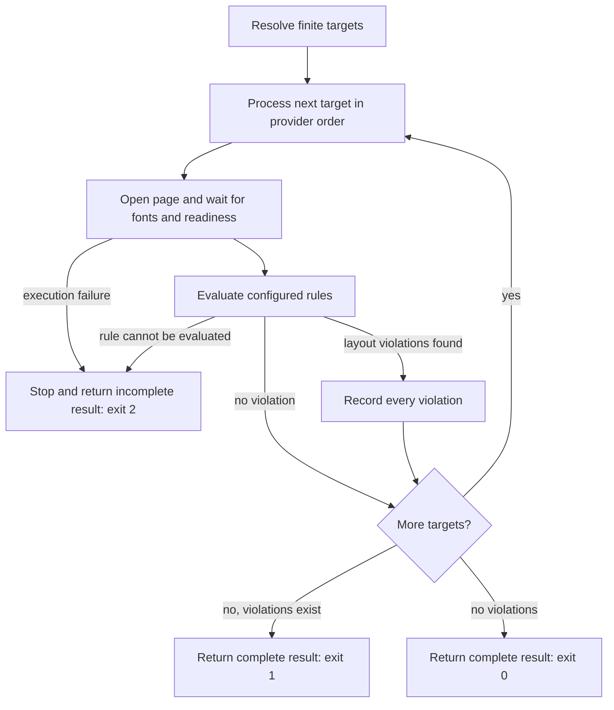
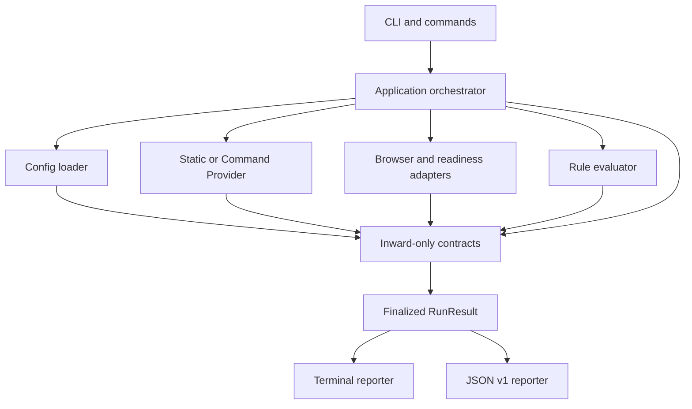
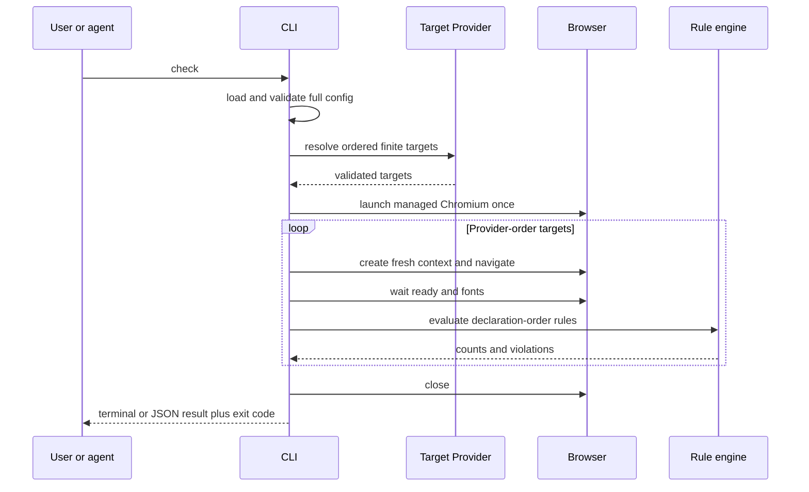
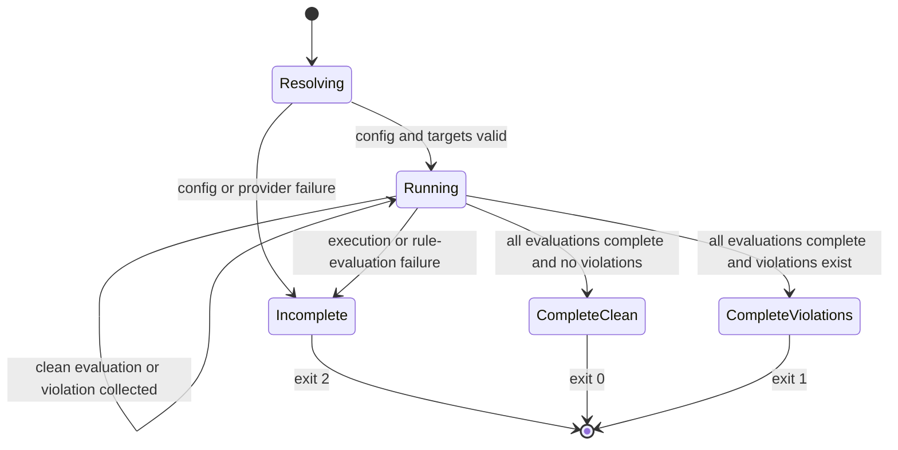
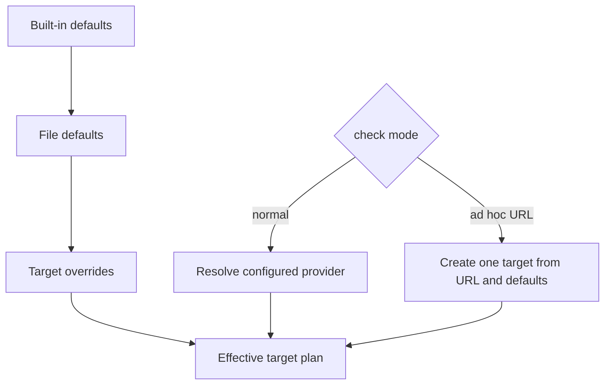
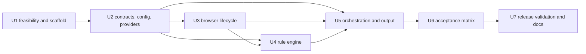

# vlint - Plan

## Goal Capsule

- **Objective:** AIエージェントが単一コマンドを実行するだけで、宣言済みの全UI targetに共通のレイアウト契約を適用し、タブラベルの折り返しを高速かつ省トークンに検出できる独立CLIを提供する。
- **Authority:** Product Contractが製品挙動を、Planning Contractが実装方針を定める。矛盾時はProduct Contractを優先する。
- **Execution profile:** GreenfieldのTypeScript/Bun CLIを7 unitsで実装し、Linux x64単一binaryとして検証する。
- **Stop conditions:** compiled binaryからPlaywright管理Chromiumの導入または直接launchを再現可能に実行できない場合は停止し、Node.js fallback、独自browser path、手動CDP launcherを追加せず製品判断へ戻す。
- **Tail ownership:** executorはunitごとのtestとrelease validationを完了する。利用project側のCI、git hook、AI gate作成は行わない。

---

## Product Contract

### Summary

vlintは、有限の検査target集合へ共通のDOM geometry ruleを適用し、画像をLLMへ渡さずにUIレイアウト違反を検出する独立CLIである。
初版は現行PRDの全scopeを含み、AIエージェントが`vlint check`と構造化診断だけで違反targetと要素を特定できる状態を作る。

### Problem Frame

Web UIの文字折り返しやはみ出しは、実ブラウザで描画するまで発見しにくい。
実際のタブラベル折り返しは自動検査ではなく、人の目視で初めて発覚した。
個別componentへ回帰testを追加する運用では追加忘れが未検査へ直結し、CIだけの検査ではPR作成後まで発見が遅れる。
実行時にURLを指定する方式も、利用者が検査対象を毎回判断するため指定漏れを防げない。
画像をLLMへ渡して判定する方式は、明示的なDOM geometry判定より遅く、token消費も大きい。

### Key Decisions

- **AIエージェントを主要利用者とする。** 単一command、機械可読出力、違反要素の再特定可能性を人間向けの対話的操作より優先する。
- **有限target集合の完全検査をcoverage契約とする。** route探索による全page網羅は保証せず、実行時に解決した集合を黙ってskipしない。
- **レイアウト違反と検査不能を分離する。** 違反は全件収集するが、rule評価不能または実行基盤の失敗は不完全なrunとして扱う。
- **レイアウト違反では停止しない。** 全targetと全rule instanceを評価し、検出した違反をまとめて返す。
- **実行失敗ではfail-fastする。** 最初の評価不能または実行基盤の失敗で後続検査を停止し、未実行targetを結果へ残す。
- **targetをProvider宣言順に逐次処理する。** 停止位置と観測済み結果を同じ入力に対して安定させる。
- **違反要素を出力だけで再特定可能にする。** 描画文字と、計測時点で一意なDOM locatorを診断へ含める。locatorのコード変更後の永続安定性は保証しない。
- **browser管理をPlaywrightへ委ねる。** vlintは独自のbrowser build管理やcross-version再現性protocolを持たず、通常検査中にbrowserを暗黙導入または更新しない。

### Actors

- A1. **AIエージェント:** `vlint check`を実行し、終了コードとJSON診断から修正対象を特定する主要利用者。
- A2. **開発者:** PR前にローカル検査を実行し、人間向けterminal診断を利用する。
- A3. **導入チーム:** projectごとのtarget、browser state、ready条件、layout ruleを宣言し、既存のCIやhookへcommandを組み込む。
- A4. **対象application:** 呼び出し側が起動し、固定data、権限、font、認証済みstateを含む再現可能なpageを提供する。
- A5. **Target Provider:** Static設定または外部commandから、有限で順序付きのtarget集合を返す。

### Key Flows

- F1. **宣言済みtargetの通常検査**
  - **Trigger:** 利用者またはAIエージェントがURL引数なしで`vlint check`を実行する。
  - **Actors:** A1またはA2、A4、A5
  - **Steps:** target集合を解決し、Provider順に各targetを開き、fontとready条件を待ち、全rule instanceを評価する。違反は収集して処理を継続する。評価不能または実行基盤の失敗では停止する。
  - **Outcome:** 完了か未完了か、全観測済み違反、検査済みtarget、未実行targetをterminalとJSONで返す。
- F2. **単一URLのad hoc調査**
  - **Trigger:** 利用者が`vlint check --url <URL>`を実行する。
  - **Actors:** A1またはA2、A4
  - **Steps:** Target Providerを解決せず、設定内の共通defaultを単一URLへ適用する。
  - **Outcome:** 通常検査と同じrule判定、診断形式、終了分類を返す。
- F3. **browserの明示的な導入または更新**
  - **Trigger:** 初回導入時または利用者がbrowser更新を選択したとき。
  - **Actors:** A2またはA3
  - **Steps:** 通常検査とは別commandで、Playwright互換のChromiumを取得または更新する。
  - **Outcome:** 後続の`vlint check`がbrowserを暗黙変更せず、導入済みbrowserを起動できる。



### Requirements

**Product and distribution**

- R1. vlintは対応OSとarchitecture向けの単一実行ファイルとして配布する。
- R2. 利用環境へNode.js、Bun、npm、package manager、`node_modules`を要求しない。
- R3. 実行ファイルはPlaywrightのlibrary codeとvlintの検査logicを含む。
- R4. 実行ファイルはChromiumなどのbrowser executableを含まない。
- R5. browserの取得、保存、起動、Playwrightとの互換性はPlaywrightの仕組みに委ねる。
- R6. browserの導入と更新は通常検査から分離した明示的な操作とする。
- R7. `vlint check`はbrowserを暗黙に導入または更新しない。
- R8. 利用者へbrowser path、接続port、DOM計測scriptの指定を要求しない。

**Configuration and coverage**

- R9. projectは言語runtimeに依存しない宣言的な設定ファイルで共通default、target、rule instanceを定義できる。
- R10. `vlint check`はURL引数なしで、解決された有限target集合を検査する。
- R11. targetは識別名、具体URL、viewport、ready条件、browser context、必要な固定dataまたは権限前提を表現できる。
- R12. 抽象routeではなく、同じ描画状態を再現できる具体URLをtargetとする。
- R13. dev serverの起動、fixture dataの準備、権限の準備は呼び出し側が担う。
- R14. 解決target数と各targetの識別情報をterminal出力とJSON出力へ含める。
- R15. targetを黙ってskipしてはならない。
- R16. 通常検査はtargetをProviderが返した順序で逐次処理する。

**Target Providers and ad hoc checks**

- R17. Static Providerは設定ファイルへ具体targetを列挙できる。
- R18. Command Providerは利用側が指定した外部commandを子processとして実行し、標準出力のJSONからtarget集合を受け取る。
- R19. Command Providerは利用側のsource codeやruntimeをvlint processへ直接loadしない。
- R20. Providerの非ゼロ終了、timeout、不正JSON、必須field欠落、0 targetは実行失敗とする。
- R21. `--url`によるad hoc検査はProviderを解決せず、設定内の共通defaultを適用する。

**Built-in layout rule**

- R22. 初版は組み込みrule `tab-label-single-line`を提供する。
- R23. rule設定がない場合は、画面上に描画されている`[role="tab"]`を候補とする既定instanceを適用する。
- R24. 選択、未選択、disabledのvisible tabを検査し、非表示要素を除外する。
- R25. 行数判定には候補内で実際に描画されている文字を使用し、accessible nameだけの文字を使用しない。
- R26. 既定では候補全体をlabel regionとし、badgeや補助文字を含む描画文字が一つのvisual lineへ収まることを要求する。
- R27. 描画文字を持たないicon-only tabは検査件数へ含めない。
- R28. rule instanceは追加候補selector、除外selector、候補からの相対label selectorを指定できる。
- R29. 相対label selectorは各候補につき一つの描画要素へ解決されなければならず、0件または複数件はrule評価不能とする。
- R30. 意図した複数行表示は候補単位で明示的に除外できる。
- R31. label region内の描画文字が複数のvisual lineへ分かれた場合はレイアウト違反とする。
- R32. 設定された全rule instanceを全targetへ既定で適用する。
- R33. 一つのtargetで候補が0件でも既定では失敗にしない。
- R34. rule instanceは明示的に許可されない限り、run全体で一件以上のlabelを検査できなければrule評価不能とする。
- R35. targetまたはrule instanceは最低一致件数を指定でき、除外後の件数が未達ならrule評価不能とする。
- R36. targetはrule instanceの無効化、除外selector、最低一致件数を上書きできる。
- R37. 同じ入力に対するrule instanceの評価順は決定論的でなければならない。
- R38. DOM行数判定algorithmはvlintのversion管理対象とし、fixtureで互換性を固定する。

**Browser context, readiness, and authentication**

- R39. targetまたは共通defaultはviewport、device scale factor、locale、time zone、ready条件、timeoutを設定できる。
- R40. 計測前にWeb Fontの読み込み完了と設定されたready条件を待つ。
- R41. fontまたはready条件を満たせない場合はレイアウト違反ではなく実行失敗とする。
- R42. 公開pageは追加認証なしで検査できる。
- R43. 認証済みpageは利用側が生成したbrowser stateを共通defaultまたはtarget単位で読み込める。
- R44. vlintはlogin操作、credential保存、MFA、CAPTCHA、認証provider固有処理を行わない。
- R45. 認証前提を満たせずready条件へ到達できない場合は実行失敗とする。
- R46. browser未導入、破損、起動不能はbrowser setupまたは実行失敗とする。

**Execution semantics**

- R47. レイアウト違反を検出しても停止せず、後続rule instanceとtargetをすべて検査する。
- R48. rule評価不能または実行基盤の失敗が発生した場合は、最初の失敗で後続検査を停止する。
- R49. fail-fastで未実行となったtargetとrule evaluationをJSONで観測済み結果から区別する。
- R50. 実行失敗前に観測したレイアウト違反は、未完了runのJSON結果へ保持する。
- R51. 同じ描画状態と同じrule設定から同じverdictを返す。
- R52. 異なるOS、browser version、font resource、application data間のpixel単位の同一性は保証しない。

**Diagnostics and outcomes**

- R53. 人間向けの簡潔なterminal診断と、AIおよび他tool向けのversion付きJSONを返す。
- R54. run summaryは解決target数、検査完了数、未実行数、一致要素数、違反数、実行失敗数を含む。
- R55. 違反診断はtarget名、URL、viewport、描画文字、計測時点で一意なDOM locator、rule、実測行数、要素位置を含む。
- R56. DOM locatorは計測時点の対象を再特定できなければならないが、コード変更後の永続安定性は保証しない。
- R57. 実行診断はTarget Provider、browser setup、navigation、認証、font、ready条件、rule評価のどこで失敗したかを区別する。
- R58. browser名とversion、vlint version、platformを取得可能な範囲で診断へ含める。
- R59. 全targetの検査が完了し違反がなければ終了コード`0`を返す。
- R60. 全targetの検査が完了し一件以上の違反があれば終了コード`1`を返す。
- R61. 設定、target解決、browser、navigation、認証、font、ready条件、rule評価その他の理由で検査が未完了なら終了コード`2`を返す。
- R62. レイアウト違反と実行失敗が同時に存在する場合は、観測済み違反をJSONへ残して終了コード`2`を返す。

**Integration responsibility**

- R63. vlintは自律起動せず、実行忘れの防止は利用側が既存のcheck、CI、git hook、AIエージェント完了gateへ`vlint check`を組み込んで担う。
- R64. vlintは利用側のgateを作成または管理しない。

### Acceptance Examples

- AE1. **Covers R22-R31, R47, R60.** 正常な一行tabと複数行へ崩れたtabが複数targetに存在するとき、全targetを検査し、崩れたtabをすべて返して終了コード`1`となる。
- AE2. **Covers R28-R30.** 除外selectorが意図した複数行tabだけに一致するとき、そのtabを検査件数から除き、他の候補は通常どおり評価する。
- AE3. **Covers R29, R48, R61.** 相対label selectorが一つの候補で複数要素へ一致するとき、rule評価不能としてその時点で停止し、終了コード`2`となる。
- AE4. **Covers R33-R35.** 一つのtargetで候補が0件でも他targetで同じrule instanceがlabelを検査できれば成功可能だが、run全体で0件なら明示的許可がない限り終了コード`2`となる。
- AE5. **Covers R35.** targetの最低一致件数を下回るとき、レイアウト違反ではなくrule評価不能として終了コード`2`となる。
- AE6. **Covers R17-R20.** Static ProviderとCommand Providerが同じtarget集合を返すとき同じrule verdictを返し、Command Providerの非ゼロ終了、timeout、不正JSON、必須field欠落、0 targetは終了コード`2`となる。
- AE7. **Covers R39-R45.** 公開pageとbrowser stateを使う認証済みpageを検査でき、認証前提、font、ready条件のいずれかを満たせない場合は終了コード`2`となる。
- AE8. **Covers R6-R8, R46.** browser未導入または起動不能の環境で`vlint check`はbrowserを自動取得せず終了コード`2`となり、別のbrowser管理操作後に検査を再実行できる。
- AE9. **Covers R21.** `vlint check --url http://localhost:3000/settings`はProviderを実行せず、共通defaultで単一pageを検査する。
- AE10. **Covers R47-R50, R62.** 先行targetで違反を観測し、後続targetでnavigationが失敗したとき、後続検査を停止して終了コード`2`を返し、先行違反と未実行targetをJSONへ残す。
- AE11. **Covers R1-R5, R53.** Node.js、Bun、package manager、`node_modules`がないclean環境で、単一実行ファイルと導入済みChromiumだけを使ってpage表示、DOM計測、JSON出力まで完走する。
- AE12. **Covers R51-R52.** 同じfixture、browser、font、context、rule設定で繰り返し実行したとき同じverdictを返すが、異なる環境間のpixel一致は要求しない。
- AE13. **Covers R55-R56.** 違反JSONのtarget、URL、描画文字、DOM locatorから、AIエージェントが計測時点の違反要素を一意に特定できる。

### Success Criteria

- 対応platformのclean環境で、runtimeやpackage managerなしに単一実行ファイルが起動する。
- 導入済みChromiumを使い、`node_modules`なしでbrowser起動、page表示、DOM計測、terminal診断、JSON出力まで完走する。
- Static Provider、Command Provider、ad hoc URLの各flowが同じrule契約と終了分類を使用する。
- 正常、違反、明示的除外、最低一致件数未達、Provider失敗、browser失敗、navigation失敗、認証失敗、font失敗、ready timeoutをfixtureで安定して分類する。
- 同じ安定描画条件で繰り返し実行し、同じrule判定を返す。
- AIエージェントが一つのcommandと診断出力だけで違反targetと要素を特定できる。
- 実行失敗時に観測済み違反と未実行targetを失わず、不完全なrunを成功または通常の違反runとして扱わない。

### Scope Boundaries

**Deferred for later**

- route、sitemap、Storybook、DOM link、crawlerから有限target集合を生成する追加Providerまたはdiscover command。
- click、入力、scrollを伴う操作scenario。
- 文字切れ、要素衝突、親領域からの突出、page overflow、色、contrast、余白、alignment、tap領域を検査する追加rule。
- watch mode、複数browser engine、実モバイル端末。

**Outside this product's identity**

- application内の全pageを自動発見したという網羅性保証。
- screenshot比較、画像理解、pixel差分によるvisual regression。
- dev serverの起動と終了、fixture dataの生成、認証stateの生成。
- login、credential、MFA、CAPTCHA、認証provider固有flowの自動化。
- CI、git hook、AIエージェント完了gateの作成と管理。
- Chromium executableのvlint binaryへの内包。
- `vlint check`中のbrowser自動導入または更新。
- 異なるOSまたはbrowser build間のpixel単位の同一性保証。

### Dependencies / Assumptions

- 呼び出し側は対象applicationを起動し、具体URL、固定data、必要な権限、browser stateを準備する。
- 対象pageは指定されたfontとready条件へtimeout内に到達できる。
- Playwrightのbrowser取得、保存、起動、互換性mechanismがvlintの対応platformで利用できる。
- Bun single executableがPlaywright library codeとvlint logicを含む配布物を生成できることは、実装計画またはtechnical spikeで検証する。
- 対応platformごとの配布とfixture実行環境をrelease前に自動検証できる。


### Sources / Research

- `vlint-prd.md` — 製品定義、初版scope、成功条件、release判定の元要件。

---

## Planning Contract

### Product Contract Preservation

Product ContractのR1-R64、A1-A5、F1-F3、AE1-AE13、成功条件、scope boundariesは変更しない。
planning-ownedだったOutstanding Questionsだけを削除し、以下のKTD1-KTD13で解決した。

### Key Technical Decisions

- KTD1. **Bun + Playwrightをfresh environmentで最初に実証する。** Bun 1.3.14とPlaywright 1.61.1を初期pinとし、最終形と同じ`bun-linux-x64-baseline` compile flagsを使うtest-only feasibility artifactをUbuntu 24.04 x64 clean environmentへ置く。empty cacheへinstaller seamを実行したprocessを終了し、別のcompiled processが同じcacheからChromiumをlaunch、navigate、evaluate、closeできることをU1のhard gateにする。U1はproduction adapterを作らず、成功後にU2 contracts→U3 adaptersの順で実装する。
- KTD2. **初版の正式supportをUbuntu 24.04 x64へ限定する。** `vlint browser install`はPlaywright browser payloadだけを導入し、OS libraryやpackageは変更しない。Ubuntu 24.04上のPlaywright system dependenciesをenvironment prerequisiteとしてrelease imageで検証する。他platformは初版のsupport claimへ含めない。
- KTD3. **設定をproject-local JSONへ固定する。** 正式名を`vlint.config.json`とし、current working directoryから8 MiB以下の一fileだけを読む。arbitrary JavaScript、global user config、上位directory探索は行わない。built-in defaults、file defaults、target overridesの順でmergeし、runtime schemaでprovider output全体をbrowser起動前に検証する。
- KTD4. **一つのconfigは一つのTarget Providerを選ぶ。** Static Providerは宣言配列順を保持する。Command Providerはtrusted executableとargvをshellなし、config directory cwd、invoking processのenvironmentで起動する。既定30秒、stdout 8 MiB、stderr 64 KiBをhard limitとし、instance timeout override以外のlimit overrideは持たない。stderrはcap/cleanupのためだけにdrainしてbyte countだけを保持し、そのcontentをFailure、terminal、JSONへ複製しない。
- KTD5. **browser revisionとcacheをPlaywrightへ委ねる。** `vlint browser install`はbinaryへpinされたPlaywright revisionのChromium headless shellをPlaywrightの標準cacheへidempotentに導入し、`--force`でrepair/reinstallする。`PLAYWRIGHT_BROWSERS_PATH`が設定されていればinstall/checkとも`browser-cache-override-unsupported`でfailする。`PLAYWRIGHT_DOWNLOAD_HOST`または`PLAYWRIGHT_CHROMIUM_DOWNLOAD_HOST`が設定されていればinstallはcache/installer access前に`browser-download-host-override-unsupported`でfailし、ambient cacheまたはdownload originを差し替えさせない。`vlint check`はinstallを呼ばず、missing/corrupt/incompatible browserをtyped browser-setup failureと再導入案内へ変換する。custom manifest、registry、system-browser fallbackは作らない。
- KTD6. **resource ownershipをrun scopeへ一元化する。** CLI check scopeがsignal handlerとcancellation requestを、Provider adapterがactive command process groupを、browser run scopeが一つのBrowserを、target scopeがPage/BrowserContextを所有する。signalはcancellationだけを要求し、orchestratorの一つのidempotent LIFO finalizerがtarget、browserの順で解放する。install commandは独立したsignal/cancellation scopeとidempotent bounded finalizerでinstaller process groupのgraceful termination、forced termination、reapを所有する。
- KTD7. **target executionを一つのmonotonic deadlineでboundedにする。** deadlineはbrowser-state readの直前に開始し、context/page setup、`domcontentloaded` navigation、declarative ready condition、`document.fonts.ready`がremaining budgetだけを受け取る。browser launchは既定30秒のrun-level budgetを持つ。timeout stageはbudgetを使い切ったstageとし、後続stageへ新しいtimeoutを与えない。
- KTD8. **line countは描画text fragmentのgeometryから求める。** label region自身と全ancestorがconnectedで、computed `display != none`、`visibility`が`hidden/collapse`でなく、`content-visibility != hidden`、積算opacityが0より大きい時だけrenderedとする。非空DOM text nodeへRangeを当て、zero-area rectを除外する。fragmentはvertical overlapまたはcenter distanceが両fragmentのresolved line-heightの小さい方の半分以下なら同line候補とし、nearest clusterのmedian centerへnon-transitiveに割り当てる。`line-height: normal`はfragment rect heightを使う。label regionまたはdescendant ownerが同じrendered-state predicateを満たし、その`::before`/`::after` pseudo自身も`display != none`、visible、`content-visibility != hidden`、積算opacity>0である場合だけcomputed `content`を調べる。`none`、`normal`、空quoted string以外が一つでもあればsilent skipせず`generated-content-unsupported` failureにする。algorithm変更はfixture更新とvlint version changeを要求する。
- KTD9. **locatorは計測時点で一意なCSS selectorを生成する。** unique id、`data-testid`などのstable data attribute、semantic attribute、ancestor pathの順に候補を作り、同じdocumentで一件だけに解決することを検証する。light DOMだけを初版対象とし、fallbackのpositional pathにも一意性checkを課す。
- KTD10. **inward-only contractsをadapterより先に固定する。** effective target/rule、evaluation fact、failure stage、disposition、RunResultを`src/contracts/`が所有する。config、provider、browser、rule adapterはcontractsへ依存し、typed valueまたは自boundaryのtyped failureだけを返す。orchestratorだけがrun stateを進め、reporterはfinalized RunResultだけへ依存する。
- KTD11. **JSON schema v1をbreaking-change gateにする。** rootのinteger `schemaVersion`、`clean | violations | incomplete` run status、target/rule disposition、machine-readable failure stage、nested violationを固定する。optional field追加だけをv1-compatibleとし、rename、remove、type changeはschema versionを上げる。timestampsと成功時timingを省き、同じ安定入力のfield/orderを安定させる。
- KTD12. **executionまたはrule-evaluation failureだけをfail-fastし、dispositionを事前に固定する。** target×rule matrixはProvider順、global rule declaration順でseedし、explicit disableを`disabled`とする。pair failureはそのpairを`failed`、同targetの後続applicable rulesと後続targetsを`not-executed`にする。全pair完了後、global zero-label invariantをrule declaration順で`ruleFinalizations`へ記録し、最初のfailureだけをauthoritativeにして後続finalizationを`not-executed`とする。CLIだけがfinalized statusを0/1/2へmappingする。
- KTD13. **diagnostic outputをuntrusted data boundaryとして扱う。** schemaはtarget/rule nameをUTF-8 1 KiB、URL/selectorを64 KiB、browser stateを8 MiBへ制限する。rule evaluationはrendered text/locatorが各64 KiBを超えた場合にincompleteとなる。terminalはcontrol/ANSI/OSC/bidi charactersをescapeし、URL query valuesをredactしてfragment全体を除去する。JSONはlimit内のconfigured URLと全DOM-rendered textをprovenanceに関係なくexactに保持するため、それら自身がauthenticated dataやsecretを含み得るsensitive outputと明記する。raw exception、raw state-file bytes/parsed credential fieldsのdiagnosticへのcopy、provider stderr contentは出力しない。

### High-Level Technical Design

**Component and data flow**



contractsはadapter、CLI、reporterをimportしない。
leaf adapterはexit codeやRunResultを生成せず、orchestratorだけがtyped failureをrun stateへ反映する。

**Normal check protocol**



Provider output全体を先にvalidateするため、invalidな後続targetが部分runを発生させない。
target execution開始後はlayout violationだけがnon-terminalであり、その他のfailureはその場でresultをincompleteへ遷移させる。

**Run-state and exit mapping**



`Incomplete`はそれ以前のviolationsを破棄しない。
config/provider failureはtarget解決前なのでtarget dispositionを作らない。target解決後は全target×rule pairをseedし、explicit disableを`disabled`、fail-fast remainderを`not-executed`として区別する。
全pairが完了した後にglobal zero-label invariantをfinalizeするため、このfailureでは全target evaluationが実行済みのままrunだけが`incomplete`になる。
failure ownershipは次のboundaryへ固定する。

| Boundary | Owns | Does not own |
|---|---|---|
| Config | JSON、schema、merge、path syntax | File existence、RunResult、exit code |
| Provider | Child lifecycle、bounded streams、atomic target schema | Browser、RunResult、exit code |
| Authentication | State-file read/parse/application | Config syntax、reporting |
| Browser/readiness/rule | Own exception translation and resource scope | Cross-run state transition |
| Orchestrator | Matrix、dispositions、partial result、idempotent finalization | Terminal/JSON formatting |
| CLI | Signal registration/removal、status-to-0/1/2 mapping | Domain failure inference |

Owned child cleanupはpipe read停止、pipe close、graceful process-group termination、fixed grace period、forced group termination、reapの順でboundedに行い、その後にpartial resultをserializeする。

failure位置ごとのstate transitionは次に固定する。
rule evaluatorは`facts[]`とoptional typed failureを同時に返せるため、failureより前に観測したviolationsを保持できる。

| Failure point | Target and rule disposition | Retained result |
|---|---|---|
| Config/provider before resolution | `targets=[]`; matrixなし | tool/environment、failure |
| Browser launch after resolution | 全target=`not-executed`; applicable pair=`not-executed`; explicit disableは`disabled`; 全finalization=`not-executed` | resolved target context、failure |
| Target pre-pair: state/context/navigation/ready/font | current target=`failed`; current/later applicable pairs=`not-executed`; explicit disableは`disabled`; 全finalization=`not-executed` | prior targets、failure |
| In-pair evaluation | pair=`failed`; later applicable pairs=`not-executed`; explicit disableは`disabled`; 全finalization=`not-executed`; target=`partial` only when attempted pairs and not-executed pairs coexist, otherwise `failed` | prior factsとcurrent evaluator facts、failure |
| Post-matrix zero-label finalization | 全target statusを維持; current finalization=`failed`; later finalizations=`not-executed` | 全target/pair result、failure |
| Cleanup after completed evaluation | 全target/pair resultを維持; run=`incomplete` | complete facts、cleanup failure |
| Interrupt | acquisition位置に対応する上記disposition | signal前のfacts、interrupt failure |

target statusは`complete | partial | failed | not-executed`とする。
`complete`は全applicable pairが`clean | violations | disabled`、`partial`はattempted pairと`not-executed` pairが混在、`failed`はcurrent targetでfailureが起きpartial条件を満たさない場合、`not-executed`はtarget preconditionもpairも開始していない場合である。

**Configuration and mode resolution**



| Concern | Normal check | Ad hoc URL |
|---|---|---|
| Config | Required | Required |
| Provider | Exactly one Static or Command Provider | Bypassed |
| Target order | Provider output order | One synthetic target |
| Defaults | Built-in, file, target override | Built-in, file |
| Rules | Global declaration order | Same global declaration order |

**Normative configuration contract**

```text
ConfigV1 = {
  schemaVersion: 1
  provider: StaticProvider | CommandProvider
  defaults?: TargetDefaults
  rules?: RuleInstance[]
}

StaticProvider = { type: "static", targets: Target[] }
CommandProvider = {
  type: "command"
  executable: string
  args?: string[]
  timeoutMs?: integer
}

CommandProviderOutput = { targets: Target[] }

TargetDefaults = {
  viewport?: { width: integer, height: integer }
  deviceScaleFactor?: number
  locale?: string
  timezoneId?: string
  timeoutMs?: integer
  browserState?: string
  readyCondition?: {
    selector: string
    state?: "attached" | "visible" | "hidden"
  }
}

Target = TargetDefaults & {
  name: string
  url: string
  ruleOverrides?: {
    [ruleName]: {
      enabled?: boolean
      excludeSelectors?: string[]
      minimumLabels?: integer
    }
  }
}

RuleInstance = {
  name: string
  type: "tab-label-single-line"
  additionalCandidateSelectors?: string[]
  excludeSelectors?: string[]
  labelSelector?: string
  minimumLabels?: integer
  allowZeroLabels?: boolean
}
```

RuleInstance field defaultsはadditional candidates/excludesがempty、labelSelector omitted時はcandidate自身、minimumLabels `0`、allowZeroLabels `false`である。
Targetの`ruleOverrides[*].enabled` omitted時は`true`である。各map keyはbuilt-in rule注入後のglobal rule name一つへ解決する。unmatched keyはStatic/config由来なら`config-schema-invalid`、Command output由来なら`provider-output-invalid`とする。
built-in→file defaults→target direct fieldsの順でmergeする。scalarはreplaceし、`viewport`と`readyCondition`はobject全体をreplaceしてからomitted inner fieldのdefaultを適用する。`ruleOverrides`だけを同名global ruleへfield単位で適用する。配列mergeはcandidate/excludeについて上記のappend規則以外を行わない。

- `schemaVersion`、`provider`はrequiredで、unknown fieldを全levelでrejectする。
- `rules` omitted時はname/typeとも`tab-label-single-line`のbuilt-in instanceを一つ注入する。明示した`rules`はnon-empty、name unique、declaration order authoritativeとする。
- candidate orderは`[role="tab"]`、続いて`additionalCandidateSelectors` declaration order、各selector内はdocument orderとする。同elementの重複matchは最初の出現だけを使う。excludeはcandidate自身の`matches()`へ適用する。relative labelはcandidate内`querySelectorAll()`でexactly oneを要求し、0/manyは`label-selector-cardinality`、一件でも上記rendered-state predicateを満たさなければ`label-selector-not-rendered`とする。
- target excludeはrule-level excludesへappendし、`minimumLabels`はtarget overrideがrule valueをreplaceする。minimumはexclude、icon-only、non-renderedを除いたtarget/rule pairの`labelsInspected`へ適用する。
- global zero-label finalizationは少なくとも一つのenabled pairがあるruleだけを対象にし、全enabled pairsの`labelsInspected`合計が0かつ`allowZeroLabels=false`ならfailureとする。全pair disabledのruleは0 labelsでもpassedになる。
- Static Providerの`targets`とCommand Provider stdoutの`CommandProviderOutput.targets`は同じ`Target[]` schemaを使い、non-empty、unique target names、array order authoritativeとする。Command stdoutは他fieldを持たない一つの`CommandProviderOutput` JSON object、`args` defaultは`[]`である。
- built-in target defaultsはviewport `1280x720`、deviceScaleFactor `1`、locale `en-US`、timezoneId `UTC`、timeout `30000 ms`、browserState/readyConditionなしとする。ready state defaultは`visible`である。
- viewport width/heightはinteger `1..10000`、deviceScaleFactorは`0.1..10`、timeoutはinteger `100..300000 ms`、minimumLabelsはinteger `0..100000`とする。
- nameはUTF-8 1 KiB、URL/selectorは64 KiB以下とする。URLはabsolute HTTP(S)でuserinfoを禁止し、timezoneIdはChromiumが受理するIANA identifier、localeはChromiumが受理するBCP 47 tagとする。
- `browserState`はconfig directory relative pathまたはabsolute pathを受け付ける。resolved targetはregular fileかつ8 MiB以下でなければならない。
- check grammarは`vlint check [--url <absolute-http(s)-url>] [--format terminal|json]`、install grammarは`vlint browser install [--force]`、version queryは`vlint --version`とする。重複/unknown optionと相互排他的commandはRunResultを作らず、escaped one-line CLI parse errorをstderrへ出してexit 2となる。
- normal checkはProviderを使い、ad hoc target nameは固定`adhoc`、ProviderとruleOverridesをbypassし、config defaultsとglobal rulesを使う。version queryはconfig/browserへ触れずstdoutへ`vlint <semver>`とnewlineを出してexit 0とする。
`--format` defaultは`terminal`である。valid check invocationはterminal/JSONともstdoutへ一resultとnewlineを出し、stderrを空にする。

`vlint browser install`は成功時にstdoutへ`vlint browser: chromium <revision> ready (<installed|already-present|reinstalled>)`とnewlineを出し、stderrを空にしてexit `0`とする。`--force`成功時のoutcomeは`reinstalled`である。失敗またはsignal interrupt時はstdoutを空にし、stderrへ`vlint: <browser-cache-override-unsupported|browser-download-host-override-unsupported|browser-install-failed|signal-interrupt>: <escaped-safe-message>`とnewlineを出してexit `2`とする。いずれもraw downloader/child exceptionは出力しない。
Minimal Static config:

```json
{"schemaVersion":1,"provider":{"type":"static","targets":[{"name":"settings","url":"http://127.0.0.1:4173/settings"}]}}
```

Minimal Command config:

```json
{"schemaVersion":1,"provider":{"type":"command","executable":"./targets","args":["--json"]}}
```
Command executable stdoutは例えば`{"targets":[{"name":"settings","url":"http://127.0.0.1:4173/settings"}]}`だけを出す。bare array、stdoutのlog/prefix/suffixはprovider-output-invalidで、stderrはtarget dataへ使わない。

ad hocでもconfigはrequiredで、例えば上のいずれかと`vlint check --url http://127.0.0.1:4173/settings --format json`を使う。
main-frame navigationはfinal response status `200..399`だけを成功とし、responseなし/network error、`400..599`、deadline消費を別codeへ分ける。
ready condition後に`document.fonts.ready`を待ち、FontFaceSet内に`status=error`のfaceが一つでもあれば`font-load-failed`、remaining deadlineを使い切れば`font-timeout`とする。

**Normative JSON v1 contract**

```text
RunResultV1 = {
  schemaVersion: 1
  status: "clean" | "violations" | "incomplete"
  tool: { name: "vlint", version: string }
  environment: {
    platform: "linux"
    arch: "x64"
    browser: { name: "chromium", version: string | null }
  }
  summary: {
    targets: {
      resolved: integer
      complete: integer
      partial: integer
      failed: integer
      notExecuted: integer
    }
    ruleEvaluations: {
      clean: integer
      violations: integer
      failed: integer
      disabled: integer
      notExecuted: integer
    }
    ruleFinalizations: {
      passed: integer
      failed: integer
      notExecuted: integer
    }
    violations: integer
    matchedElements: integer
    executionFailures: integer
  }
  targets: TargetResult[]
  ruleFinalizations: RuleFinalization[]
  failure: Failure | null
}

TargetResult = {
  name: string
  url: string
  viewport: { width: integer, height: integer }
  deviceScaleFactor: number
  locale: string
  timezoneId: string
  status: "complete" | "partial" | "failed" | "not-executed"
  rules: RuleResult[]
}

RuleResult = {
  name: string
  type: "tab-label-single-line"
  status: "clean" | "violations" | "failed" | "disabled" | "not-executed"
  labelsInspected: integer
  violations: Violation[]
}

Violation = {
  text: string
  lineCount: integer
  geometry: { x: number, y: number, width: number, height: number }
  locator: string
}

RuleFinalization = {
  name: string
  status: "passed" | "failed" | "not-executed"
  labelsInspected: integer
  failure: Failure | null
}

Failure = {
  stage: FailureStage
  code: FailureCode
  message: string
  target: string | null
  rule: string | null
}
```

- JSON object property orderは上記schema declaration order、array orderはProvider target、global rule、DOM candidate、rule finalization declaration orderを保持する。
- config/provider failureではtargetsとruleFinalizationsをemptyにする。target解決後はfull target×rule matrixをserializeし、pair evaluation完了前の全ruleFinalizationsを`not-executed`でseedする。
- target summaryの4 dispositionは`resolved`へ合計し、ruleEvaluationの5 dispositionはmatrix pair総数へ合計する。`matchedElements`は全RuleResultの`labelsInspected`合計、`executionFailures`はauthoritative `failure`がnon-nullなら`1`、nullなら`0`とする。
- `status`はincomplete failureがあれば`incomplete`、なければviolation countが1以上なら`violations`、0なら`clean`とする。`failure`は`incomplete`だけnon-nullで、最初のauthoritative failureを保持する。RuleFinalization failureは同じ内容を持つ。
- Failure scopeはpre-resolutionとbrowser launch/run-level browser cleanupで`target=null, rule=null`、target preconditionとtarget-context cleanupで`target=<name>, rule=null`、pair evaluationで両方set、global rule finalizationで`target=null, rule=<name>`とする。interruptはsignal受信時のactive scopeを継承し、config/provider/browser run scopeでは両方null、target scopeではtargetだけ、pair scopeでは両方setする。
- `labelsInspected`、`matchedElements`、violationsはpair/finalization failure以前に観測したfactを保持する。disabled/not-executed RuleResultは0とempty arrayを使う。
- violation textはlabel regionの`innerText`をCRLF/CRからLFへnormalizeし、ECMAScript whitespaceを両端だけtrimした値とする。内部space/newlineは保持する。
- geometryはmeasurement時の`getBoundingClientRect()` border box、viewport origin、CSS pixelsとし、transform後のfinite valueを小数3桁へroundする。NaN/Infinityは`geometry-evaluation-failed`とする。
- terminalはsafe/redacted view、JSONのtarget URLとnormalized violation textはschema limit内でexactである。

| FailureStage | FailureCode |
|---|---|
| `config` | `config-not-found`, `config-read-failed`, `config-too-large`, `config-invalid-json`, `config-schema-invalid` |
| `provider` | `provider-spawn-failed`, `provider-exit-nonzero`, `provider-timeout`, `provider-output-too-large`, `provider-output-invalid`, `provider-empty`, `provider-cleanup-failed` |
| `browser-setup` | `browser-cache-override-unsupported`, `browser-download-host-override-unsupported`, `browser-missing`, `browser-install-failed`, `browser-launch-failed`, `browser-incompatible`, `browser-context-failed`, `browser-page-failed`, `browser-cleanup-failed` |
| `authentication` | `state-missing`, `state-read-failed`, `state-not-regular`, `state-too-large`, `state-invalid`, `state-apply-failed` |
| `navigation` | `navigation-network`, `navigation-http-status`, `navigation-timeout` |
| `ready-condition` | `ready-invalid-selector`, `ready-timeout` |
| `web-font` | `font-load-failed`, `font-timeout` |
| `rule-evaluation` | `candidate-selector-invalid`, `exclude-selector-invalid`, `label-selector-invalid`, `label-selector-cardinality`, `label-selector-not-rendered`, `minimum-labels-unmet`, `zero-labels-global`, `generated-content-unsupported`, `diagnostic-field-too-large`, `geometry-evaluation-failed`, `rule-script-failed` |
| `interrupt` | `signal-interrupt` |

### Output Structure

```text
.
├── package.json
├── bun.lock
├── tsconfig.json
├── README.md
├── .github
│   └── workflows
│       ├── ci.yml
│       └── release.yml
├── src
│   ├── cli.ts
│   ├── commands
│   │   ├── browser-install.ts
│   │   └── check.ts
│   ├── config
│   │   ├── load.ts
│   │   ├── merge.ts
│   │   └── schema.ts
│   ├── providers
│   │   ├── command.ts
│   │   ├── static.ts
│   │   └── types.ts
│   ├── browser
│   │   ├── install.ts
│   │   ├── lifecycle.ts
│   │   └── readiness.ts
│   ├── contracts
│   │   ├── config.ts
│   │   ├── evaluation.ts
│   │   ├── failure.ts
│   │   └── result.ts
│   ├── rules
│   │   ├── locator.ts
│   │   └── tab-label-single-line.ts
│   ├── run
│   │   └── orchestrator.ts
│   └── output
│       ├── json.ts
│       └── terminal.ts
├── scripts
│   ├── build.ts
│   ├── check-architecture.ts
│   └── release-validate.ts
└── tests
    ├── acceptance
    ├── feasibility
    ├── fixtures
    │   ├── app
    │   └── providers
    ├── golden
    ├── integration
    ├── smoke
    ├── release
    │   ├── Containerfile
    │   ├── fixture-server.ts
    │   └── validate.sh
    └── unit
```

### Implementation Constraints

- compiled binaryはBunのautomatic `.env`と`bunfig.toml` loadingをdisableし、vlintが宣言したconfig以外を暗黙loadしない。
- production codeはNode.js executable、npm、`node_modules`、system Chromium path、CDP portへfallbackしない。
- Command Providerは利用projectが明示したtrusted arbitrary commandとして扱い、invoking processのenvironmentを継承する。vlintはsandboxやapproval engineを提供しない。
- Static Providerはconfigured child executionを避けるだけで、target page JavaScriptとbrowser stateは依然untrusted inputである。unreviewed worktree/pageの検査はcredentialを渡さないdisposable containerで行う。
- browser state pathはconfig directory基準で解決し、bounded regular-file read、descriptor cleanup、sanitized parse errorを要求する。raw content、cookie、tokenをterminal、JSON、snapshotへ出力しない。permissive file modeは受理し、READMEでowner-only modeを推奨する。
- terminalへ出すuntrusted fieldはcontrol/ANSI/OSC/bidi escapeとlength capを通し、URLはquery valuesをredactしてfragment全体を除去する。provider stderrはcap/cleanupのためにdrainするがcontentをFailure、terminal、JSONへ含めず、static messageにexit status、timeout/cap state、観測byte countだけを使う。JSON outputはconfigured URL/rendered textにcredentialを含み得るsensitive artifactとして扱う。
- `PLAYWRIGHT_BROWSERS_PATH`、`PLAYWRIGHT_DOWNLOAD_HOST`、`PLAYWRIGHT_CHROMIUM_DOWNLOAD_HOST`によるambient executable/cache origin overrideを上記KTD5どおり拒否する。CI/releaseはempty owner-only HOME/cacheをrunごとに作り、異なるtrust domainが生成したbrowser cacheをrestoreしない。
- browser install/download gateとGitHub Release asset取得だけをnetwork-using checkとする。page、font、fixture trafficはrepository内fixtureだけを使い、install後のcheckはnetwork-disabled guestで再現する。
- retryはlayout verdictを変え得るため初版に導入しない。timeoutやnavigation failureは一回でincompleteとする。
- Playwright内部install seamへ依存する場合は`src/browser/install.ts`だけへ隔離し、exact dependency pinとcompiled-binary smoke testでchurnを検出する。
- lockfile、Bun、Playwright、Ubuntu image digest、GitHub Actions commit SHAをfrozen inputとする。release workflowはtag targetがprotected default branch history上にあり、そのSHAのrequired checksが成功したことをread-only provenance jobで確認する。build/package/clean-guest validationは`contents: read`、secretなしで行い、immutable artifact+digestだけをprotected-environment publish jobへ渡す。publish/cleanup jobはrepositoryをcheckoutせずscriptも実行せず、`contents: write` tokenを固定GitHub API stepへだけ渡す。

### Sequencing



U1 failure is a plan stop condition。
U2がinward-only contractsを固定した後、U3のbrowser workを開始する。U4はU2のrule contractとU3のbrowser boundaryへ依存する。

### System-Wide Impact

- **Agent and developer interface:** CLI flags、exit code、JSON schema、terminal textがpublic contractになる。golden fixturesとschema testsなしに変更しない。
- **Authentication boundary:** vlintはbounded regular-fileとしてbrowser stateを読みcontextへ適用するだけで、生成やcredential管理をしない。raw state-file bytesとparsed credential fieldsをdiagnosticへcopyしない。pageがそれらをDOMへrenderした場合は通常のrendered textとして扱う。
- **Process boundary:** Provider、installer、Chromiumのownership treeを分離し、全exit pathでgraceful termination、forced group termination、reapまでをboundedに完了する。
- **Persistent state:** vlint固有databaseやrun stateを持たない。Playwright標準browser cacheだけを永続させ、vlint固有manifestやlock registryを追加しない。cache location overrideは拒否し、CI/release cacheはtrust domainを跨いで再利用しない。
- **Diagnostic boundary:** terminalはURL fragmentを除去したinertなescaped/redacted view、JSONはprovenanceを問わずexact configured URL/DOM-rendered textを含むsensitive machine artifactである。両方ともraw exception、vlint自身によるraw state-file/parsed credential fieldのcopy、provider stderr contentを拒否する。
- **Performance:** targetを逐次実行するが、一browser processを再利用してlaunch costを抑える。targetごとに一deadlineとfresh contextを使う。
- **Consumer integration:** consumer側のCI、hook、agent gateは変更しない。Command Providerはreview済みtrusted configに限定する。Static Providerでもunreviewed page JavaScriptを実行するため、credential-free disposable environmentをREADMEに示す。

### Risks and Dependencies

| Risk or dependency | Impact | Mitigation |
|---|---|---|
| Bun runtimeとPlaywright transportの互換性 | single-binary productが成立しない | U1でfresh Ubuntu上のseparate compiled processesを実行し、失敗時はproduct decisionへ戻る |
| Playwright browser install APIのpublic surface不足 | internal seamがupgradeで破損する | exact pin、thin adapter、install smoke、chosen seamのsupport status記録 |
| Browser revisionとLinux system dependency | browser payload install後もlaunch不能になり得る | OS dependencyをenvironment prerequisiteとし、Ubuntu 24.04 release imageで検証 |
| Fontとlayout fixtureのenvironment差 | false positiveまたはflaky verdict | local font、fixed viewport/context、network-free fixture、repeatability gate |
| JSON/terminal diagnostic injectionまたはsecret exposure | CI log汚染、credential leakage | inert terminal encoding、bounded safe errors、sensitive JSON guidance、sentinel-secret tests |
| Command Providerのhangまたはresistant descendants | run hang、memory消費、orphan process | direct exec、fixed stream cap、timeout、grace-to-force group cleanup、reap |
| Browser state fileの特殊fileまたはlarge input | block、memory exhaustion、credential leak | bounded regular-file read、sanitized error、descriptor cleanup、secret non-disclosure tests |
| Browser cacheまたはrelease assetの差し替え | attacker-controlled executableを起動する | ambient cache override拒否、owner-only clean cache、protected tag、commit-SHA pinned Actions、draft validation、published checksum |
| Module boundary drift | adaptersがCLI/outputへcoupleし、partial result semanticsが分岐する | inward-only contracts、acyclic dependency check、single orchestrator |
| DOM locatorのvolatile fallback | agentがsource correlationしにくい | stable attribute preference、measurement-time uniqueness test、rendered text併記 |
| Current directoryの誤り | config未発見または別project検査 | project-local single-file lookupとconfig pathを含むerror |

### Documentation and Operational Notes

- `README.md`にUbuntu 24.04 x64 support、GitHub Releasesからのbinary導入、SHA-256照合、`vlint --version`、OS prerequisites、`vlint browser install`、`vlint check`、`--format json`、config reference、browser state、exit codesを記載する。
- READMEのconsumer integrationは既存CIやagent gateへcommandを追加する例に留め、gate作成機能として扱わない。
- Command Providerがtrusted arbitrary codeをcurrent environmentで実行することを警告する。Static Providerもtarget JavaScriptを実行するため、unreviewed worktree/pageではcredential-free disposable containerを使う。
- browser stateをignore対象、least-privilege、short-lived credential fileとして扱い、output JSONもauthenticated page contentを含み得るsensitive artifactとして保管する。
- browser cacheを異なるtrust domainからrestoreしないこと、`PLAYWRIGHT_BROWSERS_PATH`がunsupportedであることを記載する。
- browser upgradeはvlint binary upgrade後に`vlint browser install`を再実行する手順として記載する。
- JSON v1 fieldとcompatibility policyをREADME内のmachine-consumption sectionで固定する。
- GitHub Releasesの正式assetは`vlint-v<semver>-linux-x64.tar.gz`と`SHA256SUMS`とする。archiveはmode 0755の`vlint`とREADMEを含み、checksumはintegrity確認であってGitHub account/tag trustから独立した署名ではないと明記する。

### Sources and Research

- `vlint-prd.md` — product scope、failure semantics、release criteria。
- [Bun single-file executables](https://bun.com/docs/bundler/executables) — dependency bundling、cross-compilation、baseline target、automatic config loading disable flags。
- [Playwright browser management](https://playwright.dev/docs/browsers) — version-matched browser install、standard cache、`PLAYWRIGHT_BROWSERS_PATH` semantics。
- [Playwright BrowserType API](https://playwright.dev/docs/api/class-browsertype) — managed executable discoveryとlaunch contract。
- [Playwright Browser API](https://playwright.dev/docs/api/class-browser) and [BrowserContext API](https://playwright.dev/docs/api/class-browsercontext) — ownership、context isolation、close semantics。
- [Bun child processes](https://bun.com/docs/runtime/child-process) — spawn、signal、stdout/stderr、child lifecycle。
- [Bun issue #15679](https://github.com/oven-sh/bun/issues/15679) — Bun runtimeでのPlaywright transport failure reports。Linux WebSocket pathとWindows pipe pathのrisk evidence。
- [Bun issue #23826](https://github.com/oven-sh/bun/issues/23826) — Bun runtimeでのChromium launch hang report。
- [POSIX shell exit status](https://pubs.opengroup.org/onlinepubs/9699919799/utilities/V3_chap02.html#tag_20_14_01) — normal exit code rangeとsignal-reserved conventions。

---

## Implementation Units

### U1. Prove the standalone Playwright runtime

- **Goal:** Production contractsへ着手する前に、test-only Linux x64 compiled artifactでPlaywright管理Chromiumのinstall、discover、launch、navigate、evaluate、close成立性を実証する。
- **Requirements:** R1-R8、R46、R58、AE8、AE11。
- **Dependencies:** Docker-capable Linux x64 host、pinned Ubuntu imageを取得できるregistry connectivity、初回Chromium payloadを取得できるdownload connectivity。
- **Files:** `package.json`、`bun.lock`、`tsconfig.json`、`scripts/build.ts`、`tests/feasibility/compiled-playwright.ts`、`tests/smoke/compiled-runtime.test.ts`、`tests/release/Containerfile`、`tests/release/fixture-server.ts`、`tests/release/validate.sh`。
- **Approach:** BunとPlaywrightをexact pinし、test-only artifactからPlaywright-owned installer/lifecycle seamを直接exerciseする。buildは最終Linux x64 baseline targetとautomatic dotenv/bunfig disable flagsを使う。public supported exportかisolated internal importかを記録し、custom downloaderを作らない。production `src/`へadapter、CLI、result shapeを作らない。`tests/release/Containerfile`は`ubuntu:24.04` amd64 manifest `sha256:52df9b1ee71626e0088f7d400d5c6b5f7bb916f8f0c82b474289a4ece6cf3faf`とchecked-in exact OS package listを使う。
- **Execution note:** Dockerでprerequisite imageをbuildし、test-only artifact、test-only compiled fixture server、local fixturesだけをread-only mountする。final validation stageからBun、Node.js、npm、apt/dpkg executable、`node_modules`を除く。
- **Patterns to follow:** KTD1、KTD2、KTD5、KTD6、Bun executable/child-process docs、Playwright browser/lifecycle docs。
- **Test scenarios:**
  - Network-enabled fresh guest、isolated owner-only HOME、empty cache volumeでcompiled feasibility installer actionを実行し、processとguestを終了する。
  - Network-disabled二つ目のfresh guestで同artifactがpersisted cacheを発見し、loopbackのtest-only fixture serverへlaunch/navigate/evaluate/closeする。
  - `PLAYWRIGHT_BROWSERS_PATH`、`PLAYWRIGHT_DOWNLOAD_HOST`、`PLAYWRIGHT_CHROMIUM_DOWNLOAD_HOST`を一つずつ設定したguestはcache/installer access前に対応するtyped failureで停止する。
  - 二回目のinstallがidempotentに成功し、force repair seamがpartial cacheを修復する。
  - unreachable download hostとdownload中断がbounded nonzeroで終わり、partial cacheをvalidとして受理しない。
  - compiled artifactがprojectの`.env`と`bunfig.toml`をautoloadしない。
  - normal close、launch failure、SIGTERM後にChromiumまたはinstaller descendantが残らない。
- **Verification:** production codeなしのcompiled feasibility artifactでseparate-process install/cache/launch/cleanupがpinned fresh guest上repeatably通り、chosen seamのsupport statusが記録される。失敗時はU2以降へ進まない。

### U2. Define configuration and target providers

- **Goal:** `vlint.config.json`を一回でvalidateし、StaticまたはCommand Providerから順序付きfinite targetsを解決する。
- **Requirements:** R9-R21、R32、R35-R37、AE6、AE9。
- **Dependencies:** U1。
- **Files:** `src/contracts/config.ts`、`src/contracts/evaluation.ts`、`src/contracts/failure.ts`、`src/contracts/result.ts`、`src/config/schema.ts`、`src/config/load.ts`、`src/config/merge.ts`、`src/providers/types.ts`、`src/providers/static.ts`、`src/providers/command.ts`、`scripts/check-architecture.ts`、`tests/unit/config.test.ts`、`tests/unit/providers.test.ts`、`tests/fixtures/providers/`。
- **Approach:** normative configuration/JSON v1 contractsをadapter-independent runtime typesとして最初に固定する。configとProvider outputをatomicにvalidateし、effective target/rule、failure stage/code、disposition、evaluation fact、RunResultをcontractsが所有する。Command Providerはexecutable/argvをdirect execし、stdoutの`CommandProviderOutput.targets`をStatic Providerと同じTarget array schemaでparseする。leaf codeはtyped success/failureだけを返し、exit codeやRunResultを生成しない。
- **Patterns to follow:** KTD3、KTD4、KTD10-KTD12。
- **Test scenarios:**
  - minimal Static configへbuilt-in viewport/context/rule defaultsが適用され、declaration orderを保持する。
  - full configでtarget scalar、`viewport`、`readyCondition`のwhole-object replacementとinner default適用を固定し、rule disable、exclude、minimum countがrule nameへfield単位で正しく適用される。omitted `enabled`はtrueになり、Staticのunknown ruleOverride keyはconfig failureになる。
  - missing file、EISDIR/EACCESまたはfault-injected regular-file read error、malformed JSON、unmatched ruleOverride、unknown field、duplicate name、userinfoを持つURL、relative/unsupported URL、invalid viewport、invalid browser-state path syntaxをbrowser launch前の個別config failureにする。
  - config byte/field limitのexact-boundaryは成功し、一byte超過はconfig failureになる。
  - Command Providerの`{"targets":[...]}` objectとarray orderを保持し、spawn失敗、non-zero exit、30秒timeout、bare array、invalid JSON、unknown/missing field、unmatched ruleOverride、duplicate target、0 targetsをprovider boundaryの個別typed failureとして返す。
  - shell metacharacterを含むargvをshell interpretationせずchildへそのまま渡し、invoking process environmentを継承する。
  - stdout 8 MiBまたはstderr 64 KiBを超えた時点でreadを停止し、grace-to-force process-group cleanup後にbounded safe diagnosticを返す。
  - graceful terminationを無視するgrandchild、open pipeを保持するchild、streaming outputをtimeout/cap pathでreapする。
  - Covers AE9. ad hoc URLはconfig defaults/rulesを使いProvider commandを起動しない。
- **Verification:** contractsがadapter/CLI/reporterをimportしないacyclic graphになり、両Providerが同じeffective-target modelまたはtyped boundary failureを返す。invalid inputではbrowser codeへ到達しない。

### U3. Build browser contexts, navigation, authentication, and readiness

- **Goal:** contractsに従うproduction browser install/lifecycle adapterを作り、一browser process上でtargetごとのisolated contextを測定可能なready stateまで進める。
- **Requirements:** R3-R8、R39-R46、R51-R52、AE7、AE8、AE12。
- **Dependencies:** U1、U2。
- **Files:** `src/commands/browser-install.ts`、`src/browser/install.ts`、`src/browser/lifecycle.ts`、`src/browser/readiness.ts`、`tests/integration/browser-install.test.ts`、`tests/integration/browser-lifecycle.test.ts`、`tests/integration/readiness.test.ts`、`tests/fixtures/app/server.ts`、`tests/fixtures/app/pages/`、`tests/fixtures/app/fonts/`、`tests/fixtures/app/state/`。
- **Approach:** U2のfailure/config contractsを先にimportし、U1で選んだinstaller/lifecycle seamをthin production adapterへ閉じ込める。run開始時にmanaged Chromiumを一度launchし、各targetへfresh context/pageを作る。target deadlineをbrowser-state read前に開始し、config-relative regular file、context/page setup、navigation、ready、fontへremaining budgetだけを渡す。adapterはown boundary failureを返し、target/browser ownership scopeを越えてcloseしない。
- **Patterns to follow:** KTD5-KTD7、KTD10、Playwright Browser/BrowserContext lifecycle。
- **Test scenarios:**
  - public install handlerがidempotent/force repairを行い、`PLAYWRIGHT_BROWSERS_PATH`をcache access前、`PLAYWRIGHT_DOWNLOAD_HOST`と`PLAYWRIGHT_CHROMIUM_DOWNLOAD_HOST`をinstaller access前に個別拒否する。check adapterはmissing/corrupt/mismatched cacheをimplicit downloadせずtyped failureへ変換する。
  - browser launch、context creation、page creationをそれぞれfault-injectして個別のbrowser-setup codeへmappingし、既に取得したresourceだけを逆順にcloseする。
  - public pageとvalid storage stateを使うauthenticated pageが同じbrowser processのseparate contextsで成功し、cookie/storageがtarget間で漏れない。
  - missing、truncated、invalid、8 MiB超過、FIFO/device browser stateと、stat後にfault-injectしたregular-file read errorを個別のauthentication-stage failureにし、resolved regular-file symlinkだけを許可する。
  - permissive state-file modeは実行時diagnosticを増やさず受理し、READMEがowner-only modeを推奨する。sentinel cookie/tokenとraw parse inputをtyped failure、browser-side fact、test failure textへ含めず、全caseでdescriptorをcloseする。
  - connection refusal、DNS failure、HTTP 404/500をnavigation-stage failureにする。
  - ready selectorのattached、visible、hidden stateを判定し、never-ready targetをready-condition timeoutにする。
  - delayed local fontはload完了後に測定へ進み、never-loadingまたはloading-error fontをweb-font failureにする。
  - navigationまたはreadyがbudgetの大半を消費した時、次stageがremaining budgetだけを受け取りtotal elapsedがtarget timeout内に収まる。
  - cancellationをstate read、context setup、navigation、ready、fontの各acquisition/wait中に注入し、同じidempotent LIFO pathでpage/context/browserを回収する。
  - production `vlint browser install`と`--force`のdownload/repair中にSIGINT/SIGTERMを注入し、bounded graceful/forced child-group terminationとreap、partial cacheの不受理、規定stderr、exit 2を検証する。
  - network-disabled empty-cache downloadとcorrupt-cache `--force` repairをproduction compiled CLIで実行し、`browser-install-failed`、規定stderr、exit 2、raw child error不在、partial cache不受理を検証する。
  - 同じfixed contextを繰り返し作り、viewport、device scale、locale、time zoneが一致する。
- **Verification:** targetがrule engineへ渡る時点でauth、navigation、ready、fontの全preconditionが満たされ、deadlineとcancellationを含む全failure pathでresourceが残らない。

### U4. Implement the tab-label geometry rule

- **Goal:** semantic tab候補から描画labelのvisual line数と一意locatorを決定論的に計測する。
- **Requirements:** R22-R38、R51、R55-R56、AE1-AE5、AE12-AE13。
- **Dependencies:** U2、U3。
- **Files:** `src/rules/tab-label-single-line.ts`、`src/rules/locator.ts`、`tests/unit/geometry.test.ts`、`tests/unit/locator.test.ts`、`tests/integration/tab-label-single-line.test.ts`、`tests/fixtures/app/pages/tabs.html`。
- **Approach:** candidate selection、rendered-state predicate、exclusion、relative label resolution、rendered text extraction、non-transitive rect clustering、minimum count、violation fact作成を一rule evaluatorへ閉じ込める。browser-side measurementは`facts[]`とoptional typed failureだけを返し、run dispositionやglobal finalizationを変更しない。
- **Patterns to follow:** KTD8-KTD10、global rule declaration order。
- **Test scenarios:**
  - Covers AE1. selected、unselected、disabledの一行tabはcleanとなり、二行以上へwrapした全tabをDOM orderで収集する。
  - Covers AE2. exclusion selectorが一致した意図的multi-line tabだけをcandidate/label countから除く。
  - Covers AE3. relative label selectorが0件または複数件なら`label-selector-cardinality`、exactly oneでもhidden/non-renderedなら`label-selector-not-rendered`となり、それ以前のcandidate factsを保持してfail-fastする。後者をglobal zero/minimum fallbackとして扱わない。
  - Covers AE4. targetごとの0 candidatesをvalid factとして返し、rule evaluator自身はrun-global zero-label verdictを出さない。
  - Covers AE5. exclusionとicon-only除外後のinspectable labelsがtarget `minimumLabels`未達ならrule-evaluation failureとなる。
  - same-lineのsuperscript/translated badge、vertical overlap、line-height `normal`を一lineと判定する。二行を跨ぐtall badgeが別line clusterをtransitively連結しない。
  - stack、wrap、fractional geometry、device scale factor、CSS transform fixtureを複数lineまたは契約どおりのrounded geometryへ判定する。
  - whitespace-only、display none、visibility hidden/collapse、content-visibility hidden、opacity 0、detached、zero-area、icon-only tabをlabel countへ含めず、aria-labelだけのtextを測定しない。
  - rendered owner/pseudoの`::before`/`::after` generated textは`generated-content-unsupported`となりsilent cleanへしない。display none、visibility hidden、content-visibility hidden、opacity 0のownerまたはpseudoにある同じcontentは測定へ寄与せずfailureにしない。
  - first candidateのfact取得後にbrowser-side measurement exceptionを起こすfixtureとpage close/protocol rejectionを検証し、前者はprior factsを保持、後者はempty factsで、いずれも`rule-evaluation/rule-script-failed`を返す。U5はこのtyped failureをcurrent pair failed/後続not-executedへ遷移させる。
  - stable attribute、semantic attribute、fallback pathの各locatorがsame documentでexactly one elementへ解決する。
  - Covers AE12. fixed fixtureを複数回測定し、line count、ordering、locator、geometryが同じになる。
  - Covers AE13. emitted textとlocatorから同じpageの違反elementを一意に再取得できる。
- **Verification:** adversarial fixtureがline cluster bridge、superscript、generated content、rendered state、wrap、badge、selector、exclude、minimum、locatorのalgorithm contractを固定し、変更がgolden差分として見える。

### U5. Orchestrate checks and render stable results

- **Goal:** resolved targetsを逐次実行し、collect-all violations、fail-fast failures、terminal/JSON output、exit codeを一貫して生成する。
- **Requirements:** R10、R14-R16、R37、R47-R64、A1-A5、F1-F3、AE1、AE10。
- **Dependencies:** U2、U3、U4。
- **Files:** `src/commands/check.ts`、`src/run/orchestrator.ts`、`src/output/json.ts`、`src/output/terminal.ts`、`src/cli.ts`、`scripts/build.ts`、`tests/smoke/compiled-runtime.test.ts`、`tests/unit/result.test.ts`、`tests/unit/output.test.ts`、`tests/integration/check-cli.test.ts`、`tests/golden/`。
- **Approach:** target resolution成功後にfull target×rule matrixをseedし、explicit disableを`disabled`へ固定する。violation factはappendして続行し、failure位置に応じてnormative transition tableを適用する。全pair完了後にglobal zero-label invariantをdeclaration orderで`ruleFinalizations`へfinalizeする。orchestratorだけがRunResultを完成させ、reporterはsafe view、CLIは0/1/2だけをmappingする。final `src/cli.ts`をbaseline Linux x64 binaryへcompileするproduction build targetもここで完成させる。
- **Patterns to follow:** KTD10-KTD13、pure result model、machine enum at boundaries。
- **Test scenarios:**
  - all-clean complete runがexit 0、all target executed、0 violationsをterminalとJSONで返す。
  - one/many/all targetsにviolationsがあるcomplete runが全件をtarget-major/rule-major/candidate orderで返しexit 1となる。
  - Covers AE10. 先行targetのviolations後にcurrent targetのnavigation failureが起きるとexit 2、current target=`failed`、その全pairと後続targets=`not-executed`、先行factsを保持する。
  - rule evaluatorがviolationsとfailureを返すとcurrent pair=`failed`、観測factsを保持し、後続applicable pairsを`not-executed`にする。attempted/not-executed混在targetだけを`partial`にする。
  - explicit `disabled`とfail-fast `not-executed`を区別し、summary各partitionがmatrix/target/finalization totalsへ一致する。
  - `matchedElements`はRuleResultの観測済み`labelsInspected`合計、`executionFailures`はauthoritative failureの0/1と一致する。
  - config/provider failureはtarget dispositionsを作らず、browser launch以降のfailureは解決済みmatrixを保持する。
  - 全target pair完了後のzero-label finalization failureはtarget evaluationsをexecutedのまま保ち、複数empty ruleでは最初のdeclaration-order failureだけをauthoritativeにする。
  - enabled zero-count pairで`allowZeroLabels=true`、全pair disabledで`allowZeroLabels=false`、enabled/disabled混在を個別に検証し、finalization=`passed`、failure=null、summary partition一致、exit 0とする。
  - completed evaluation後のbrowser cleanup failureは全factsを保持した`incomplete`になり、二重finalizationしない。
  - normative FailureStage/FailureCode全値をstable enumとしてmappingし、unknown codeをcompile/schema gateで拒否する。
  - config/provider、browser launch/cleanup、target precondition/context cleanup、pair、global finalization、各active scopeでのinterruptが規定どおり`Failure.target`/`rule`のnullabilityを固定する。
  - `--format json`のstdoutがclean、violations、incompleteの全caseでschema-validな一つのJSON objectだけを含み、terminal modeと同じRunResultから導出される。
  - table-driven CLI grammar testがbare/incomplete/mixed command、duplicate/unknown option、malformedまたはmissing `--url`/`--format` value、`--version`への追加argumentを拒否し、RunResultを作らず規定stderr一行とexit 2になることを固定する。
  - terminalのANSI/OSC、carriage return、newline、bidiをinertにescapeし、URL query valuesをredactしてfragment全体を除去する。field limitのexact-boundaryは保持し、一byte超過はown boundaryのtyped failureとなる。JSONはlimit内のexact configured URL/textを保持する。
  - raw browser exception、provider stderr content、DOMへrenderされないraw state-file/parsed credential fieldのsentinelをterminal、JSON、goldenへ漏らさない。provider failure messageはstatic textとexit/timeout/cap/byte-count metadataだけから作る。
  - 同じstable resultをserializeするとbyte-identical JSONとstable terminal outputを返す。
  - SIGINT/SIGTERMをconfig前、provider中、target precondition中、rule中、cleanup中に注入し、handlerを外し、owned pipeをcloseし、graceful/forced group terminationとreap後に位置相応のvalid partial outputを返してexit 2となる。
  - concurrent check processesが独立browser processes/contextsで実行でき、vlint固有lock fileを作らない。
  - production `bun run build:linux-x64`がembedded versionを持つstandalone CLIを生成し、runtime/package-manager/node_modulesなしのguestで`--version`、browser install、terminal/JSON checkを実行できる。
- **Verification:** boundary failure、matrix state、summary、safe diagnostics、reporters、exit mappingが一つのfinalized RunResultから導出され、全failure positionで矛盾しない。U6へ渡すproduction compiled CLIとstandalone smokeがgreenである。

### U6. Cover the complete acceptance and failure matrix

- **Goal:** Product Contractの全Acceptance Examplesとrelease failure classificationをactual CLI boundaryで固定する。
- **Requirements:** R1-R64、A1-A5、F1-F3、AE1-AE13、全Success Criteria。
- **Dependencies:** U5。
- **Files:** `.github/workflows/ci.yml`、`tests/acceptance/vlint.test.ts`、`tests/fixtures/app/`、`tests/fixtures/providers/`、`tests/golden/`、`scripts/release-validate.ts`。
- **Approach:** local fixture server、local font、generated storage state、provider helper、isolated browser cache/homeをtest harnessが所有する。actual compiled CLIへfixtureごとのexit code、normative JSON schema/semantic fields、terminal snapshot、resource cleanupを検証する。CI Actionsはcommit SHAへpinし、PR jobは`contents: read`だけを持つ。
- **Execution note:** fixture harnessをproduction commandへ流用せず、test processだけがserver、data、auth stateを生成する。browser download以外のacceptance checkはthird-party networkを遮断する。
- **Patterns to follow:** PRD release matrix、AE-link convention、compiled-artifact-first deterministic fixtures。
- **Test scenarios:**
  - Covers AE1-AE5. normal、wrap、exclude、relative selector failure、zero-label、minimum countをStatic Providerで検証する。
  - Covers AE6. Static/Command parityとCommand `{"targets":[...]}` wrapper、bare-array rejection、non-zero、spawn失敗、timeout、invalid JSON、missing/unknown field、0 targetを検証する。
  - Covers AE7. public/authenticated、invalid auth state、navigation、font、ready failureを検証する。
  - Covers AE8. missing browser、launch failure、separate install、force reinstallを検証する。
  - Covers AE9. ad hoc URLがProviderをbypassすることを検証する。
  - Covers AE10. mixed violations/incomplete partial resultを検証する。
  - Covers AE11. runtime/package-manager/node_modulesなしのcompiled-binary runを検証する。
  - Covers AE12. stable fixtureを複数回実行しverdictとdeterministic fieldsが一致する。
  - Covers AE13. violation locatorをsame pageへ再適用し一意elementとrendered textが一致する。
  - violationを生むfixture幅またはlabelを修正したvariantへ切り替え、再runがexit 0になるagent fix-and-rerun loopを検証する。
  - raw state-file/parsed credential field、provider stderr、raw browser exceptionへ置きDOMへrenderしないsentinel credentialはterminal/JSON/goldenの全artifactへ不在とする。secret-bearing URL query/fragmentはterminalでredact/removeし、DOM textのnon-secret sentinelはescapeする。configured URLと全DOM-rendered textはprovenanceに関係なくephemeral JSONでexact値をassertするがgoldenへ保存しない。
  - Covers A1-A5. actor traceはCLI invocation、config authoring、diagnostic consumption、browser setup、rerun loopの各entrypointをactual commandで検証する。
- **Verification:** R/A/F/AE trace matrixに未cover entryがなく、release validatorが一commandで全fixture classificationを検査する。

### U7. Package and document the Linux x64 release

- **Goal:** verified sourceをLinux x64 binaryとchecksumへ変換し、利用者とAIエージェントがruntime dependencyなしに導入できるrelease surfaceを完成させる。
- **Requirements:** R1-R8、R38、R51-R58、R63-R64、AE8、AE11-AE13。
- **Dependencies:** U6、GitHub repository remote、protected default branchとrequired checks、protected `v*` tag ruleset、approval-required release environment、GitHub Actions release permission。
- **Files:** `.github/workflows/release.yml`、`scripts/build.ts`、`scripts/release-validate.ts`、`README.md`、`tests/smoke/compiled-runtime.test.ts`、`tests/release/Containerfile`、`tests/release/validate.sh`。
- **Approach:** read-only provenance jobが`v<semver>` tag targetのdefault-branch到達可能性、同SHAのrequired-check success、`package.json`/embedded version一致を検証する。secret-free `contents: read` build/validate jobがfrozen inputsから`vlint-v<semver>-linux-x64.tar.gz`と`SHA256SUMS`を再現可能に作り、credential-free fresh guestでchecksum、mode、`--version`、browser install/cache、normal/JSON check、cleanupを完了してimmutable Actions artifactとplatform-reported digestを出す。approval-required release environmentのpublish jobはrepositoryをcheckoutせずrepo code/scriptを実行せず、commit-SHA pinned artifact actionでそのexact artifactを取得・digest検証し、固定GitHub API callsだけで既存release/assetの上書きを拒否してdraftへupload、server-side asset bytes/checksumを照合後にpublishする。`contents: write` tokenはupload/publish API stepsのenvironmentだけへ渡す。後続のpermissions-empty jobがpublic URLからanonymous re-downloadしてchecksumと`--version`を検証し、失敗時だけ同じprotected environmentのcheckoutなしcleanup jobが固定delete API callへtokenを渡してreleaseを削除する。
- **Patterns to follow:** KTD1、KTD2、KTD5、KTD13、compiled-artifact-first verification、least-privilege release automation。
- **Test scenarios:**
  - pinned Ubuntu 24.04 x64 guestでNode.js、Bun、npm、package manager、`node_modules`なしに`vlint --version`、browser install、normal check、JSON checkが成功する。
  - install guestだけnetworkを許可し、persisted cacheを使うcheck guestはnetwork disabledでloopback fixtureだけへ接続する。
  - archive内の`vlint`がmode 0755で、archive filename、embedded semver、tag、SHA256SUMS entryが一致する。
  - old x64 CPU compatibilityを意識したbaseline artifact metadataとchecksumを生成する。
  - frozen lock、pinned build input、Ubuntu digest、Action SHAのdrift、default branch外tag target、required-check未成功SHAはcredential発行/artifact publication前に失敗する。
  - release binaryがbuild-time vlint version、runtime browser name/version、platformをreportする。
  - corrupt/missing cacheでcheckがauto-installせず、install command後に成功する。
  - secret-free build/validate jobがimmutable artifactとreported digestを生成し、publish jobはcheckout/repo scriptなしでexact digestだけをdraft upload/publishする。tokenは固定GitHub API steps以外のenvironmentへ渡さない。
  - permissions-empty public verification jobのanonymous re-download bytesがvalidated artifact checksumへ一致し、失敗時だけcheckoutなしprotected cleanup jobがreleaseを削除する。
  - untrusted PR workflowはrelease environment、release token/write permissionを持たず、tagだけではdefault-branch provenance/required-check gateを迂回できない。mutable tag、既存asset overwrite、checksum tamperingをpublish前に拒否する。
  - README手順がGitHub Release取得、checksum、version、Command Provider trust、Static Provider page trust、browser-cache/state hygiene、sensitive JSON、OS prerequisitesを正確に再現する。
- **Verification:** protected tagからGitHub Releaseのversioned archiveとSHA-256が公開され、credential-free clean guestがREADMEのpublic URL手順だけで取得・検証・実行できる。

---

## Verification Contract

| Gate | Applies to | Required outcome |
|---|---|---|
| `bun run typecheck` | U1-U7 | TypeScript errorなし。browser-sideとhost-side typesの境界もcompileする |
| `bun run check:architecture` | U2-U5 | module graphにcycleがなく、contractsがadapter/CLI/reporterへ依存せず、reporterがfinalized resultだけを読む |
| `bun run test:unit` | U2、U4、U5 | config/provider/result/geometry/locator/outputのpure behaviorがgreen |
| `bun run test:integration` | U3-U5 | actual Chromiumでcontext、readiness、rule、CLI boundaryがgreen |
| `bun run test:acceptance` | U6 | AE1-AE13とfailure category matrixがgreen |
| `bun run test:feasibility` | U1 | production codeなしのcompiled seamでinstall/cache/launch/cleanup hard gateがgreen |
| `bun run build:linux-x64` | U5、U7 | production baseline standalone binaryとembedded version metadataを生成 |
| `bun run test:standalone` | U5、U7 | production binaryがruntime/package-manager/node_modulesなしでinstall、launch、check、JSON、cleanupを完了 |
| `bun run release:validate` | U6、U7 | Ubuntu 24.04 clean environmentで全release criteriaとchecksumを検証 |
| protected tag release workflow | U7 | read-only provenance/build/clean-guest validationからimmutable digestをprotected publisherへ渡し、public URLのanonymous再検証まで一致する |

Verificationはsource executionだけで完了としない。
browser integration、single-executable contract、clean-environment contractはcompiled artifactで証明する。

---

## Definition of Done

### Global

- frontmatterが`artifact_readiness: implementation-ready`の契約どおり、R1-R64、A1-A5、F1-F3、AE1-AE13をtraceできる実装、tests、docsが揃う。
- `vlint check`がStatic Provider、Command Provider、ad hoc URLで宣言どおり動作する。
- layout violationsが全件収集され、execution/rule-evaluation failureだけがfail-fastする。
- terminal defaultと`--format json`が同じRunResultを矛盾なく表現する。
- exit 0、1、2とpartial result semanticsがacceptance fixturesで固定される。
- Linux x64 compiled binaryがNode.js、Bun、npm、package manager、`node_modules`なしに動作する。
- Playwright-managed browser installとcheckが分離され、checkはcacheを暗黙変更しない。
- browser、provider、signalの全pathでchild processとcontextを回収する。
- contractsとadapterのdependency direction、typed failure ownership、single orchestrator ownershipがarchitecture gateで固定される。
- terminal diagnosticはinertで、raw exception、vlint自身がcopyしたraw state-file/parsed credential field、provider stderr contentがterminal、JSON、golden artifactへ漏れない。configured URLと全DOM-rendered textはprovenanceに関係なくJSONでexactに保持するためこの非開示保証の対象外とし、JSON全体をsensitive artifactとして扱う。
- READMEがsupport boundary、config、browser setup、output、exit semanticsを正確に説明する。
- `vlint --version`とGitHub Releasesのversioned archive/checksum取得経路が固定され、credential-free clean guestで再現できる。
- abandoned spike code、unused fallback、debug logging、temporary fixture、generated cacheを最終diffへ残さない。

### Per Unit

| Unit | Done signal |
|---|---|
| U1 | production codeなしのactual compiled feasibility artifactでPlaywright install/launch/navigation/cleanup gateが通る |
| U2 | inward-only contracts、config、両Providerがacyclic dependencyとordered target contractを満たす |
| U3 | isolated contexts、bounded state read、monotonic deadline、auth/navigation/ready/font cleanupがactual browserで安定する |
| U4 | tab geometry、rendered state、minimum、exclusion、locator、generated-content fixturesがalgorithm contractを固定する |
| U5 | matrix dispositions、global zero-label finalization、safe reporters、exit mapping、partial status、signalsが一つのRunResultから導出される |
| U6 | R/A/F/AE trace matrixとrelease failure matrixに欠落がない |
| U7 | GitHub Release archive、checksum、clean Ubuntu validation、public acquisition、READMEが揃う |
