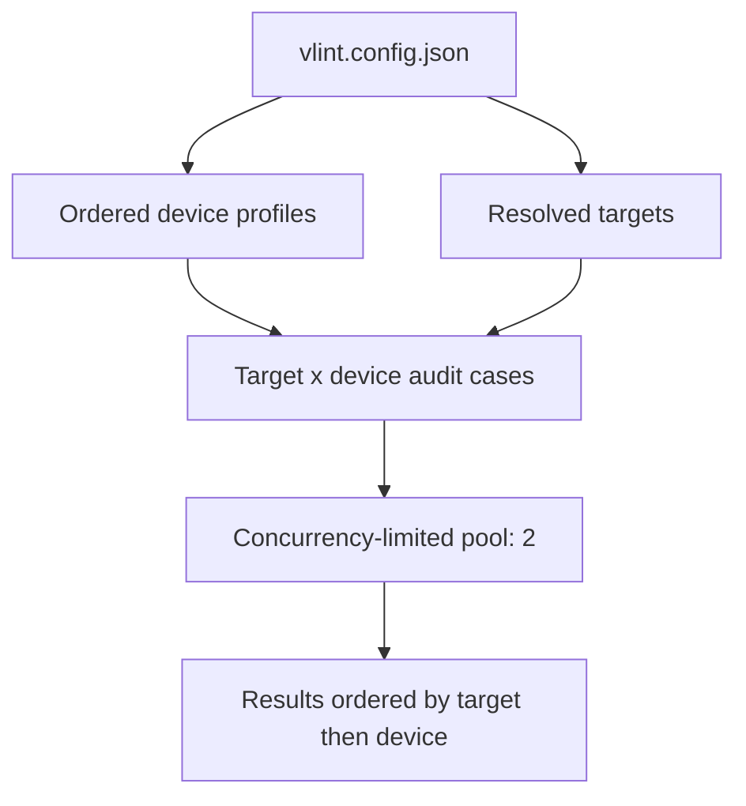
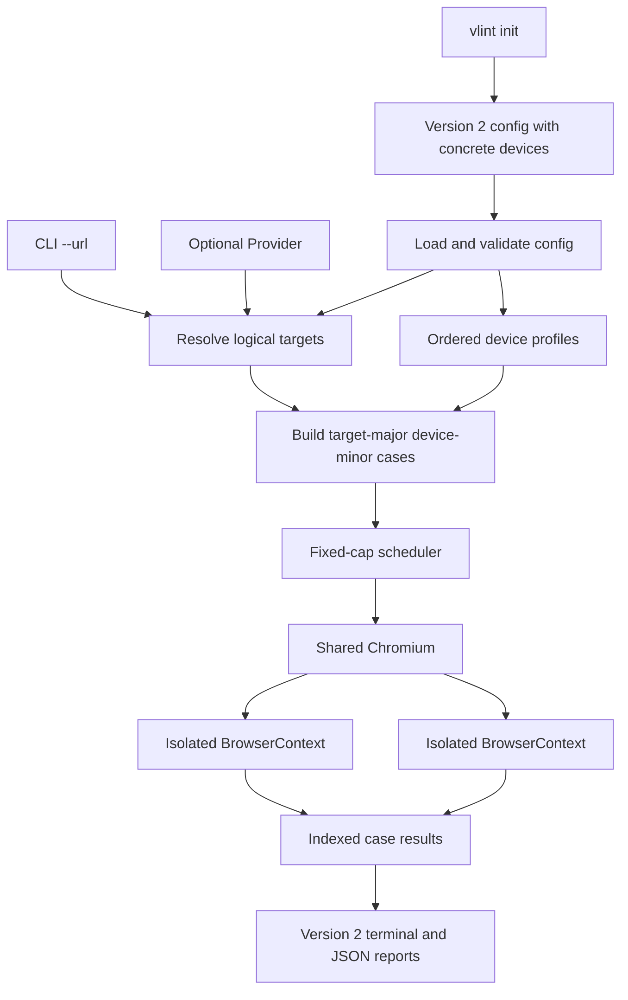
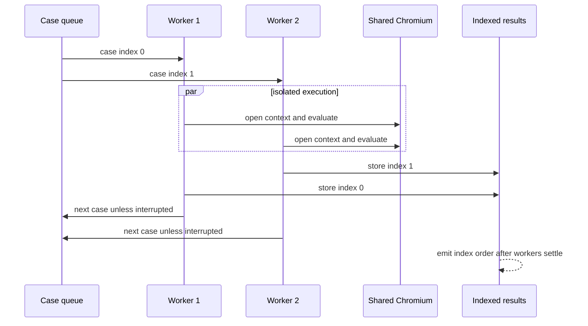

# Multi-device audits - Plan

## Goal Capsule

- **Objective:** 1回の`vlint check`でMacBook Air 13インチとiPhone 17相当のレイアウトを監査し、desktopだけでは見逃すmobile崩れをDOM geometryで検出する。
- **Authority:** Product Contractが利用者向け挙動とscopeを定め、Planning Contractが実装方針を定める。矛盾時はProduct Contractを優先する。
- **Execution profile:** Config、CLI、browser lifecycle、orchestrator、result schemaを一括でversion 2へ切り替え、既存の境界結果と実browser検証パターンを拡張する。
- **Open blockers:** なし。
- **Stop conditions:** Playwright 1.61.1の公開device registryからiPhone 17 descriptorを取得できない場合、独自UAや近似profileへ黙ってfallbackせず、dependencyまたは製品判断へ戻す。
- **Tail ownership:** executorはunit test、integration test、compiled-binary acceptance、golden、README、release validationまで完了する。

---

## Product Contract

### Summary

`vlint`へ設定駆動のmulti-device監査を追加する。
標準設定はMacBook Air 13インチとiPhone 17相当を含み、全targetを両deviceで最大2ケースずつ並列監査する。

### Problem Frame

現在の監査は1 targetにつき1 viewportだけを使い、組み込み値は`1280×720`である。
実際にはmobileでだけ崩れるケースが多く、AIエージェントによるスクリーンショット確認と既存監査の両方が見逃した崩れを、人間の直接確認で発見したことがある。
単一desktop viewportを通過したことは、主要なmobile表示が成立する証拠にならない。

### Key Decisions

- **特定モデルを標準にする。** 抽象的なdesktop/mobile breakpointではなく、2026年7月時点のMacBook Air 13インチとiPhone 17を監査基準にする。
- **設定をdevice authorityにする。** 組み込みdevice fallbackを持たず、`vlint init`が標準deviceを明記した設定を生成する。利用者はこの一覧を追加、削除、並べ替えできる。
- **初期化は非破壊にする。** `vlint init`は既存の`vlint.config.json`を上書きまたはmergeせず、既存時は失敗する。
- **全targetと全deviceの直積を監査する。** 標準2deviceは排他的な選択肢ではなく、1回の実行で各targetへ両方を適用する。
- **上限2で並列化する。** 全監査ケースを最大2件まで同時実行し、device追加時もCPU、memory、対象serverへの負荷を制限する。
- **個別失敗で打ち切らない。** navigation、readiness、rule評価などの失敗をケース単位で収集し、開始可能な全ケースを最後まで監査する。
- **結果の二つのidentityを保つ。** targetとdeviceを別フィールドとして報告し、並列完了順にかかわらず設定上の順序で出力する。

### Actors

- A1. **AIエージェント:** 1回のcommandと構造化結果から、device固有の違反と実行失敗を特定する。
- A2. **開発者:** projectを初期化し、ad hoc URLまたは宣言済みtargetを監査する。
- A3. **導入チーム:** projectに必要なdeviceとtarget Providerを設定する。
- A4. **対象application:** 並列アクセス可能な再現可能pageを提供する。

### Requirements

**Initialization and configuration**

- R1. `vlint init`は、標準device一覧と標準ruleを持ち、URLまたはProviderを持たない有効な`vlint.config.json`を現在directoryへ生成する。
- R2. `vlint init`は`vlint.config.json`が既に存在する場合、その内容を変更せず失敗する。
- R3. 標準desktop deviceはMacBook Air 13インチM5のデフォルト論理画面を想定し、CSS viewport `1470×956`とdevice scale factor `2`を使う。
- R4. 標準mobile deviceはPlaywright 1.61.1のiPhone 17 descriptorを基準とし、screen `402×874`、CSS viewport `402×681`、device scale factor `3`、mobile mode、touch、iPhone相当user agentを使う。
- R5. iPhone 17監査はChromium上のdevice emulationとし、SafariまたはWebKitの描画再現を保証しない。
- R6. device一覧は非空かつ順序付きで、各deviceは一意な名前を持つ。
- R7. 利用者は設定内のdevice一覧を編集して標準deviceを削除、変更し、任意のdeviceを追加できる。
- R8. `vlint check`はad hoc監査を含む全監査で有効な`vlint.config.json`を要求し、組み込みdeviceへfallbackしない。
- R9. target Providerは設定上optionalとし、`vlint check --url <URL>`に使うdevice-only設定を許可する。
- R10. `vlint`の更新は既存設定を自動変更せず、`init`時点のdevice定義をprojectへ固定する。

**Target resolution and execution**

- R11. `--url`指定時はそのURLを単一targetとして使い、設定内のProviderを解決しない。
- R12. `--url`がなくProviderもない場合は、browser起動前に監査target不足として実行を失敗させる。
- R13. target解決後、各targetを各deviceでちょうど1回ずつ監査する。
- R14. 全監査ケースを共有run内で最大2件まで同時実行し、設定されたdevice数に応じて並列上限を引き上げない。
- R15. browser launchなどrun全体を開始できない失敗を除き、個別ケースの失敗後も他の監査ケースを開始して完了させる。
- R16. 同一ケースのruleは同じ描画状態へ適用し、layout違反を全件収集する。

**Results and diagnostics**

- R17. 各ケース結果はtarget identityとdevice identityを別々に含める。
- R18. 各ケース結果は実効viewport、device scale factor、emulation特性、完了状態、rule結果、違反、実行失敗をdeviceと対応付ける。
- R19. terminalとJSONはtarget宣言順を第一key、device設定順を第二keyとして結果を安定順序で返す。
- R20. 1件以上の個別ケースが実行または評価に失敗したrunは、成功した他ケースの結果を保持したままincompleteとして報告する。

### Key Flows

- F1. **初期設定を生成する**
  - **Trigger:** A2が設定のないprojectで`vlint init`を実行する。
  - **Actors:** A2
  - **Steps:** 既存ファイルがないことを確認し、標準2deviceと標準ruleを持つ設定を生成する。
  - **Outcome:** URLを後から引数またはProviderで供給できるdevice-only設定が残る。
- F2. **単一URLを両deviceで監査する**
  - **Trigger:** A1またはA2が`vlint check --url <URL>`を実行する。
  - **Actors:** A1またはA2、A4
  - **Steps:** 設定からdeviceを読み、引数のURLと直積にして上限2で監査する。
  - **Outcome:** MacBook AirとiPhone 17の結果がtarget/device別に返る。
- F3. **宣言済みtarget集合を監査する**
  - **Trigger:** A1またはA2がURL引数なしで`vlint check`を実行する。
  - **Actors:** A1またはA2、A3、A4
  - **Steps:** Providerから有限target集合を解決し、全targetと全deviceの直積を上限2で監査する。
  - **Outcome:** 設定順の全ケース結果が返り、個別失敗があっても残りの監査を継続する。

### Acceptance Examples

- AE1. **新規初期化:** `vlint.config.json`がないdirectoryで`vlint init`を実行すると、MacBook Air 13インチとiPhone 17の2deviceを含むURLなし設定が生成される。
- AE2. **既存設定の保護:** 既存設定があるdirectoryで`vlint init`を実行すると失敗し、file bytesは変化しない。
- AE3. **Device-only ad hoc監査:** `init`直後に`vlint check --url http://localhost:3000/`を実行すると、同じURLを標準2deviceで監査する。
- AE4. **Target情報不足:** device-only設定でURL引数なしの`vlint check`を実行すると、browser起動前にtarget不足として失敗する。
- AE5. **直積と順序:** 2 targetと標準2deviceを設定すると4ケースを監査し、完了時刻にかかわらず`target 1 × device 1`、`target 1 × device 2`、`target 2 × device 1`、`target 2 × device 2`の順で出力する。
- AE6. **継続する個別失敗:** 1ケースのnavigationが失敗しても他ケースを監査し、成功結果と失敗結果を保持したincomplete runを返す。
- AE7. **Device一覧の編集:** 利用者がdevice一覧を1件へ変更すると、各targetをその1deviceだけで監査する。
- AE8. **設定なし監査の拒否:** `vlint.config.json`がない状態では、`--url`指定の有無にかかわらず`check`は設定不足として失敗する。

### Scope Boundaries

- Safari/WebKit固有の描画差と実機Safariの完全再現は対象外とする。
- 横向きprofile、tablet、Android、追加desktopを標準設定へ含めない。利用者による追加設定は許可する。
- route自動探索、target推論、対話式`init`は追加しない。
- 並列上限の利用者設定と無制限並列実行は追加しない。
- screenshot比較、画像理解、pixel diffは引き続き対象外とする。

### Dependencies / Assumptions

- 対象applicationは最大2件の同時navigationと監査に耐え、固定dataと認証stateを各browser contextへ再現できる。
- MacBook Airの`1470×956`はmacOSのデフォルト論理表示領域を監査viewportとして扱い、browser chromeが占める高さは差し引かない。
- iPhone user agentはdevice identityの再現に使うが、ChromiumをSafariへ変えるものではない。

### Sources / Research

- `src/config/merge.ts:13-19,60` — 現在の単一viewportと`1280×720`組み込みdefault。
- `src/commands/check.ts:19-42` — 現在のimplicit configとad hoc URL解決。
- `src/config/schema.ts:223-238,296,327-350` — 現在の必須Providerと非空target契約。
- `src/run/orchestrator.ts:193-232` — 現在の逐次target処理と実行失敗時fail-fast。
- `src/browser/lifecycle.ts:5,47-52,65-69,112` — 共有Chromiumと現在のbrowser context項目。
- `src/contracts/result.ts:16-25` — 現在のtarget result identity。
- [Apple MacBook Air Tech Specs](https://www.apple.com/macbook-air/specs/) — MacBook Air 13インチM5のdisplay仕様。
- [Apple iPhone 17 Tech Specs](https://www.apple.com/iphone-17/specs/) — iPhone 17のdisplay仕様。
- [Playwright Emulation](https://playwright.dev/docs/emulation) — device registryとmobile emulationの公式契約。
- [Playwright Browser.newContext](https://playwright.dev/docs/api/class-browser#browser-new-context) — viewport、screen、device scale factor、mobile、touch、user agent、context isolationの公式契約。

---

## Planning Contract

### Product Contract Preservation

Product ContractはR4だけを変更した。
Playwright 1.61.1の標準iPhone 17 descriptorとユーザー確認に基づき、誤ってscreen heightを使っていたviewportを`402×874`から`402×681`へ修正し、screen `402×874`を明記した。

### Key Technical Decisions

| ID | Decision | Rationale |
|---|---|---|
| KTD1 | ConfigとJSON resultをschema version 2へclean cutoverする | device必須化、Provider optional化、`targets`から`cases`への変更は公開契約の破壊的変更であり、version 1へ二つの意味を持たせない |
| KTD2 | Device emulationをtarget defaultsから独立したordered profileとして表現する | viewport、screen、DPR、mobile、touch、UAを一つのauthorityへ集約し、target単位の競合するviewport sourceを残さない |
| KTD3 | `init`はPlaywrightの公開iPhone 17 descriptorを具体値へ正規化して設定へ保存する | runtime fallbackを作らず、生成時点のprofileをprojectへ固定する。Chromium固定に反する`defaultBrowserType`は保存しない |
| KTD4 | target-major、device-minorの順でaudit caseをbrowser起動前に解決する | 直積の件数、identity、順序を一度確定し、schedulerとreporterへ同じimmutable planを渡す |
| KTD5 | 一つのChromium process上で独立BrowserContextを最大2件並列実行する | context isolationを維持しながらnavigation待ちを重ね、無制限のCPU、memory、server負荷を避ける |
| KTD6 | 結果schemaはlogical target数とaudit case状態を分離する | `summary.targets.resolved`は元target数、`summary.cases`は実行partition、`cases`配列はtarget/device別結果とし、agentが件数を誤解しない |
| KTD7 | 個別failureはcaseへ、run全体failureはrunへ帰属させる | 複数case failureを失わず、config、Provider、browser launch、browser-wide cleanupの失敗と区別する。Failureにはnullable device identityを追加する |
| KTD8 | 外部interruptだけはcollect-allの例外として新規dispatchを停止する | ユーザーのcancel意思を尊重し、開始済みscopeをcloseして未開始caseをnot-executedに保つ |

Config version 1とresult version 1のparser、migration shim、alias、deprecated fieldは残さない。
既存projectは`vlint init`で上書きせず、version 2形式へ明示的に設定を更新する。

### High-Level Technical Design

Config resolutionと実行の責務を次の境界へ分ける。

Schedulerは宣言順indexを先に確保し、最大2 workerがcaseを取得する。
各workerはcontext作成、navigation、readiness、rule評価、context closeを一つのresource scopeとして完了し、結果を元indexへ格納する。

Caseのnavigation、readiness、rule、context cleanup failureはそのcaseへ保存し、他workerを停止しない。
一つでもcase failureがある場合、global zero-label finalizationは部分観測から誤判定しないようnot-executedとする。
config、Provider、browser launch failureはcase dispatch前のrun failureとし、browser-wide cleanup failureは観測済みcaseを保持したrun failureとする。

### System-Wide Impact

- **Configuration:** `schemaVersion: 2`と非空device一覧が必須になる。Providerは`--url`利用projectに限り省略でき、target側のviewport/DPR overrideは廃止する。
- **CLI:** zero-config ad hoc checkは終了し、`init`が導入入口になる。exit mappingはclean `0`、violations `1`、incompleteまたはCLI/config error `2`を維持する。
- **Browser lifecycle:** 同一browserで最大2 contextが同時に存在する。storage state、locale、timezone、readiness、timeoutはcaseごとに従来どおり適用する。
- **Machine consumers:** JSONはversion 2となり、target/device identity、case failure、logical target count、case countを区別できる。
- **Documentation:** READMEのinstall後flow、config reference、result schema、failure semantics、互換性説明、examplesをversion 2へ更新する。

### Risks and Mitigations

| Risk | Impact | Mitigation |
|---|---|---|
| Config/result version 1 consumerが破損する | 既存設定とJSON parserがそのまま動かない | version 2を明示し、READMEに移行差分を集約する。互換shimで曖昧化しない |
| Playwright device descriptorが将来変わる | 新規`init`結果がversion間で変わり得る | dependencyをpinし、生成済み設定を自動更新しない。標準profile値をacceptanceで固定する |
| 並列contextが対象applicationの共有stateへ干渉する | flakyまたは異なる描画状態になる | contextを分離し、固定data前提を維持し、最大2件のrepeatabilityをintegration/acceptanceで確認する |
| Case failureとfinalization failureが混同される | agentが誤った修正対象を選ぶ | case/run/finalizationのfailure帰属を分離し、partial観測時はglobal finalizationを実行しない |
| Interruptまたはcleanupでcontextが残る | process leak、hang、後続test汚染 | workerごとのfinally closeとrun-wide closeを維持し、中断時のnot-executed partitionとresource解放を検証する |
| 並列完了順がoutputへ漏れる | 同一入力でJSON/goldenが揺れる | pre-seeded indexへ結果を保存し、逆順完了testとbyte-exact goldenで固定する |

### Alternatives Considered

- **組み込み2deviceをfallbackする案:** 設定を唯一の正にできず、projectごとの監査条件がbinary versionへ依存するため不採用。
- **Config/result version 1を維持する案:** 同じschema versionへ破壊的に異なる意味を持たせるため不採用。
- **全caseを`Promise.all`で無制限実行する案:** target数に比例してresourceとserver負荷が増えるため不採用。
- **iPhone descriptorのWebKitを起動する案:** Chromium固定というProduct Contractを変えるため不採用。
- **並列上限を設定可能にする案:** 今回のscope外であり、設定と検証行列を増やすため不採用。

### Sequencing

U1でversion 2 configとaudit case contractを確定する。
U2、U3、U4はU1後に進められる。
U5はdevice contextとresult contractを前提にschedulerを切り替え、U6がcompiled binary、documentation、release gateを統合する。

---

## Implementation Units

### U1. Version 2 config and audit case resolution

- **Goal:** deviceを唯一のviewport authorityとするversion 2 configを読み、logical targetとordered deviceの直積を決定的なaudit case列へ解決する。
- **Requirements:** R6-R13、R19、F2、F3、AE3-AE5、AE7、AE8
- **Dependencies:** なし
- **Files:** `src/contracts/config.ts`, `src/contracts/failure.ts`, `src/config/schema.ts`, `src/config/load.ts`, `src/config/merge.ts`, `src/commands/check.ts`, `tests/unit/config.test.ts`, `tests/unit/check.test.ts`
- **Approach:** Config contractをversion 2へ切り替え、非空・一意名のdevice profileとoptional Providerを検証する。viewport、screen、DPR、mobile、touch、UAはdeviceへ集約し、target/defaultsのviewportとDPRは削除する。`--url`はProviderを解決せず、URLもProviderもない場合は専用のtarget-source failureをbrowser起動前に返す。
- **Patterns to follow:** `src/config/schema.ts`のexact-key、bounded-number、non-empty、duplicate-name validationと、`src/config/merge.ts`の宣言順を保つpure resolution。
- **Test scenarios:**
  - Covers AE3. Providerなしのversion 2 configと`--url`から、ad hoc target × 全deviceのcaseをtarget-major/device-minor順で解決する。
  - Covers AE4. Providerなし、`--url`なしではtarget-source failureを返し、browser dependencyを呼ばない。
  - Covers AE5. 2 target × 2 deviceを4 caseへ解決し、target順を第一、device順を第二として保持する。
  - Covers AE7. device一覧を1件へ編集すると各targetから1 caseだけを作る。
  - Covers AE8. configなしの`--url`監査をimplicit fallbackせず`config-not-found`にする。
  - 空device一覧、duplicate device名、unknown field、不正viewport/screen/DPR、mobile/touch/UA型、version 1 configをschema failureにする。
  - Command Providerの出力順とstatic Provider順をdevice直積後も維持する。
- **Verification:** config resolutionだけでcase件数、identity、context値、順序、pre-browser failureが確定し、組み込みdevice値へ依存しない。

### U2. Non-destructive init command

- **Goal:** 標準2deviceと標準ruleを持つURLなしversion 2 configを安全に生成する。
- **Requirements:** R1-R5、R8-R10、F1、AE1、AE2
- **Dependencies:** U1
- **Files:** `src/commands/init.ts`, `src/cli.ts`, `src/contracts/failure.ts`, `tests/unit/init.test.ts`, `tests/unit/cli.test.ts`, `tests/unit/cli-run.test.ts`, `tests/integration/cli-acceptance.test.ts`
- **Approach:** 引数なし`init`を既存CLI dispatchへ追加する。MacBook profileは確認済み論理displayを具体値で生成し、iPhone profileはPlaywright公開device registryからcontextに必要なfieldだけを正規化して保存する。config fileはexclusive-createで開き、既存fileとのcheck-then-write raceを作らない。成功時は安定した1行、既存またはwrite failure時はsafeな1行とexit `2`を返す。
- **Patterns to follow:** `src/cli.ts`のdiscriminated invocation、browser install boundary、terminal escaping、`src/config/load.ts`のbounded config filename/error classification。
- **Test scenarios:**
  - Covers AE1. 空directoryで`init`するとparse可能なversion 2 configを生成し、Provider/URLを含まず、MacBook `1470×956@2`とiPhone screen `402×874`・viewport `402×681@3`を含む。
  - Covers AE2. regular file、directory、symlinkを含む既存pathでは上書きせず失敗し、既存bytesを変えない。
  - `init`へのunknown/duplicate argumentをbrowserまたはfilesystem処理前にCLI parse errorにする。
  - Playwright registryからiPhone 17が取得できない場合、近似deviceを生成せず失敗する。
  - 成功stdoutと失敗stderrをcontrol characterなしの1行へ固定する。
- **Verification:** 生成直後のfileを通常loaderが受理し、再実行は非破壊で拒否される。

### U3. Device-aware Chromium contexts

- **Goal:** 各audit caseを独立したChromium BrowserContextへ正確なdevice emulationで適用する。
- **Requirements:** R3-R5、R13、R16、R18、F2、F3
- **Dependencies:** U1
- **Files:** `src/browser/lifecycle.ts`, `tests/integration/browser-lifecycle.test.ts`
- **Approach:** audit caseからviewport、screen、DPR、UA、mobile、touchと既存locale/timezone/storage stateを一つのcontext optionへ写像する。stateあり・なしの両context作成pathへ同じoptionを渡し、共有browserとcase単位のclose ownershipを維持する。
- **Patterns to follow:** `contextOptionsFor`のpure mapping、`acquireTargetScope`のboundary failure stamping、context/pageのgraceful cleanup。
- **Test scenarios:**
  - MacBook profileでviewport、screen、DPR `2`、desktop mode、touchなしをpage内から確認する。
  - iPhone 17 profileでviewport `402×681`、screen `402×874`、DPR `3`、UA、mobile viewport behavior、touch supportをpage内から確認する。
  - browser stateあり・なしの両pathが同じdevice optionを受け取る。
  - context作成、page作成、navigation前処理、closeの各failureがtarget/device identityを失わない。
  - 二つのcontextがcookie、cache、storageを共有せず同時に存在できる。
- **Verification:** Playwrightが受理した実効contextとcase resultのemulation情報が一致し、全failure pathでcontextが残らない。

### U4. Version 2 case results and reporters

- **Goal:** logical target、device、case状態、case failure、run failureを曖昧なく表すversion 2 resultを提供する。
- **Requirements:** R17-R20、A1、F2、F3、AE5、AE6
- **Dependencies:** U1
- **Files:** `src/contracts/result.ts`, `src/contracts/failure.ts`, `src/output/terminal.ts`, `src/output/json.ts`, `tests/golden/reporter-golden.test.ts`, `tests/golden/fixtures/violations.terminal.txt`, `tests/golden/fixtures/violations.json.txt`, `tests/golden/fixtures/incomplete.terminal.txt`, `tests/golden/fixtures/incomplete.json.txt`
- **Approach:** outputをschema version 2へ切り替え、ordered `cases`、logical target count、case partition、case failure、nullable run failureを定義する。Failureへnullable device identityを加える。terminalはtarget/deviceを別々にescapeし、JSONはexact fieldを単一行で出力する。
- **Patterns to follow:** 現行のsafe terminal encoding、URL redaction、single-line exact JSON、adversarial golden fixtures。
- **Test scenarios:**
  - Covers AE5. terminalとJSONがtarget/deviceを別fieldで表し、4 caseを同じ宣言順で出力する。
  - Covers AE6. 一つのcase failureと成功caseを同じincomplete resultに保持し、failureへ正しいtarget/device/ruleを付ける。
  - `summary.targets.resolved`はlogical target数、case partition合計は`cases.length`、rule partition合計は全case-rule pair数と一致する。
  - clean `0`、violations `1`、case/run/finalization failure `2`のexit分類を維持する。
  - secret query、fragment、control sequence、bidi、改行を既存goldenと同じ安全性で処理する。
- **Verification:** version 2 resultの全partitionがreconcileし、terminal/JSONを繰り返しrenderしてbyte-identicalになる。

### U5. Bounded collect-all orchestration

- **Goal:** 全audit caseを最大2件で並列実行し、完了順や個別failureに左右されない完全で決定的なrun結果を作る。
- **Requirements:** R13-R16、R19、R20、F2、F3、AE5、AE6
- **Dependencies:** U3、U4
- **Files:** `src/run/orchestrator.ts`, `tests/unit/result.test.ts`, `tests/integration/result-transitions.test.ts`
- **Approach:** case resultを宣言順にpre-seedし、`min(2, cases.length)`件のworker（最大2件）が共有queueからindexを取得する。worker内のruleは逐次評価し、case failure後も別caseをdispatchする。外部interrupt時だけ新規dispatchを止め、開始済みscopeをcloseする。case failureがあればglobal finalizationをnot-executedとし、全case成功時だけ全rule finalizationを評価する。
- **Execution note:** 既存fail-fast expectationを先にcollect-all contractへ置き換え、逆順完了と同時failureのdeterministic harnessを作ってからschedulerを変更する。
- **Patterns to follow:** seeded result transition、BoundaryResultによる例外封じ込め、rule内のpartial/failed/not-executed区別、finally相当のscope close。
- **Test scenarios:**
  - Covers AE5. 4 caseでactive countが一度も2を超えず、完了順を逆転してもresult順を変えない。
  - Covers AE6. navigation failure、rule failure、context cleanup failureを異なるcaseで同時に発生させ、未失敗caseをすべて完了する。
  - device 1件またはcase 1件では不要なworkerを作らず、同じpartition invariantsを満たす。
  - interrupt後は新規caseを開始せず、開始済みcaseをcloseし、未開始caseをnot-executedとしてincompleteにする。
  - browser launch failureは全caseをnot-executedにし、browser-wide close failureは観測済みcase結果を保持する。
  - 一つでもcase failureがあればfinalizationをnot-executedにし、全case成功時は全ruleのzero-label finalizationを宣言順に評価する。
- **Verification:** repeat runでcase順、summary、failure帰属が一致し、終了後のactive contextとchild resourceが0になる。

### U6. Compiled acceptance, migration documentation, and release proof

- **Goal:** 実binaryで全confirmed flowを証明し、導入とschema version 2への移行を利用者へ説明する。
- **Requirements:** R1-R20、F1-F3、AE1-AE8
- **Dependencies:** U2、U5
- **Files:** `tests/acceptance/vlint.test.ts`, `README.md`
- **Approach:** compiled binaryをloopback fixtureへ接続し、initからad hoc監査、Provider監査、multi-device違反、collect-all failureまでを通す。READMEのquick start、config schema、device追加/削除、result schema、exit/failure semantics、version 1からの移行、Chromium/WebKit境界をversion 2へ置き換える。
- **Execution note:** unit testの再現ではなく、production binary、管理Chromium、生成された実configを使うsmoke-first proofにする。
- **Test scenarios:**
  - Covers AE1 / AE2. compiled `init`の生成内容、成功出力、既存file保護、exitを検証する。
  - Covers AE3 / AE8. init後の`check --url`は2deviceを監査し、configなしでは同じcommandがbrowser起動前に失敗する。
  - Covers AE4. device-only configの引数なしcheckがtarget-source failureになる。
  - Covers AE5. 2 target × 2 deviceの4 caseとdevice固有viewportをJSONで確認する。
  - Covers AE6. 一つのnavigation failure後も他caseが完了し、runがincompleteになる。
  - Covers AE7. device一覧を1件へ編集したconfigでcase数がtarget数と一致する。
  - mobile fixtureでdesktopはclean、iPhoneだけが違反する状態を作り、元の見逃しを実browserで再現する。
- **Verification:** clean Ubuntu向けcompiled binaryでinit、browser install済みcheck、全acceptance、release validationが通り、README手順だけで同じ結果を再現できる。

---

## Verification Contract

| Gate | Applies to | Evidence |
|---|---|---|
| `bun run typecheck` | U1-U6 | version 2 contract、Playwright context options、CLI runtimeの全callsiteが整合する |
| `bun run check:architecture` | U1-U6 | 新commandとcontractが既存layer boundaryを破らない |
| `bun run test:unit` | U1、U2、U4、U5 | schema、resolution、CLI、result transitions、scheduler、goldenが決定的に通る |
| `bun run test:integration` | U2-U5 | CLI boundary、real context emulation、parallel lifecycle、failure partitionが通る |
| `bun run build:linux-x64`後の`bun run test:acceptance` | U6 | production binaryでAE1-AE8とmobile-only regressionを再現する |
| `bun run test:feasibility` | U2-U6 | compiled runtimeとfixture serverの実行可能性を維持する |
| `bun run release:validate` | U6 | release archive、checksum、clean Ubuntu、browser payload、README導線を含むrelease gateが通る |

Smoke proofは`vlint init`で生成した設定を変更せず`check --url`へ渡し、同じURLについてMacBookとiPhoneの二つのcaseが出ることをproduction binaryから確認する。
並列性のproofはwall-clock比較ではなくactive context counterで上限2を固定し、遅延を反転したcaseでもoutput順が変わらないことを確認する。

---

## Definition of Done

- Product Contract preservation noteどおり、R4以外のProduct Contract本文とR/F/AE IDが維持されている。
- Configとresultがschema version 2として一貫し、version 1 shim、alias、deprecated field、implicit device fallbackが残っていない。
- U1-U6の各Verificationと対応test scenarioが完了している。
- `vlint init`が非破壊で再現可能な標準設定を生成し、その設定がad hoc監査へ直結する。
- 全target × device caseが固定上限2で実行され、個別failure後も未開始caseを監査する。
- target/device identity、case/run/finalization failure、logical target count、case partitionがterminalとJSONで矛盾しない。
- compiled binaryでdesktop clean・mobile violationの回帰を検出し、元の見逃しを再現不能にする。
- 全resourceが成功、failure、interruptの各pathでcloseされ、repeat実行が同じ結果を返す。
- READMEがversion 2設定、移行、device編集、Chromium emulation、exit semanticsを正確に説明する。
- 実装途中のdead-end code、旧schema fixture、使われないhelper、compatibility scaffoldingが最終diffから除去されている。
