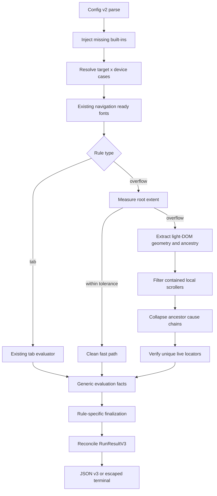

# Page Horizontal Overflow - Implementation Plan

## Goal Capsule

- **Objective:** Add an opt-out `page-horizontal-overflow` DOM-geometry rule that reports actionable, element-scoped causes of unintended root-page horizontal scrolling for every declared target × device case.
- **Authority:** Product Contract R1-R23 and AE1-AE9 define behavior; Planning Contract KTD1-KTD15 defines implementation boundaries; existing result ordering, failure preservation, escaping, browser readiness, and exit-code contracts remain authoritative where this plan is silent.
- **Execution profile:** Clean cutover to result schema v3; config schema remains v2 so existing configs can receive the new default rule without migration.
- **Stop conditions:** Do not ship a page-level boolean without attributed causes, do not treat every local scroller as a violation, do not retain tab-specific result terminology, and do not claim support for shadow roots or descendant browsing contexts.
- **Tail ownership:** Update public documentation, generated init config, exact golden outputs, compiled-binary acceptance fixtures, and release validation in the same change.
- **Product Contract preservation:** Product Contract unchanged. The implementation decisions below operationalize existing terms such as “root overflow,” “contained local scroll,” and “escaping chain” without changing R/AE scope.

---

## Product Contract

### Summary

Add `page-horizontal-overflow` as vlint's second audit rule. It detects unintended root-page horizontal overflow per target × device and reports one violation per independent attributed cause, including a verified locator, overflow amount, geometry, and a bounded computed-CSS evidence object. It is enabled by default for new and existing schema-v2 configs and can be disabled for the project or one target.

### Problem Frame

Responsive layout regressions often create a horizontal page scrollbar only at narrow viewports. A page-level `scrollWidth > viewport` signal proves the symptom but does not tell an AI agent what to edit. Reporting every protruding descendant produces duplicate noise, while suppressing every element inside `overflow-x:auto|scroll` hides real failures when that scroller itself escapes the viewport. The rule therefore needs a deterministic source-attribution contract, not only a root boolean.

### Actors

- A1. AI coding agent running `vlint check` and consuming terminal or JSON diagnostics.
- A2. Developer configuring project-wide rules and target-specific overrides.
- A3. CI or release consumer using exit status and schema-versioned JSON.

### Requirements

**Rule lifecycle and execution**

- R1. Add a built-in rule type named `page-horizontal-overflow` and execute it in the existing target × device × rule partition.
- R2. Enable the rule by default for new configs and existing schema-v2 configs, including configs with an explicit tab-rule list.
- R3. Allow explicit project-level and target-level opt-out without adding a second disable mechanism.
- R4. Keep the rule selector-free; it audits the top-level page rather than declared candidate selectors.
- R5. Measure only after the existing navigation, optional ready condition, and web-font readiness sequence succeeds.
- R6. Preserve declared case/rule order, bounded case concurrency, collect-all behavior across cases, and stop-after-first-rule-failure behavior within a case.

**Verdict and attribution**

- R7. Base the verdict on root horizontal extent in CSS pixels and a numeric tolerance; vertical extent must not affect the verdict.
- R8. Return clean when root horizontal overflow does not exceed tolerance.
- R9. Use browser DOM/CSSOM geometry only; no screenshots, image understanding, or LLM classification.
- R10. If root overflow exists, return element-scoped attributed causes rather than only a page-level boolean.
- R11. Treat `overflow-x:auto|scroll` as a local boundary only when it is actually horizontally scrollable.
- R12. Suppress descendant overflow contained by an active local boundary whose own border box remains within the root viewport.
- R13. Do not suppress an active local boundary that itself breaches the root viewport; attribute that escaping boundary as a cause.
- R14. Collapse ancestor-descendant contributors in one escaping chain to one attributed cause.
- R15. Preserve unrelated cause chains as separate violations.
- R16. Resolve each attributed element to a live, unique light-DOM locator using the existing locator preference and verification contract.

**Diagnostics and compatibility**

- R17. Emit per-cause horizontal overflow amount, representative border-box geometry, and locator.
- R18. Emit a deterministic bounded allowlist of relevant computed CSS, not an unrestricted style dump or full ancestor chain.
- R19. Include enough width, positioning, whitespace, overflow, flex, and grid evidence for an agent to identify likely corrective CSS.
- R20. Return causes in top-level document order and keep repeated identical runs byte-stable.
- R21. Generalize shared evaluation/result terminology; page results must not expose `labelsInspected`, `lineCount`, or other tab-only fields.
- R22. Preserve status and exit semantics: clean `0`, violations `1`, incomplete `2`, with incomplete dominating violations.
- R23. Preserve already observed facts/violations when a later locator verification or protocol operation fails, and retain target/device/rule identity on the failure.

### Flows

- F1. **Default audit:** Config v2 loads; missing built-in rule types are injected; each ready target × device case runs tab and overflow rules in deterministic order; result reconciliation determines status and exit code.
- F2. **Project opt-out:** A configured `page-horizontal-overflow` instance with `enabled:false` suppresses implicit injection and produces disabled rule partitions except for targets explicitly re-enabled with `target.ruleOverrides[ruleName].enabled:true`.
- F3. **Target opt-out:** `target.ruleOverrides[ruleName].enabled:false` overrides project enablement only for that target.
- F4. **Root fit fast path:** Root extent is measured; overflow at or below tolerance returns clean without a full candidate/style scan.
- F5. **Cause attribution:** Root overflow triggers one light-DOM extraction pass, local-boundary filtering, ancestor-chain grouping, representative selection, CSS collection, then authoritative locator verification.
- F6. **Partial failure:** Verified causes remain in facts; a later verification/protocol failure marks the rule failed, later rules in that case not-executed, and other cases continue.
- F7. **Interrupt:** Existing abort normalization stops new case dispatch, closes active scopes, records one run-level interrupt, and leaves unstarted partitions not-executed.

### Acceptance Examples

- AE1. A page whose root width equals the configured viewport is clean on desktop and mobile.
- AE2. A wide child fully contained by an active, viewport-contained `overflow-x:auto` or `scroll` ancestor is clean.
- AE3. The same local scroller is a violation when its own border box breaches the root viewport.
- AE4. One parent-child escaping chain yields one violation; two unrelated chains yield two violations in document order.
- AE5. Each overflow violation includes a unique locator, per-cause amount, geometry, and the fixed CSS evidence shape.
- AE6. Project and target `enabled:false` produce disabled rule results without evaluation.
- AE7. A page that grows only vertically is clean.
- AE8. Repeated runs against unchanged content and device configuration produce the same verdict, cause order, locators, and serialized output.
- AE9. A locator verification failure preserves earlier verified causes and returns incomplete/exit `2`.

### Success Criteria

- Every supported target × device case receives an overflow rule partition unless disabled.
- The compiled CLI reproduces a responsive fixture that is desktop-clean and mobile-violating with the expected numeric overflow.
- Browser-backed coverage proves contained versus escaping local scrollers, chain collapse, unrelated causes, tolerance boundaries, vertical-only growth, locator drift, and partial-fact preservation.
- JSON schema v3 and terminal output are exact-golden stable and contain no tab-only fields for overflow results.

### Scope Boundaries

**Deferred for later**

- Click occlusion, tap-target sizing, text truncation, overlap/collision, general spacing/alignment, and generic semantic-label auditing.
- More expensive causal perturbation such as hiding/resizing elements to prove authored CSS causality.
- Additional settling/quiescence heuristics beyond the existing ready-condition and font contract.

**Outside this rule's identity**

- Screenshot or pixel-diff visual regression.
- Route discovery, crawling, user interaction, or viewport mutation outside declared target × device cases.
- Shadow-root traversal, cross-origin or same-origin iframe-document traversal, and image/LLM analysis.
- Intentional local horizontal scrolling that remains contained within its own viewport-contained boundary.

### Dependencies and Assumptions

- Playwright continues to provide Chromium DOM/CSSOM measurements and existing lifecycle readiness.
- Top-level light DOM is the locator authority. A frame can be reported only when the frame element itself contributes to top-level overflow.
- Generated pseudo-element overflow is attributed to its owning element when owner geometry exposes it; if root overflow is proven but no non-root representative survives, the rule emits one fallback cause on the scrolling element rather than returning clean.
- Dynamic applications own stabilization through the existing `readyCondition`; the rule adds no sleep or layout-quiescence loop.

### Outstanding Questions

None. Planning-time ambiguities are resolved by KTD1-KTD15.

---

## Planning Contract

### Context and Research

- `src/contracts/config.ts:27-37,68-102` and `src/config/schema.ts:153-200,252-299` hard-code tab-specific rule and override shapes. A second rule requires discriminated unions and type-aware strict-key validation.
- `src/config/merge.ts:22-51` currently treats explicit `rules` as a complete replacement and has target-only enablement. Default-on for existing explicit configs therefore requires missing-built-in injection plus rule-instance `enabled`.
- `src/commands/check.ts:68-103` dispatches every rule to `evaluateTabLabelSingleLine`; this is the production type-dispatch seam.
- `src/contracts/evaluation.ts:3-41`, `src/contracts/result.ts:1-76`, `src/run/orchestrator.ts:62-69,194-250`, and `src/output/terminal.ts:66-105` embed `labelsInspected`, tab violation fields, and zero-label finalization. These must move together to avoid compatibility shims.
- `src/rules/tab-label-single-line.ts:166-217,343-463,511-689` establishes the reusable pattern: closure-free in-page extraction, deterministic Node-side processing, a second live locator-verification round trip, three-decimal finite geometry, and partial-fact preservation.
- `src/rules/locator.ts:13-60,109-153` defines the locator preference and uniqueness contract reused by both rules.
- `src/browser/lifecycle.ts:440-482` already enforces the required navigation/ready/font sequence; the new evaluator must not add independent readiness.
- No `docs/solutions/` or `CONCEPTS.md` exists. The closest durable precedent is the schema-v2 multi-device plan, which requires clean result cutovers, deterministic partitions, exact golden output, and compiled-binary proof.
- External grounding in the upstream ideation artifact favors DOM-first overflow/source tracing and selective false-positive suppression over screenshot comparison.

### Key Technical Decisions

- KTD1. **Use discriminated rule unions.** Define `RuleType`, shared base fields, and distinct tab/overflow instance, effective-rule, target-override, violation, and rule-result shapes. Every switch over rule or violation type is exhaustive; no optional-field “bag” is introduced.
- KTD2. **Keep config schema v2, cut result schema to v3.** Config v2 is extended with the new type and optional `enabled` so existing files load and receive the new default. Public result fields change from tab-specific to generic, so `RunResultV3` replaces `RunResultV2` with no aliases or dual-write compatibility layer.
- KTD3. **Inject missing built-ins by type.** If no configured tab instance exists, prepend the standard tab instance. If no configured overflow instance exists, append the standard overflow instance. Preserve configured instance order. Any explicit overflow instance, including disabled, suppresses implicit overflow injection. Permit multiple named tab instances but at most one page-overflow instance.
- KTD4. **Use existing enablement precedence.** Effective enablement is `target override ?? rule instance ?? true`. Project opt-out is the overflow rule instance's `enabled:false`; target opt-out remains the named target override. No top-level disable collection is added.
- KTD5. **Make tolerance rule-level and deterministic.** `tolerancePx` is a finite CSS-pixel number in `[0,100]`, defaults to `1`, and is not target-overridable in this release. Root and cause thresholds both use strict `> tolerancePx`.
- KTD6. **Define root extent explicitly.** At the authoritative measurement point, `viewportWidth = document.documentElement.clientWidth`; `rootScrollWidth = max(document.scrollingElement?.scrollWidth, document.documentElement.scrollWidth, document.body?.scrollWidth)`. `rootOverflowPx = max(0, rootScrollWidth - viewportWidth)`, rounded with the existing three-decimal finite policy only when serialized. No vertical dimension participates.
- KTD7. **Gate expensive work behind root overflow.** If root overflow is at or below tolerance, return clean with `elementsInspected:0`. Otherwise perform one top-level light-DOM traversal and collect only serializable geometry, ancestry, active-boundary metadata, locator descriptors, and final-representative CSS.
- KTD8. **Define an active local boundary operationally.** It is a rendered ancestor whose computed `overflow-x` is `auto` or `scroll` and whose `scrollWidth > clientWidth + tolerancePx`. Suppress a descendant contribution only when the nearest active boundary's border box is within the root viewport. If that boundary breaches root, retain the boundary as an ordinary candidate. `hidden` and `clip` are not local scroll boundaries.
- KTD9. **Define attributed cause chains, not inferred authored causality.** A candidate is a rendered non-root element whose document-coordinate left or right extent breaches the root viewport by more than tolerance and is not suppressed by KTD8. Connect candidates only through ancestor-descendant relationships. One connected chain yields its outermost breaching non-`html`/`body` element as representative; unrelated chains remain separate. Sort representatives by extraction-time document index. Documentation calls these “attributed cause elements,” not guaranteed authored CSS root causes.
- KTD10. **Never turn proven root overflow into clean due to attribution limits.** If KTD6 proves overflow but no non-root representative remains, emit one fallback violation anchored to the scrolling element. This covers generated content, root styles, and unsupported contributor geometry without fabricating a non-root source.
- KTD11. **Report per-cause geometry and a fixed CSS allowlist.** `overflowPx` is the maximum left/right breach of the representative in CSS pixels. `geometry` is its border box. `computedStyle` has deterministic keys: `display`, `position`, `boxSizing`, `width`, `minWidth`, `maxWidth`, `whiteSpace`, `overflowX`, `flex`, `flexBasis`, `flexGrow`, `flexShrink`, `gridTemplateColumns`, and `gridAutoColumns`. Do not emit arbitrary CSS, ancestor chains, HTML, or text content.
- KTD12. **Generalize result counts.** Rename rule/fact/finalization `labelsInspected` to `elementsInspected` and summary `matchedElements` to `elementsInspected`. For overflow, the count is the number of rendered elements examined after the root fast path; it is diagnostic only. Zero-inspection failure remains a tab-only finalization policy.
- KTD13. **Reuse two-pass locator authority.** Compose locator candidates from the existing `ElementDescriptor`, then verify each against the live document in representative order. A 0 or multi-match result is a typed rule failure, not a dropped cause or knowingly non-unique locator. Previously verified causes remain in facts.
- KTD14. **Preserve orchestration semantics.** Type dispatch belongs in `src/commands/check.ts`; `src/run/orchestrator.ts` remains evaluator-agnostic except for type-specific finalization. Rule failure stops later rules only in that case; other cases continue; pre-seeded order remains authoritative over completion order.
- KTD15. **Keep output safe and explicit.** JSON serializes canonical v3 unchanged. Terminal rendering switches exhaustively on violation type, escapes every DOM-derived locator/CSS/text value with the existing terminal sanitizer, retains URL redaction, and uses deterministic field order.

### High-Level Technical Design

The browser pass supplies measurements, not verdict policy. Root/candidate arithmetic and chain grouping live in exported pure functions so tolerance, ancestry, boundary, tie, and ordering behavior can be tested without duplicating browser logic. The in-page function remains self-contained because Playwright serializes it.

### Public Contract Shape

Directional type shape; exact declarations follow repository naming conventions:

- `RuleType = "tab-label-single-line" | "page-horizontal-overflow"`.
- Shared rule instance fields: `name`, `type`, `enabled?`.
- Overflow instance fields: `tolerancePx?`; no candidate, label, or exclusion selectors.
- Target override validation is resolved by referenced rule name/type: tab accepts current fields plus `enabled`; overflow accepts only `enabled`.
- `Violation` is discriminated by `type`. Tab retains `text`, `lineCount`, `geometry`, `locator`; overflow carries `overflowPx`, `geometry`, `locator`, and fixed `computedStyle`.
- `RuleResult` is discriminated by `type` and uses `elementsInspected`, `violations`, `failure`, and existing statuses.
- `RunResultV3.schemaVersion` is `3`; statuses, target/device identities, failures, ordering, and exit-code mapping do not change.

### Failure and Interruption Semantics

- Reuse `geometry-evaluation-failed` for malformed/non-finite browser measurements or locator drift and `rule-script-failed` for unexpected adapter rejection. Messages must not include raw DOM/CSS values.
- Preserve extracted and already verified violations in `RuleEvaluationOutcome.facts` when later verification fails.
- A failed overflow rule has `status:"failed"`; later rules in that case are `not-executed`; previously completed rules and other cases remain.
- The run is `incomplete`/exit `2` whenever any failure exists, even if another case has overflow violations.
- Abort checks occur before extraction and before each verification round trip. Existing run-level interrupt normalization remains the sole public interrupt failure.

### Sequencing

1. Establish generic public contracts and result v3 before touching evaluators or output.
2. Implement strict config parsing, built-in injection, and project/target enablement against those contracts.
3. Generalize tab evaluator/finalization/locator plumbing without changing tab verdict behavior.
4. Implement and browser-prove the overflow evaluator and pure attribution seam.
5. Wire mixed dispatch, reconciliation, terminal/JSON output, and compiled CLI fixtures.
6. Complete documentation, exact goldens, architecture/type checks, release build, and release validation.

### Risks and Mitigations

- **False suppression by CSS keyword:** Require active scrollability and viewport-contained boundary geometry, not only `overflow-x:auto|scroll`.
- **Duplicate or misleading causes:** Use the operational outermost-chain definition and browser fixtures for fixed parent, wide child, unrelated siblings, and escaping scroller. Avoid claiming authored CSS causality.
- **Root/candidate arithmetic drift:** Centralize CSS-pixel arithmetic and tolerance in pure helpers; round only serialized values.
- **Schema ambiguity:** Clean-cut result v3 and document exact migration; do not retain deprecated fields.
- **Default-rule regression:** Test omitted rules, explicit tab-only rules, disabled explicit overflow, target override precedence, and deterministic insertion order.
- **Tab regression from genericization:** Run existing tab integration/acceptance suites unchanged in meaning and add mixed-rule transition coverage.
- **Dynamic DOM locator drift:** Treat failed live verification as incomplete while preserving prior facts.
- **Large DOM cost:** Root-fit fast path avoids traversal; overflow pages use one extraction pass and collect computed CSS only for final representatives. No repeated per-candidate browser round trips.

---

## Implementation Units

### U1. Generalize public rule and result contracts

- **Goal:** Establish type-safe multi-rule contracts and the result-v3 boundary before implementation code depends on them.
- **Requirements:** R1, R17-R23; KTD1, KTD2, KTD11, KTD12.
- **Files:** `src/contracts/config.ts`, `src/contracts/evaluation.ts`, `src/contracts/result.ts`, and type fixtures/helpers under `tests/` that construct canonical results.
- **Approach:** Introduce discriminated unions for rule instances/effective rules/overrides/violations/results; add fixed overflow CSS evidence; rename inspected counters; replace `RunResultV2` with `RunResultV3`; keep the existing failure taxonomy and use `geometry-evaluation-failed` for locator drift.
- **Test scenarios:** Type narrowing for both rule types; tab violation cannot omit tab fields; overflow violation cannot carry tab fields; schema version is exactly `3`; summary and per-rule inspected counts reconcile.
- **Verification:** `bun run typecheck`; focused `bun test tests/unit/result.test.ts tests/integration/result-transitions.test.ts` after dependent helpers migrate.
- **Dependencies:** None.

### U2. Add strict config parsing and default/disable semantics

- **Goal:** Make the new rule default-on for old and new config-v2 files while providing explicit project and target opt-out.
- **Requirements:** R1-R4, R6; AE6; KTD3-KTD5.
- **Files:** `src/config/schema.ts`, `src/config/merge.ts`, `src/contracts/config.ts`, `src/commands/init.ts`, `tests/unit/config.test.ts`, `tests/unit/init.test.ts`, `tests/unit/setup.test.ts`, config fixtures embedded in acceptance/integration tests.
- **Approach:** Parse rule instances by exhaustive `type`; validate exact type-specific keys; pass name-to-rule metadata into target override parsing; add finite `tolerancePx`; reject duplicate page-overflow instances; inject missing tab/page built-ins using KTD3 order; merge enablement with KTD4 precedence; emit both built-ins from `init`.
- **Test scenarios:** Omitted rules; explicit tab-only legacy config; explicit disabled overflow; overflow-only config receives standard tab; duplicate overflow rejection; wrong fields per type; tolerance at `0`, default `1`, upper bound `100`, non-finite/out-of-range rejection; project false with target true and project true with target false; unknown override name.
- **Verification:** `bun test tests/unit/config.test.ts tests/unit/init.test.ts tests/unit/setup.test.ts`.
- **Dependencies:** U1.

### U3. Generalize locator, tab evaluation, and finalization plumbing

- **Goal:** Remove tab-only assumptions from shared execution without changing existing tab behavior.
- **Requirements:** R6, R16, R20-R23; KTD12-KTD14.
- **Files:** `src/rules/locator.ts`, `src/rules/tab-label-single-line.ts`, `src/run/orchestrator.ts`, `tests/unit/geometry.test.ts`, `tests/integration/tab-label-single-line.test.ts`, `tests/integration/result-transitions.test.ts`.
- **Approach:** Extract reusable live-locator verification where it removes duplication; narrow tab evaluator inputs to the tab effective-rule type; rename facts/counts; make global finalization exhaustive by rule type so zero-label rules apply only to tab; keep case pre-seeding, concurrency, partial facts, and failure cascade unchanged.
- **Test scenarios:** Existing tab clean/violation/selector/generated-content/protocol cases retain verdicts; multiple tab instances still finalize independently; overflow zero-inspection fast path does not produce `zero-labels-global`; mixed first-rule failure marks only later same-case rules not-executed; completion order does not affect output order.
- **Verification:** `bun test tests/unit/geometry.test.ts tests/integration/tab-label-single-line.test.ts tests/integration/result-transitions.test.ts`.
- **Dependencies:** U1, U2.

### U4. Implement root measurement and cause attribution

- **Goal:** Produce deterministic, actionable overflow violations with contained-scroll suppression and chain deduplication.
- **Requirements:** R5, R7-R20, R23; AE1-AE5, AE7-AE9; KTD5-KTD13.
- **Files:** new `src/rules/page-horizontal-overflow.ts`, `src/rules/locator.ts` only if shared verification changes, new `tests/unit/page-horizontal-overflow.test.ts`, new `tests/integration/page-horizontal-overflow.test.ts`, `package.json`, and focused HTML fixtures colocated with the integration harness if repository convention requires them.
- **Approach:** Implement root fast path; one closure-free extraction pass; pure CSS-pixel/root/boundary/cause grouping helpers; outermost representative selection; fallback root attribution; fixed CSS evidence; sequential live locator verification with abort boundaries and prior-fact preservation.
- **Test scenarios:** Exact fit; exactly tolerance; just over tolerance; desktop/mobile width difference; vertical-only growth; active/inactive `auto` and `scroll`; nested contained boundary; escaping boundary; one parent-child chain; two unrelated chains; stable document order and tie handling; left-side/RTL breach; absolute/fixed/transform contributor gated by actual root overflow; root/body extent source; pseudo/generated fallback; unique locator success and drift; malformed/non-finite measurement; protocol failure after one verified cause; repeatability.
- **Verification:** `bun test tests/unit/page-horizontal-overflow.test.ts tests/integration/page-horizontal-overflow.test.ts` with managed Chromium installed.
- **Dependencies:** U1-U3.

### U5. Wire production dispatch, result reconciliation, and output v3

- **Goal:** Execute both rules through the real CLI and expose a safe, stable public result.
- **Requirements:** R1, R6, R17-R23; AE5, AE6, AE8, AE9; KTD2, KTD12-KTD15.
- **Files:** `src/commands/check.ts`, `src/run/orchestrator.ts`, `src/output/json.ts`, `src/output/terminal.ts`, `src/cli.ts` if result type imports require it, `tests/unit/output.test.ts`, `tests/unit/check.test.ts`, `tests/unit/cli-run.test.ts`, `tests/integration/cli-acceptance.test.ts`, `tests/integration/result-transitions.test.ts`, `tests/golden/reporter-golden.test.ts`, `tests/golden/fixtures/*.txt`.
- **Approach:** Add exhaustive evaluator dispatch inside the existing cancellation wrapper; reconcile generic counts and violation unions; serialize canonical v3 JSON; render type-specific terminal violation lines with deterministic key order and existing escaping/redaction; update all canonical fixtures in one cutover.
- **Test scenarios:** Mixed clean/violation/disabled/failed rules; overflow plus later failure yields incomplete; tab failure prevents later overflow in that case; overflow failure preserves completed tab facts; JSON is one exact line; terminal escapes adversarial locator/CSS values; no overflow result contains tab-only labels/text/line counts; exit `0/1/2` precedence remains.
- **Verification:** `bun test tests/unit/output.test.ts tests/unit/check.test.ts tests/unit/cli-run.test.ts tests/integration/cli-acceptance.test.ts tests/integration/result-transitions.test.ts tests/golden/reporter-golden.test.ts`.
- **Dependencies:** U1-U4.

### U6. Prove compiled CLI behavior and complete public migration

- **Goal:** Demonstrate the feature through the shipped executable and leave consumers with complete configuration/result guidance.
- **Requirements:** R1-R23; AE1-AE9.
- **Files:** `tests/acceptance/server.ts`, `tests/acceptance/vlint.test.ts`, `README.md`, `scripts/release-validate.ts`, and release fixtures/scripts whose exact schema assertions change.
- **Approach:** Add deterministic loopback pages for responsive overflow, contained/escaping local scrollers, independent causes, and vertical-only growth; assert rule lookup by name/type rather than array index; cover default-on plus both opt-outs; document config-v2 grammar/default injection and result-v3 migration; update release validation to require v3.
- **Test scenarios:** Same URL is clean on MacBook Air 13 and violates on iPhone 17 with expected amount/locator/CSS; old explicit-tab config auto-runs overflow; project and target opt-outs are disabled; two independent causes stay ordered; compiled output exits `1` for violations and `2` for injected protocol failure; release guest accepts only result schema v3.
- **Verification:** `bun run test:acceptance`; `bun run build:linux-x64`; smoke the built executable against the responsive loopback fixture; `bun run release:validate` in the supported Ubuntu 24.04 x64 guest.
- **Dependencies:** U1-U5.

---

## Verification Contract

| Gate | Command / scenario | Proves | Applies after |
| --- | --- | --- | --- |
| Type safety | `bun run typecheck` | Exhaustive unions, no stale `RunResultV2`/`labelsInspected` callers | U1 onward |
| Architecture | `bun run check:architecture` | New rule/shared helpers preserve acyclic module boundaries | U3 onward |
| Unit suite | `bun run test:unit` | Config grammar/defaults, pure geometry/grouping, result/output contracts | U2 onward |
| Browser integration | `bun run test:integration` | Real Chromium geometry, locator verification, lifecycle, mixed transitions | U3 onward |
| Compiled acceptance | `bun run test:acceptance` | Production binary, responsive target × device verdicts, opt-outs, JSON v3 | U5-U6 |
| Exact reporting | `bun test tests/golden/reporter-golden.test.ts` | Byte-stable JSON/terminal order, escaping, redaction | U5 |
| Linux artifact | `bun run build:linux-x64` | Single executable still compiles with new evaluator/contracts | U6 |
| Release guest | `bun run release:validate` | Ubuntu 24.04 x64 install/runtime/schema contract | U6 |
| Smoke scenario | Run built `vlint check --format json` against the responsive loopback fixture | MacBook clean, iPhone overflow violation with source locator and CSS | U6 |

Behavioral proof must use real Chromium for geometry and the compiled executable for the final smoke. Unit-only DOM mocks or source-text assertions are insufficient.

---

## Definition of Done

- U1. Public contracts are discriminated, generic inspected terminology is complete, and result schema v3 has no compatibility aliases.
- U2. Existing config-v2 files, including explicit tab-only files, receive the overflow rule; project/target opt-outs and strict validation work.
- U3. Existing tab verdicts, failures, ordering, and zero-label semantics remain unchanged while shared plumbing is rule-generic.
- U4. Root measurement, local-boundary suppression, cause grouping, fallback attribution, CSS evidence, live locators, partial failures, and repeatability pass pure and browser-backed tests.
- U5. Mixed production dispatch, summary reconciliation, statuses, exit codes, JSON v3, terminal safety, and exact goldens pass.
- U6. Compiled acceptance and Ubuntu release validation prove desktop/mobile behavior and documentation fully describes config-v2/result-v3 migration.
- Every R-ID and AE-ID is covered by at least one implementation unit and an observable verification scenario.
- No obsolete `RunResultV2`, tab-only shared counters, stale schema-v2 result fixture, index-based default-rule assumption, shim, alias, TODO, experiment, or abandoned implementation remains in the final diff.
- No unrelated refactor, new dependency, screenshot path, crawler, or interaction automation is introduced.

---

## Appendix

### Requirement Traceability

| Requirements | Implementation units | Primary proof |
| --- | --- | --- |
| R1-R6 | U2, U3, U4, U5, U6 | Config unit tests, mixed transition integration, browser readiness/geometry tests, compiled acceptance |
| R7-R10 | U4, U6 | Pure threshold tests, browser root-fit/overflow tests, responsive smoke |
| R11-R16 | U4, U6 | Local-boundary, chain grouping, locator integration fixtures |
| R17-R21 | U1, U4, U5 | Contract typing, output unit tests, exact goldens |
| R22-R23 | U3, U5, U6 | Transition integration, protocol-failure acceptance, exit assertions |
| AE1-AE9 | U4-U6 | Browser integration plus compiled CLI acceptance |

### Result v2 to v3 Consumer Migration

- `schemaVersion:2` becomes `schemaVersion:3` for run results only; config remains `schemaVersion:2`.
- Rule/fact/finalization `labelsInspected` becomes `elementsInspected`.
- Summary `matchedElements` becomes `elementsInspected`.
- Every violation gains a `type` discriminator.
- Tab violations retain their existing tab fields under the discriminated tab shape.
- Overflow violations use `overflowPx`, `geometry`, `locator`, and `computedStyle`; they do not emit placeholder `text` or `lineCount`.
- Status names, case/target/device identities, failure shape, ordering, and exit codes do not change.

### Sources and References

- `docs/ideation/2026-07-15-next-audit-target-ideation.html`
- `docs/plans/2026-07-15-001-feat-multi-device-audits-plan.md`
- `README.md`
- `src/contracts/config.ts`
- `src/contracts/evaluation.ts`
- `src/contracts/result.ts`
- `src/config/schema.ts`
- `src/config/merge.ts`
- `src/commands/check.ts`
- `src/rules/tab-label-single-line.ts`
- `src/rules/locator.ts`
- `src/run/orchestrator.ts`
- `src/output/terminal.ts`
- `tests/integration/tab-label-single-line.test.ts`
- `tests/integration/result-transitions.test.ts`
- `tests/acceptance/vlint.test.ts`
- `tests/golden/reporter-golden.test.ts`
