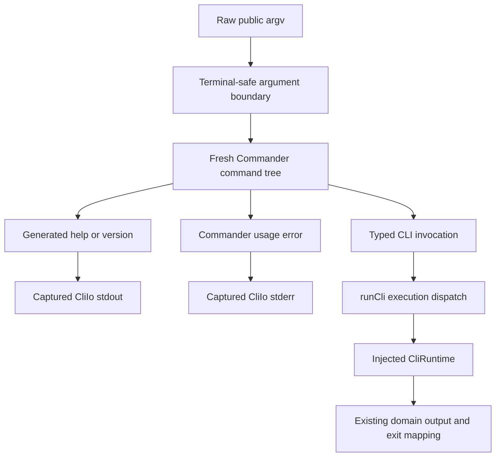
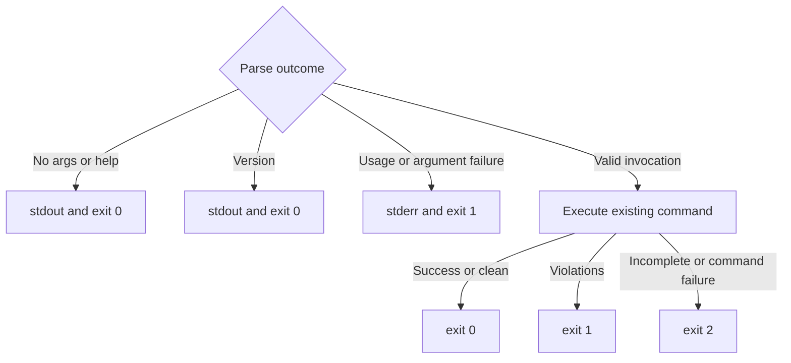
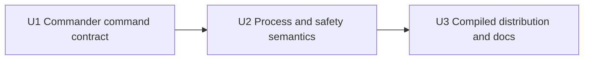

# CLI Help - Plan

## Goal Capsule

- **Objective:** Add discoverable, hierarchical CLI help whose command and option coverage stays complete as vlint grows.
- **Authority:** The Product Contract defines public CLI behavior. The Planning Contract defines Commander integration, safety, sequencing, and verification without changing product scope.
- **Execution profile:** Replace the public hand-written parser with one Commander command tree, preserve the injected runtime/I/O boundary, and verify source plus compiled behavior.
- **Open blockers:** None. A local feasibility check confirmed that Commander 15 compiles into the Bun 1.3.14 standalone executable and renders root, intermediate, and leaf-command help.
- **Stop conditions:** Stop if Commander cannot preserve help precedence, safe diagnostics, or return-driven exit handling without a second public grammar model.
- **Tail ownership:** The executor updates source, tests, docs, frozen dependencies, CI smoke coverage, and clean-guest release validation.

---

## Product Contract

### Summary

vlint will use Commander as the authority for command parsing and generated help.
Root, intermediate, and executable commands will expose consistent help, and adding a command through the command tree will make it discoverable without a separate hand-written help registry.

### Problem Frame

The current CLI parses each command and option through hand-written branches and has no `-h` or `--help` path.
Users must consult the README to discover commands, while contributors can add a command without a structural requirement to add it to a separate help surface.
Hand-written parser behavior, help text, and documentation would create multiple authorities and make omissions more likely as the CLI expands.

### Key Decisions

- **Adopt Commander 15 as the CLI parser and help authority.** (session-settled: user-approved — chosen over citty and CAC: Commander supports hierarchical generated help while allowing vlint to retain injectable output and controlled exit handling.)
- **Adopt Commander-standard grammar and error conventions.** (session-settled: user-directed — chosen over preserving the existing grammar outside help: one library-owned command contract reduces parser and documentation drift.)
- **Classify invalid CLI input as exit `1`.** (session-settled: user-directed — chosen over retaining exit `2`: Commander-standard usage errors should be distinct from an incomplete vlint run.)
- **Provide help throughout the command hierarchy.** (session-settled: user-approved — chosen over root-only and executable-command-only help: users should be able to discover the next valid command at every level.)
- **Let help win within the resolved command scope.** (session-settled: user-approved — chosen over help-only exact forms and strict left-to-right errors: a recognized help request should remain reliable when combined with other tokens.)
- **Treat an empty invocation as a help request.** (session-settled: user-approved — chosen over an error or silent success: running `vlint` should provide an immediate discovery path.)

### Key Flows

- F1. Root discovery
  - **Trigger:** A user runs `vlint`, `vlint -h`, or `vlint --help`.
  - **Steps:** vlint resolves the root scope and renders generated root usage, options, and commands without invoking config, browser, filesystem, or check behavior.
  - **Outcome:** Help is written to stdout and the process exits `0`.
- F2. Hierarchical discovery
  - **Trigger:** A user requests help for `check`, `browser`, `browser install`, `init`, or `setup`.
  - **Steps:** vlint resolves the deepest valid command scope and renders that scope's description, usage, options, and child commands where applicable.
  - **Outcome:** Scope-specific help is written to stdout and the process exits `0` without running the command.
- F3. Invalid invocation
  - **Trigger:** Input cannot be parsed or validated as a supported Commander invocation and no applicable help request wins.
  - **Steps:** vlint emits the Commander-standard usage error through its safe terminal boundary.
  - **Outcome:** The error is written to stderr and the process exits `1` without invoking command side effects.

### Requirements

**Command authority and coverage**

- R1. Commander 15 must be the single authority for public command hierarchy, option definitions, argument parsing, usage, and generated help.
- R2. The command hierarchy must represent root, `check`, `browser`, `browser install`, `init`, and `setup`.
- R3. Registering a visible command in the authoritative hierarchy must make it appear in its parent's generated help without a separate command list.
- R4. Registering an option on a command must make it appear in that command's generated help without separately maintained option text.
- R5. Root and command descriptions must remain concise enough for terminal discovery; detailed operational guidance remains in the README.

**Help behavior**

- R6. `-h` and `--help` must render help for root and every supported command scope.
- R7. The `browser` intermediate scope must render its own help and identify `install` as an available child command.
- R8. A recognized help flag must take precedence over other valid or invalid tokens within the command scope Commander resolves.
- R9. Help must be written to stdout, end with a newline, and exit `0`.
- R10. Help rendering must not read project configuration, access the filesystem, install or launch a browser, or execute a check.
- R11. An invocation with no arguments must render root help to stdout and exit `0`.
- R12. Commander-standard help command and option forms exposed by the selected version are part of the public CLI grammar.

**Compatibility and outcomes**

- R13. Existing successful `check`, `browser install`, `init`, `setup`, and version flows must retain their domain behavior and existing success or run-result exit classifications.
- R14. Commander-standard option syntax and command error wording replace the hand-written parser's accepted-syntax and error-message contract.
- R15. CLI parse and argument-validation failures must write a usage error to stderr and exit `1`.
- R16. Domain failures after a valid command begins, including incomplete checks and setup or install failures, must continue to exit `2`.
- R17. Help and CLI errors must preserve vlint's terminal safety boundary by preventing control, ANSI, OSC, and bidirectional escape injection from untrusted arguments.
- R18. The README and automated CLI contract tests must describe invalid-input exit `1` separately from incomplete-run exit `2`.

**Distribution**

- R19. Commander must be pinned as a production dependency under the repository's frozen dependency policy.
- R20. The production Ubuntu 24.04 x64 standalone executable must include Commander and require no external JavaScript runtime, package manager, or `node_modules` at execution time.

### Acceptance Examples

- AE1. **Covers R2, R3, R6, R9, R11.** Given the released command tree, running `vlint`, `vlint -h`, or `vlint --help` prints root help containing every visible top-level command and exits `0`.
- AE2. **Covers R2, R4, R6, R9.** Running `vlint check --help` prints check usage including `--url` and `--format`, writes nothing to stderr, and exits `0`.
- AE3. **Covers R6-R7.** Running `vlint browser --help` prints browser-level help containing the `install` child command, while `vlint browser install -h` prints install-specific options.
- AE4. **Covers R8-R10.** Running `vlint browser install --unknown --help` prints install help and exits `0` without invoking browser installation.
- AE5. **Covers R8-R10.** Running `vlint --help check` prints root help and exits `0` because the help flag resolves at root scope before the trailing command token.
- AE6. **Covers R12, R14-R15.** A Commander-standard option form accepted by the selected version executes normally, while an invalid command without a winning help flag prints a safe usage error to stderr and exits `1`.
- AE7. **Covers R13, R15-R16.** An unknown CLI option exits `1`, while a valid `vlint check` that cannot load configuration remains an incomplete run and exits `2`.
- AE8. **Covers R17.** An invalid argument containing control or terminal escape sequences cannot alter terminal state when rendered in a Commander-standard error.
- AE9. **Covers R19-R20.** The compiled release executable renders root and nested help in a clean Ubuntu 24.04 x64 environment with no Bun, Node.js, package manager, or `node_modules`.

### Success Criteria

- Every visible command and command option is discoverable from generated hierarchical help.
- Adding a command or option through the authoritative Commander definition causes coverage checks to fail if its help path cannot be rendered.
- Help paths are side-effect free, stdout-only, newline-terminated, and exit `0`.
- CLI usage errors exit `1`; valid commands that produce incomplete domain outcomes continue to exit `2`.
- The compiled standalone binary passes root, intermediate, leaf-help, invalid-input, and terminal-safety acceptance checks.

### Scope Boundaries

- Shell completion generation, man pages, interactive prompts, and documentation website generation are not included.
- The README remains the authority for installation, configuration schema, security guidance, and detailed workflows; help provides concise command discovery rather than duplicating it.
- This change does not alter check results, browser lifecycle, configuration schema, rule behavior, or JSON output contracts.

### Dependencies / Assumptions

- Commander 15 remains compatible with Bun 1.3.14's compile target and the supported Ubuntu 24.04 x64 release environment.
- Commander-standard grammar is intentionally a public behavior change; consumers relying on the former hand-written rejection rules or invalid-input exit `2` must update.
- vlint may adapt Commander output and exit hooks to preserve testability and terminal safety without maintaining a second parser or help model.

### Sources / Research

- `src/cli.ts` — current hand-written grammar, runtime dispatch, injectable I/O, and exit mapping.
- `tests/unit/cli.test.ts` — current accepted and rejected grammar contract.
- `tests/unit/cli-run.test.ts` — current side-effect and process-output contract.
- `tests/integration/cli-acceptance.test.ts` — current invalid-input and incomplete-run exit behavior.
- `README.md` — public exit-code and command documentation that must migrate with the CLI contract.
- [Commander command and output APIs](https://github.com/tj/commander.js/blob/ba6d13ddb4243e5913367734f8c159089ffe7834/lib/command.js#L230-L255) — injectable output configuration.
- [Commander nested command registration](https://github.com/tj/commander.js/blob/ba6d13ddb4243e5913367734f8c159089ffe7834/lib/command.js#L282-L307) — parent-owned command hierarchy.
- [citty `runMain`](https://github.com/unjs/citty/blob/9cb0edcc55c133ea04d3cbb350284a9a3548946e/src/main.ts#L10-L38) — direct console and process-exit behavior considered during selection.

---

## Planning Contract

### Product Contract Preservation

Product Contract unchanged. The implementation must preserve R1-R20, F1-F3, and AE1-AE9 while replacing only the public CLI grammar and help boundary.

### Key Technical Decisions

- KTD1. **Build one fresh Commander command tree for each parse.** (session-settled: user-approved — chosen over citty and CAC: Commander supports hierarchical generated help while allowing vlint to retain injectable output and controlled exit handling.) The tree owns command paths, options, descriptions, version, and generated help. Recreating it avoids mutable parse state leaking across repeated `runCli` calls and tests.
- KTD2. **Keep parsing separate from command execution.** Commander actions select a typed `CliInvocation`; `runCli` remains the only layer that calls `CliRuntime` and maps domain outcomes. This preserves no-side-effect help and invalid-input paths and prevents command definitions from owning browser, filesystem, or check lifecycles.
- KTD3. **Use Commander output and exit hooks instead of process-global termination.** Capture generated stdout/stderr through configured writers and convert help/version exits to `0` and usage failures to `1`; do not let Commander call `process.exit`. (session-settled: user-directed — chosen over retaining invalid-input exit `2`: Commander-standard usage failures are distinct from incomplete domain runs.)
- KTD4. **Adopt Commander grammar rather than recreating the old rejection table.** (session-settled: user-directed — chosen over preserving the existing grammar outside help: one library-owned command contract reduces parser and documentation drift.) Use Commander choices and argument parsers for constrained values and URL validation; accept Commander-standard option placement, assignment forms, help command, duplicate handling, and version alias behavior.
- KTD5. **Preserve the terminal safety boundary before diagnostics are generated.** Raw arguments containing terminal-control, ANSI/OSC, newline, carriage-return, or bidirectional control characters must never be interpolated unsafely by Commander. Sanitize diagnostic representations or reject unsafe tokens through the configured Commander error path while allowing a recognized help request to win.
- KTD6. **Make help deterministic and recursively testable.** Disable color-dependent variation and use a stable help width so source and compiled output do not vary by TTY. Traverse the authoritative command tree in tests to render every visible scope into one golden contract, so new commands cannot require a second manually maintained help registry.
- KTD7. **Keep internal worker dispatch outside the public command tree.** The dependency installer, installer worker, and out-of-process downloader invocations remain early production-entry checks. Commander owns only the documented user-facing CLI.
- KTD8. **Treat no-argument and hierarchical help as successful parse outcomes.** (session-settled: user-approved — chosen over an error or silent success: running `vlint` should provide an immediate discovery path.) Root, intermediate, and leaf help return `0`, and recognized help wins over neighboring invalid tokens in the scope Commander resolves.

### High-Level Technical Design

The public command tree is the single grammar and help source, while the existing runtime boundary remains responsible for side effects.

Exit classification stays explicit across parse and execution boundaries.

### Implementation Constraints

- Pin Commander `15.0.0` in `dependencies` and refresh `bun.lock`; do not add transitive runtime tooling or dynamic command loading.
- Preserve strict TypeScript settings, inward-only contract imports, and the acyclic source graph.
- Keep `CliRuntime` and `CliIo` injectable; tests must not mutate or depend on global `process.exit`, stdout, stderr, or prior Commander state.
- Preserve `check`, install, init, and setup domain behavior. The nested browser installer argument parser is an internal adapter boundary and is not replaced unless required to remove duplicate public parsing.
- Keep help concise and static. README remains the detailed operational authority.
- Do not alter JSON result schemas, terminal result rendering, browser lifecycle, config schema, rule execution, or hidden worker protocols.

### Sequencing

### System-Wide Impact

- **CLI consumers:** Invalid usage moves from exit `2` to `1`, no-argument invocation becomes successful help, and Commander-standard forms become accepted public syntax.
- **Security:** Commander diagnostics become a new path for untrusted argv; they must pass the same inert-terminal guarantee as existing output.
- **Testing:** Exact hand-written rejection cases are replaced by command-tree, generated-help, precedence, and exit-taxonomy contracts.
- **Distribution:** The release binary gains one pinned JavaScript dependency, bundled into the existing standalone artifact.
- **Documentation:** README command discovery and exit-code guidance must match generated help without duplicating detailed help snapshots.

### Risks & Dependencies

- **Unsafe error interpolation:** Commander may quote raw unknown tokens. Mitigate at the argv/diagnostic boundary and prove controls, OSC, and bidi input remain inert.
- **Exit-code overreach:** Broadly changing `2` to `1` could misclassify config, provider, install, setup, or check failures. Keep the change at the parse/argument-validation boundary and retain domain matrices.
- **Mutable parser state:** Reusing a parsed `Command` can leak values or actions between tests. Construct a fresh tree per invocation.
- **TTY-dependent help drift:** Color or terminal width can destabilize golden and compiled output. Configure deterministic formatting.
- **Hidden-worker regression:** Moving production dispatch wholesale into Commander could expose or break internal worker tokens. Keep current early worker routing intact.
- **Dependency churn:** Commander behavior is a public contract after adoption. Exact-pin the dependency and require intentional golden/test updates for upgrades.

---

## Implementation Units

### U1. Establish the Commander command contract

- **Goal:** Replace the public hand-written grammar with a fresh, declarative Commander tree that produces typed invocations and generated hierarchical help.
- **Requirements:** R1-R8, R11-R14, R19; F1-F2; AE1-AE3, AE5-AE6; KTD1, KTD2, KTD4, KTD6, KTD8.
- **Dependencies:** None.
- **Files:** `package.json`, `bun.lock`, `src/cli.ts`, `tests/unit/cli.test.ts`, `tests/golden/cli-help-golden.test.ts`, `tests/golden/fixtures/cli-help.terminal.txt`.
- **Approach:** Pin Commander, define root and nested commands once, and have actions select existing typed invocation variants rather than execute runtime work. Configure root metadata, command descriptions, options, choices, version behavior, implicit help command, no-argument root help, and deterministic help formatting from this tree. Replace the old invalid-case table with Commander grammar tests and recursively render every visible command scope into one golden artifact.
- **Execution note:** Add characterization assertions for existing successful invocation values before deleting the hand-written parser, then migrate those assertions to Commander-standard grammar.
- **Patterns to follow:** Preserve the `CliInvocation`, `CliRuntime`, and `CliIo` boundary in `src/cli.ts`; follow the deterministic fixture style in `tests/golden/reporter-golden.test.ts`.
- **Test scenarios:**
  - Existing `check`, `browser install`, `init`, `setup`, and version invocations produce the same typed command inputs and defaults.
  - `--format=json`, option placement, version aliases, duplicate options, and help command behavior match pinned Commander semantics rather than the removed rejection table.
  - Covers AE1. Empty argv, `-h`, and `--help` produce root help containing each visible top-level command and exit intent `0`.
  - Covers AE2. Check help contains `--url` and `--format` from the same option declarations used for parsing.
  - Covers AE3. Browser help exposes `install`; install help exposes `--force` and `--with-deps`.
  - Covers AE5. Root help before a trailing command remains root-scoped.
  - Recursive traversal renders every visible command scope into the combined golden fixture with stable ordering and width.
- **Verification:** The authoritative tree accepts documented commands, generates all help surfaces, and no parallel command/option registry remains.

### U2. Preserve process, safety, and exit semantics

- **Goal:** Integrate Commander into `runCli` without process-global exits, side effects on help, unsafe diagnostics, or domain exit-code drift.
- **Requirements:** R8-R10, R13-R17; F1-F3; AE4, AE6-AE8; KTD2, KTD3, KTD5, KTD7, KTD8.
- **Dependencies:** U1.
- **Files:** `src/cli.ts`, `tests/unit/cli-run.test.ts`, `tests/integration/cli-acceptance.test.ts`, `tests/unit/terminal-output.test.ts`.
- **Approach:** Capture Commander writers through invocation-local buffers, override exits into typed parse outcomes, and let `runCli` emit through injected `CliIo`. Keep public parsing after hidden-worker routing and before runtime calls. Apply the terminal-safety boundary to untrusted argv before Commander can interpolate it, while preserving help precedence. Map only usage and argument validation to `1`; retain existing runtime result and command failure mappings.
- **Patterns to follow:** Reuse `escapeTerminal` and the injected harness in `tests/unit/cli-run.test.ts`; preserve the source-level integration matrix's distinction between argument rejection and domain failure.
- **Test scenarios:**
  - Covers AE4. Leaf help combined with an unknown option renders help, returns `0`, and does not call install.
  - Root, intermediate, and leaf help write one newline-terminated stdout value, leave stderr empty, and do not call check/install/init/setup.
  - Unknown command, unknown option, missing value, invalid format choice, and invalid ad hoc URL write a Commander usage error to stderr and return `1` before runtime calls.
  - Covers AE7. Unknown CLI input returns `1`, while valid check with missing config, install/setup failures, and incomplete results remain `2`.
  - Covers AE8. C0/C1, ANSI/OSC, CR/LF, tab, and bidi controls in unknown command, option, and value positions are rendered inert and cannot add terminal lines or sequences.
  - Repeated `runCli` calls with different arguments do not retain option values, selected commands, writers, or exit state.
  - Existing clean/violations/incomplete check outcomes remain `0`/`1`/`2`, and successful install/init/setup output remains unchanged.
- **Verification:** Source-level CLI tests prove Commander never terminates the process directly, help is side-effect free, unsafe argv is inert, and the parse/domain exit boundary is exact.

### U3. Prove compiled distribution and migrate public documentation

- **Goal:** Lock the new CLI contract into compiled-binary, CI, clean-guest, and README coverage.
- **Requirements:** R3-R5, R18-R20; AE1-AE3, AE7, AE9; KTD6.
- **Dependencies:** U2.
- **Files:** `tests/smoke/compiled-cli-contract.test.ts`, `tests/release/validate.sh`, `.github/workflows/ci.yml`, `README.md`.
- **Approach:** Extend the existing compiled CLI smoke contract with root, intermediate, leaf, help-precedence, invalid-exit, and incomplete-exit cases. Run that smoke suite in CI after the production binary is built. Add clean Ubuntu guest assertions for root and nested help so Commander bundling is release-gated. Update README command discovery and exit taxonomy without copying full generated help.
- **Execution note:** Treat compiled and clean-guest runtime proof as the completion signal for dependency integration; source tests alone cannot prove standalone packaging.
- **Patterns to follow:** Reuse `execBinary` in the compiled smoke test, the existing build artifact handoff in CI, and the archive execution checks in `tests/release/validate.sh`.
- **Test scenarios:**
  - Covers AE1-AE3. The production binary renders root, browser, check, and browser-install help on stdout with exit `0` and empty stderr.
  - Help output remains stable in a non-interactive CI process with no color or terminal-width drift.
  - Covers AE7. The production binary returns `1` for invalid usage and `2` for a valid no-config check.
  - Help precedence in the compiled binary returns `0` without browser or config access.
  - Covers AE8. The production binary renders C0/C1, ANSI/OSC, CR/LF, tab, and bidi controls inert in unknown command, option, and value positions; an unsafe token beside a winning help flag still returns safe help with `0` and no side effects.
  - Covers AE9. The packaged binary renders root and nested help inside a clean Ubuntu 24.04 x64 guest with no Bun, Node.js, package manager, or `node_modules`.
  - README documents no-argument help, hierarchical help examples, Commander-standard usage errors, and the `0`/`1`/`2` distinction.
- **Verification:** CI and release validation exercise the same compiled artifact users receive, and public docs describe the observed contract.

---

## Verification Contract

| Gate | Command | Proves | Units |
|---|---|---|---|
| Type safety | `bun run typecheck` | Commander types, invocation outcomes, and runtime call sites remain strict | U1-U2 |
| Architecture | `bun run check:architecture` | CLI integration preserves acyclic source boundaries | U1-U2 |
| Unit and golden | `bun run test:unit` | Grammar, recursive help generation, deterministic output, safety, and side-effect isolation | U1-U2 |
| Source integration | `bun run test:integration` | Invalid usage exits `1` while valid domain failures remain `2` | U2 |
| Production compile | `bun run build:linux-x64` | Commander bundles into the supported standalone target | U3 |
| Compiled CLI smoke | `bun test tests/smoke/compiled-cli-contract.test.ts` | Root/nested help, help precedence, terminal safety, invalid `1`, and incomplete `2` work in the binary | U3 |
| Browser acceptance | `bun run test:acceptance` | Existing compiled check/install behavior remains intact | U2-U3 |
| Clean release guest | `bun run release:validate` | Packaged help works on Ubuntu 24.04 x64 without a language runtime or `node_modules` | U3 |

The focused gates must pass before the full browser and release gates. Release validation remains mandatory because Commander is a new production dependency embedded in the distributed executable.

---

## Definition of Done

- `artifact_readiness` remains `implementation-ready`, and no blocking planning question is open.
- U1 is complete when one Commander tree owns all public commands, options, parsing, and help; recursive golden coverage includes every visible scope.
- U2 is complete when help is side-effect free, Commander does not call process-global exit or I/O, unsafe argv is inert, usage failures return `1`, and domain failures retain `2`.
- U3 is complete when the production binary and clean release guest render hierarchical help and README documents the new public contract.
- R1-R20 and AE1-AE9 are traceable through implementation units and verification gates.
- Existing check results, JSON schema, browser lifecycle, config behavior, rules, hidden workers, and successful command outcomes remain unchanged outside the declared Commander grammar migration.
- Frozen dependencies, CI, smoke tests, and release validation agree on Commander `15.0.0` and Bun `1.3.14` compatibility.
- Experimental adapters, duplicate public parser/help registries, obsolete rejection fixtures, and dead migration code are absent from the final diff.
