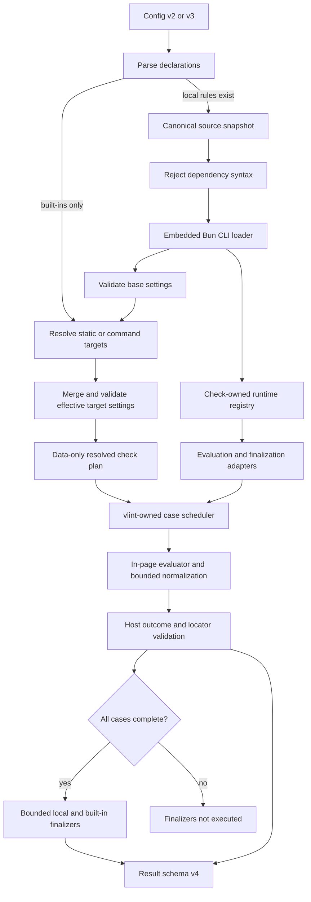
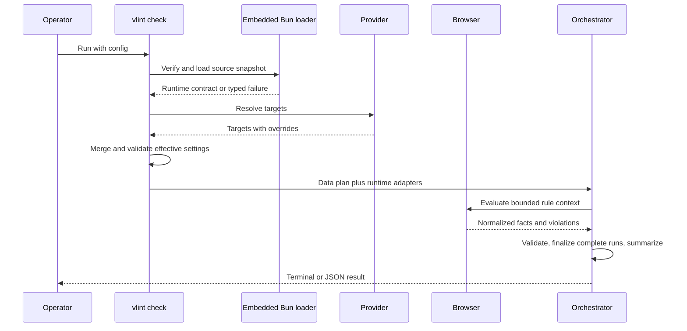

# vlint Local Rule Plugins - Plan

## Goal Capsule

- **Objective:** Allow a vlint-enabled project to define trusted, project-specific layout rules in one local TypeScript file and receive the same execution and reporting behavior as built-in rules.
- **Product authority:** The Product Contract owns local-rule behavior. The Planning Contract owns the plugin boundary. vlint remains the authority for scheduling, result classification, aggregation, and output.
- **Stop conditions:** Stop implementation if the compiled executable cannot load and run a self-contained TypeScript rule with its embedded Bun runtime, or if the browser evaluator cannot be isolated from Playwright internals without weakening R4.
- **Execution profile:** Implement contract-first, prove the compiled-runtime boundary early, then integrate evaluation, finalization, and reporting.
- **Tail ownership:** The final unit owns README updates, JSON and terminal goldens, compiled-runtime smoke coverage, and release validation.
- **Product Contract preservation:** changed: R12 and AE8 add the user-directed latest-only plugin contract policy; all prior R/A/F/AE meanings remain unchanged.

---

## Product Contract

### Summary

vlint will load explicitly configured, project-local TypeScript rules and run them as first-class rules.
Local rules can inspect browser layout and run context while vlint preserves one result contract across built-in and project-specific checks.

### Problem Frame

vlint currently accepts only its built-in rule types.
A project whose application shell already owns horizontal spacing cannot add a rule that rejects duplicate horizontal spacing in the content region, so that layout contract has no automated enforcement.
Adding each project-specific contract to vlint itself would couple the core executable to one repository's conventions and would not scale to other local rules.

### Key Decisions

- **Use trusted local rules rather than a browser-only sandbox or declarative rule language.** (session-settled: user-directed — chosen over browser-only and declarative alternatives: it provides the required inspection capability and first-class result integration.) Governs R1, R3, R5.
- **Use vlint's embedded Bun runtime only when local rules are configured.** (session-settled: user-directed — chosen over requiring a separate project runtime: direct TypeScript authoring is required while built-in-only use must remain standalone.) Governs R2, R10.
- **Require TypeScript source in the initial release.** (session-settled: user-directed — chosen over JavaScript-only support: project authors require TypeScript authoring.) Governs R1, R2.
- **Keep each local rule self-contained.** (session-settled: user-directed — chosen over local-module and package imports: the initial release should avoid project dependency resolution.) Governs R2.
- **Let rules publish their configuration type and schema.** (session-settled: user-directed — chosen over untyped JSON and common settings only: rule-specific configuration must fail early when invalid.) Governs R6.
- **Support only the current plugin contract.** (session-settled: user-directed — chosen over backward-compatible plugin contract versions: vlint may require local rules to follow its latest public plugin contract.) Governs R12.

### Actors

- A1. **Project rule author:** Defines and maintains a project-specific layout contract in the consuming repository.
- A2. **vlint operator:** Runs `vlint check` directly or through an existing development gate and consumes terminal or JSON diagnostics.
- A3. **AI coding agent:** Authors local rules, updates configuration, and uses structured diagnostics to repair a project layout.
- A4. **vlint:** Loads configured rules, validates their settings, schedules evaluation, aggregates results, and assigns the final run disposition.

### Requirements

**Local rule boundary**

- R1. A project can explicitly register one or more local rules whose source is a TypeScript file inside that project.
- R2. Each local rule is a single self-contained TypeScript file with no relative-module or external-package imports, and vlint uses its embedded Bun runtime only when at least one local rule is configured.
- R3. A configured local rule is treated as trusted project code rather than sandboxed third-party content, and vlint documentation must state that trust boundary.

**Rule capability and configuration**

- R4. A local rule can use DOM state, computed styles, element geometry, target metadata, device metadata, and run-wide observations when making its verdict.
- R5. A local rule can participate in both target-and-device evaluation and run-wide finalization without taking ownership of scheduling or run disposition.
- R6. A local rule publishes its rule-specific configuration type and schema, and vlint validates configured values before starting browser inspection.

**First-class result integration**

- R7. Local rules follow the same default application and target-level enablement or override behavior as built-in rules.
- R8. Local-rule violations and execution facts appear in terminal output, versioned JSON, run summaries, and exit-code selection through the same result contract as built-in rules.
- R9. Rule loading, TypeScript execution, schema validation, evaluation, and finalization failures make the run incomplete rather than producing a layout violation or a silent skip.

**Compatibility**

- R10. A configuration containing only built-in rules retains the existing single-executable experience and does not require a project JavaScript or TypeScript runtime.
- R11. Existing valid configurations and built-in rule behavior remain valid when local-rule support is introduced; machine consumers must migrate to the result schema version introduced by this feature.
- R12. A local rule must use the plugin contract supported by the installed vlint version; vlint does not promise backward compatibility for older plugin contracts.

### Key Flows

- F1. Local rule configuration and loading
  - **Trigger:** A2 or A3 runs `vlint check` with at least one configured local rule.
  - **Actors:** A2, A3, A4
  - **Steps:** vlint resolves the named file, checks the source boundary, loads the public contract, validates its version and settings, and either continues or records an incomplete run.
  - **Outcome:** Every configured local rule is ready before browser inspection begins, or the run fails without silently dropping that rule.
  - **Covered by:** R1, R2, R6, R9, R12
- F2. Per-case inspection
  - **Trigger:** vlint opens a configured target and device case.
  - **Actors:** A1, A4
  - **Steps:** vlint gives each enabled local rule the supported rule inputs, validates returned facts and violations, and contains a rule failure to the existing case-result semantics.
  - **Outcome:** Local and built-in rule results share deterministic case ordering and disposition behavior.
  - **Covered by:** R4, R5, R7, R8, R9
- F3. Run-wide completion
  - **Trigger:** Case evaluation reaches the existing finalization boundary.
  - **Actors:** A1, A4
  - **Steps:** vlint supplies eligible run-wide observations to each local rule finalizer, validates its outcome, and computes the normal run summary and exit code.
  - **Outcome:** A project-specific aggregate contract can fail without bypassing vlint's result authority.
  - **Covered by:** R4, R5, R8, R9

### Acceptance Examples

| ID | Covers | Given | When | Then |
| --- | --- | --- | --- | --- |
| AE1 | R1, R4, R8 | A local rule identifies an application shell and content region and rejects duplicate horizontal spacing | The content region adds horizontal spacing while the shell already provides it | The affected target, device, rule, locator, geometry, message, and bounded rule details are reported as a layout violation |
| AE2 | R4, R8 | The same rule is configured and both regions satisfy the project's spacing contract | `vlint check` completes | The local rule is clean and contributes normally to the run summary |
| AE3 | R6, R9 | A configured value violates the rule's published schema | `vlint check` starts | Browser inspection does not begin and the run is incomplete with a configuration path that identifies the invalid value |
| AE4 | R5, R9 | A local rule throws or returns an invalid outcome during case evaluation or run-wide finalization | The affected stage executes | The failure is preserved as an execution failure, later behavior follows existing incomplete-run semantics, and the rule is not reported as clean |
| AE5 | R7, R8 | A local rule is disabled or receives rule-specific settings for one target | Multiple targets are checked | The target override is validated and applied only to that target while other target pairs retain their effective settings |
| AE6 | R2, R9 | A local rule imports another local file or an external package | vlint loads the rule | The unsupported dependency is rejected before browser launch and the run is incomplete |
| AE7 | R10, R11 | A project uses only an existing built-in-rule configuration on a machine without a project runtime | `vlint check` runs | Existing checks complete without requesting or launching an external plugin runtime |
| AE8 | R9, R12 | A local rule declares a plugin contract version other than the installed vlint version's supported contract | vlint loads the rule | The run is incomplete with a structured contract-version failure and no browser inspection begins |
| AE9 | R8 | An AI coding agent receives a local-rule violation from `vlint check --format json` | The agent fixes the element named by the locator and reruns vlint | The same rule becomes clean without requiring an agent-specific API |

### Scope Boundaries

- Local rules are project-local and explicitly configured; distribution, registries, marketplaces, package installation, and automatic discovery are outside the initial release.
- JavaScript-only authoring, multi-file rules, relative imports, and external package imports are outside the initial release.
- vlint does not make local rules safe to execute and does not treat unreviewed third-party rule files as trusted.
- The feature extends rule evaluation only; target discovery, application startup, fixture creation, authentication flows, CI wiring, and browser installation retain their current ownership.
- A dedicated plugin schema inspection command, a local-rule scaffold command, and a separate agent API are deferred.

### Dependencies / Assumptions

- Bun 1.3.14's embedded runtime can scan and transpile a self-contained TypeScript file inside the compiled executable.
- A closure-free browser evaluator can express the first known use case and the expected near-term project-specific layout contracts.
- Local rules are stateless across cases; mutable module state is not a supported coordination mechanism.

### Sources / Research

- `vlint-prd.md` establishes the single-executable distribution model, trusted command-provider precedent, and built-in rule ownership.
- `src/contracts/config.ts` and `src/config/schema.ts` show the current closed rule types and strict configuration boundary.
- `src/commands/check.ts` and `src/run/orchestrator.ts` show the current evaluation dispatch and result-authority boundary.
- `src/providers/command.ts` provides the bounded trusted-subprocess precedent for failure and cancellation handling.
- `src/contracts/evaluation.ts`, `src/contracts/result.ts`, and `src/contracts/failure.ts` define the contracts that local rules must join.
- `docs/plans/2026-07-15-002-feat-page-horizontal-overflow-plan.md` records the most recent rule-addition precedent.
- Bun official documentation for `Bun.Transpiler` confirms TypeScript transformation and import scanning; its standalone executable documentation confirms the embedded Bun runtime and Bun CLI mode.

---

## Planning Contract

### Key Technical Decisions

- KTD1. **Represent every project rule as the closed `local` rule kind.** Configuration, effective rules, rule results, and violations keep exhaustive discriminators while the configured rule name identifies the project-specific contract. Governs R1, R7, R8.
- KTD2. **Use vlint's embedded Bun CLI to load a source snapshot.** (session-settled: user-approved — chosen over requiring a separate project runtime: the compiled executable can run a temporary loader through its embedded Bun CLI while preserving the built-in-only experience.) vlint reads one verified source snapshot of at most 8 MiB, rejects every runtime dependency reported by `Bun.Transpiler.scan()`, writes that snapshot and a bundled runner to a private temporary directory, and invokes its own executable with an internal-only worker token and exact argv shape. The worker returns one bounded JSON descriptor or one typed failure over stdout, writes no other stdout, and never receives user-controlled runner code. Governs R1, R2, R10.
- KTD3. **Publish one versioned plugin contract with serializable callbacks.** The contract contains metadata, a settings schema, a closure-free browser evaluator, and an optional run finalizer. The worker descriptor carries bounded callback source text from the verified snapshot; the parent reconstructs the trusted callbacks into its check-owned registry, sends only the browser evaluator through Playwright, and keeps the finalizer host-side. vlint accepts only the exact contract version it currently supports. Governs R4, R5, R6, R12.
- KTD4. **Expose a rule context instead of Playwright.** (session-settled: user-approved — chosen over exposing the raw `Page`: local rules receive stable serializable settings, target data, device data, and browser globals without coupling to vlint's Playwright version.) The browser evaluator runs through the existing page-evaluation boundary. Governs R4.
- KTD5. **Use a bounded schema descriptor owned by vlint.** The initial descriptor supports JSON object, array, string, finite number, integer, boolean, null, required fields, exact keys, and numeric or length bounds. Base settings validate after contract load; effective settings validate after provider target overrides merge and before browser launch. Governs R6, R7.
- KTD6. **Merge target settings with prototype-safe JSON semantics.** Recursive objects use own properties in null-prototype containers; arrays and scalar values replace base values; dangerous prototype keys are rejected. The common target override owns `enabled`, and the merged settings validate against the plugin schema. Governs R7.
- KTD7. **Use one generic local violation envelope.** (session-settled: user-approved — chosen over adding a result variant per project rule: machine consumers need a stable discriminator as projects add rules.) It requires a message, verified locator, geometry, and JSON-compatible details. Governs R8.
- KTD8. **Move JSON results to schema version 4 as one atomic contract.** Version 4 adds the local rule and violation variants. Built-in and local runs emit the same schema version so consumers never infer schema from configuration. Governs R8, R11.
- KTD9. **Accept config schema version 2 and introduce version 3 for local rules.** Existing version 2 configs keep their current behavior. `vlint init` and `vlint setup` create version 3 configs after this change. Only version 3 can register local rules. Governs R1, R11.
- KTD10. **Validate every plugin boundary before orchestration consumes it.** The loader validates exports, contract version, and base settings before provider resolution. Effective target settings validate after provider resolution. Evaluator and finalizer outcomes validate before entering result aggregation. Invalid plugin data becomes a typed failure, never a throw into the scheduler. Governs R6, R8, R9, R12.
- KTD11. **Use distinct local-rule lifecycle failures under existing stages.** File, dependency, transpile, contract, schema, evaluation, finalization, timeout, and diagnostic-bound failures receive stable codes. Configuration and load failures occur before browser launch; evaluation and finalization failures use the rule-evaluation stage. Governs R9, R12.
- KTD12. **Preserve data-only plans and orchestrator authority.** `ResolvedCheckPlan` contains no executable handlers. A check-owned runtime registry maps normalized local rule identities to immutable callbacks. `src/commands/check.ts` constructs evaluation and finalization adapters in `CheckDependencies`; `src/run/orchestrator.ts` invokes those adapters while retaining scheduling, failure containment, finalization gates, summaries, and exit-code authority. Governs R5, R7, R8, R9.
- KTD13. **Normalize and bound plugin data at the producing boundary.** The in-page wrapper converts returned data to plain JSON-compatible values under depth, item, field, and aggregate byte limits before it crosses Playwright. Host validation requires finite geometry and verified locators. Terminal output encodes control characters, and terminal or JSON failures omit raw stacks, source, absolute paths, and arbitrary exception text. Governs R8, R9.
- KTD14. **Execute the same canonical source snapshot that passed path and dependency checks.** Paths resolve under the real configuration directory with component-aware containment; every path component must be non-symlinked. The loader reads once, uses `Bun.Transpiler.scan()` as the dependency authority, fails closed when scanning or transformation cannot classify the snapshot, then executes only the private snapshot. The no-import rule limits dependency resolution, not trusted runtime capabilities: file, network, and process APIs remain available and are documented under R3. Duplicate paths may share a loaded contract while retaining separately named instances. Governs R1, R2, R3, R9.
- KTD15. **Do not add a separate agent surface.** `vlint check --format json` remains the automation API; structured local diagnostics provide action and context parity. Governs R8.
- KTD16. **Bound asynchronous plugin phases and document synchronous-code risk.** Loader subprocesses, Playwright evaluations, and asynchronous finalizers obey timeout and abort boundaries. Because plugins are trusted code rather than a sandbox, synchronous loops or process termination can still hang or terminate vlint; documentation and tests state this residual risk. Governs R3, R9.

### High-Level Technical Design

The loader keeps configuration data and executable capabilities separate.
It loads a canonical source snapshot into a check-owned runtime registry, then validates effective target settings after provider resolution.

The lifecycle separates base validation, provider-dependent effective validation, browser evaluation, and run-wide finalization.

### System-Wide Impact

- **Configuration:** Schema version 3 adds local declarations and generic target settings while version 2 remains readable.
- **Public JSON:** Result schema version 4 is a consumer-visible cutover and requires README, golden, acceptance, and release updates in the same change.
- **Trust:** Local rule loading adds a second trusted-code boundary beside Command Provider execution.
- **Runtime:** The embedded Bun runtime gains a runtime source-transformation responsibility; built-in-only runs bypass it.
- **Agents:** Existing CLI and JSON surfaces gain enough context for automated remediation without another API.

### Risks & Dependencies

- **Compiled-runtime feasibility:** Official Bun documentation supports the embedded CLI, source scanning, and transpilation, but U2 must prove the complete snapshot-to-export path in the compiled Linux artifact before U3 begins.
- **Trusted-code availability:** Timeouts contain asynchronous loader, browser, and finalizer work where supported. Synchronous trusted code can still loop forever or terminate the process; R3 documentation must state this residual risk.
- **Browser serialization:** An in-page normalizer must reject cyclic, deeply nested, wide, getter-backed, DOM, function, symbol, bigint, and oversized outcomes before they cross Playwright.
- **Schema and merge safety:** Runtime schema validation is authoritative, and prototype-safe merge tests prevent dangerous keys from changing object prototypes or bypassing exact-key checks.
- **Path and source races:** Canonical containment plus execute-the-verified-snapshot semantics prevent symlink, prefix-collision, and check-to-load replacement paths.
- **Aggregate growth:** U3 caps violations and serialized details contributed by each rule and case. U4 separately caps observation count and total serialized bytes before finalizer invocation.
- **Result migration:** Every consumer must reject unknown result schema versions; version 4 documentation and goldens must land atomically.

### Sequencing

1. Define contract, configuration, result, and failure shapes.
2. Prove and implement TypeScript loading plus schema validation.
3. Add browser evaluation and validate local outcomes.
4. Generalize run finalization without moving scheduler authority.
5. Complete reporting, documentation, compiled-runtime, and release verification.

---

## Implementation Units

### U1. Public contracts and configuration migration

- **Goal:** Define the closed local-rule, plugin contract, configuration, violation, result, and failure boundaries.
- **Requirements:** R1, R2, R6, R7, R8, R9, R11, R12; F1; AE3, AE5, AE6, AE8
- **Dependencies:** None
- **Files:**
  - Modify `src/contracts/config.ts`, `src/contracts/evaluation.ts`, `src/contracts/result.ts`, and `src/contracts/failure.ts`.
  - Create `src/contracts/plugins.ts`.
  - Modify `src/config/schema.ts`, `src/config/merge.ts`, `src/config/load.ts`, and `src/commands/init.ts`.
  - Modify `tests/unit/config.test.ts`, `tests/unit/result.test.ts`, `tests/unit/init.test.ts`, and `tests/unit/setup.test.ts`.
- **Approach:** Apply KTD1, KTD3, KTD5, KTD6, KTD8, KTD9, and KTD11. Parse structural version 2 and version 3 shapes without requiring a loaded plugin schema. Keep contract modules free of outward imports; defer semantic plugin settings validation to U2.
- **Patterns to follow:** Strict `exactKeys` validation in `src/config/schema.ts`; discriminated rule unions and effective-rule normalization in `src/contracts/config.ts` and `src/config/merge.ts`; failure boundaries in `src/contracts/failure.ts`.
- **Test scenarios:**
  1. A valid version 2 built-in config normalizes unchanged.
  2. A structurally valid version 3 config registers one local declaration and injects missing built-ins in deterministic order.
  3. A version 2 config containing a local declaration fails at the config boundary.
  4. Duplicate names, missing paths, unknown declaration fields, and non-JSON settings fail with exact configuration paths.
  5. Structural target overrides accept `enabled` and a JSON settings overlay without evaluating plugin-specific keys.
  6. Prototype keys at any settings depth are rejected and never mutate global prototypes.
  7. Local lifecycle failure codes produce incomplete results and result schema version 4.
- **Verification:** Type checking and architecture checks accept the new contracts; focused unit tests prove config compatibility and normalization.

### U2. Trusted TypeScript loader and schema validator

- **Goal:** Load one self-contained TypeScript rule into a validated runtime contract before browser work.
- **Requirements:** R1, R2, R3, R6, R9, R10, R12; F1; AE3, AE6, AE7, AE8
- **Dependencies:** U1
- **Files:**
  - Create `src/plugins/load.ts`, `src/plugins/schema.ts`, and `src/plugins/types.ts`.
  - Modify `src/commands/check.ts` and `scripts/build.ts` only if the compiled runtime needs an explicit embedded runner asset.
  - Create `tests/unit/plugins.test.ts`.
  - Create fixtures under `tests/fixtures/plugins/` for valid, imported, malformed, throwing, and contract-mismatch rules.
  - Modify `tests/smoke/compiled-runtime.test.ts` and `tests/smoke/compiled-cli-contract.test.ts`.
- **Approach:** Apply KTD2, KTD3, KTD5, KTD10, KTD11, KTD13, KTD14, and KTD16. Read and canonicalize one bounded source snapshot, fail closed on scanner-reported runtime dependencies, execute that snapshot through the bundled internal worker under vlint's embedded Bun CLI, validate its bounded descriptor, and reconstruct immutable callbacks in a check-owned registry. Validate base settings before provider resolution and every merged effective setting after targets resolve.
- **Execution note:** Checkpoint 1 is a dedicated compiled-artifact feasibility proof: retrieve a valid descriptor and handle a top-level throw through the exact production worker and source-snapshot path. Do not continue the remaining loader work or U3 if this proof fails; preserve the evidence and revisit KTD2.
- **Patterns to follow:** Bounded trusted process handling in `src/providers/command.ts`; config-directory path ownership in `src/config/load.ts`; architecture checks in `scripts/check-architecture.ts`.
- **Test scenarios:**
  1. Covers F1. A valid plugin loads, base settings validate, and command-provider target overrides validate before browser launch.
  2. Covers AE3. Invalid base or effective settings fail with an exact configuration path before browser launch.
  3. Covers AE6. Scanner-reported static imports, re-exports, dynamic imports, and `require` dependencies fail closed.
  4. Type-only declarations that Bun's scanner reports as non-runtime dependencies remain valid.
  5. Missing, unreadable, absolute, parent-escaping, prefix-collision, symlinked-file, symlinked-directory, outside-project, and over-8-MiB sources map to typed failures.
  6. The executed bytes match the verified snapshot even when the project path changes after reading.
  7. Covers AE8. A mismatched contract version fails without loading a browser.
  8. Invalid internal worker tokens or argv, extra stdout, missing exports, unexpected export shapes, oversized descriptors, non-serializable schemas, top-level throws, timeouts, and aborts map to typed failures.
  9. A callback that captures module state loads as trusted code but fails through the typed evaluation boundary if the capture is unavailable.
  10. Covers AE7. A built-in-only config never invokes the plugin loader and passes in the compiled runtime without external Bun or Node.
- **Verification:** Unit fixtures prove every loader boundary; the compiled Linux feasibility artifact proves embedded TypeScript loading without external runtime dependencies.

### U3. Browser evaluation and local violation validation

- **Goal:** Execute local browser evaluators through the existing page boundary and produce bounded first-class rule outcomes.
- **Requirements:** R4, R7, R8, R9; F2; AE1, AE2, AE4, AE5, AE9
- **Dependencies:** U1, U2
- **Files:**
  - Create `src/plugins/evaluate.ts`.
  - Modify `src/commands/check.ts`, `src/contracts/evaluation.ts`, and `src/rules/locator.ts` if shared locator verification is generalized.
  - Create `tests/integration/local-rules.test.ts`.
  - Modify `tests/unit/check.test.ts` and `tests/fixtures/app/server.ts`.
  - Add spacing-rule pages and states under `tests/fixtures/app/pages/`.
- **Approach:** Apply KTD4, KTD7, KTD10, KTD11, KTD13, KTD15, and KTD16. Reconstruct a fresh browser callback for each case and execute it through an in-page wrapper, so module state and host closures cannot coordinate concurrent cases. Normalize and bound plain data, including per-rule/per-case violation count and details bytes, before Playwright serialization. The host then validates facts and verifies locators before producing `RuleEvaluationOutcome`.
- **Execution note:** Use the duplicate-horizontal-spacing fixture as the first end-to-end rule and preserve partial facts when later locator verification fails.
- **Patterns to follow:** Closure-free browser extraction and authoritative locator verification in `src/rules/tab-label-single-line.ts`; geometry and diagnostic bounds in `src/rules/page-horizontal-overflow.ts`; cancellation wrapping in `src/commands/check.ts`.
- **Test scenarios:**
  1. Covers F2 / AE1. Duplicate shell and content horizontal spacing yields one local violation with target, device, rule, verified locator, geometry, message, and details.
  2. Covers AE2. The same fixture without duplicate spacing yields a clean local result.
  3. Covers AE5. A disabled target pair stays disabled and a target settings overlay changes only that pair.
  4. Covers AE4. A thrown evaluator, rejected promise, unavailable closure capture, malformed fact count, invalid geometry, invalid locator, oversized message, and oversized details each produce a typed rule failure.
  5. Cyclic, deep, wide, getter-backed, DOM, bigint, function, symbol, and oversized return values fail inside the normalization boundary.
  6. A never-resolving promise and an abort produce the documented timeout or interrupt result; synchronous infinite-loop risk remains documented as trusted-code behavior.
  7. Two concurrent cases do not share mutable local-rule state or reorder declared results.
  8. Covers AE9. JSON diagnostics identify the element required for an automated fix and the rerun becomes clean.
- **Verification:** Browser integration tests observe the changed rule path on desktop and mobile fixtures; focused check tests preserve cancellation and deterministic ordering.

### U4. Run-wide finalization and scheduler integration

- **Goal:** Generalize finalization for local rules while preserving vlint-owned run semantics.
- **Requirements:** R4, R5, R8, R9; F3; AE4
- **Dependencies:** U1, U2, U3
- **Files:**
  - Modify `src/commands/check.ts`, `src/run/orchestrator.ts`, `src/contracts/evaluation.ts`, and `src/contracts/config.ts`.
  - Modify `tests/unit/result.test.ts` and `tests/integration/result-transitions.test.ts`.
  - Extend fixtures under `tests/fixtures/plugins/` with passing, failing, throwing, and malformed finalizers.
- **Approach:** Apply KTD3, KTD10, KTD11, KTD12, KTD13, and KTD16. Wire the check-owned finalization adapter through `CheckDependencies`, and pass each host-side local finalizer bounded read-only per-case summaries for its own rule. Keep the existing all-cases-complete gate and first-finalization-failure cascade.
- **Patterns to follow:** `resolveFinalizations` ordering and zero-label policy in `src/run/orchestrator.ts`; result-transition assertions in `tests/unit/result.test.ts`.
- **Test scenarios:**
  1. A local finalizer receives target and device identity, status, inspected count, violations, and failure for each eligible case of its rule.
  2. A passing local finalizer records `passed` after every case completes.
  3. Covers F3 / AE4. A returned failure, thrown finalizer, malformed result, timeout, or oversized diagnostic records `failed` and leaves later finalizers `not-executed`.
  4. Any failed, partial, interrupted, or not-executed case skips every run finalizer.
  5. Built-in tab zero-label finalization remains unchanged before, between, and after local rules.
  6. Observation count and aggregate bytes at the limit pass; inputs above either limit fail before finalizer invocation.
  7. Finalization failures coexist with previously observed violations and force the run to `incomplete`.
- **Verification:** Unit and transition tests prove ordering, cascade, partial-run gates, summary counts, and exit-code precedence.

### U5. Reporting, documentation, and release closure

- **Goal:** Publish the result schema v4 contract, trusted-rule authoring guidance, and complete release evidence.
- **Requirements:** R3, R8, R9, R10, R11, R12; AE1, AE3, AE6, AE7, AE8, AE9
- **Dependencies:** U1, U2, U3, U4
- **Files:**
  - Modify `src/output/terminal.ts`, `src/output/json.ts`, and `README.md`.
  - Modify `tests/unit/output.test.ts`, `tests/golden/reporter-golden.test.ts`, and `tests/golden/fixtures/*.txt`.
  - Modify `tests/integration/cli-acceptance.test.ts` and `tests/acceptance/vlint.test.ts`.
  - Modify `scripts/release-validate.ts` and release fixtures if the packaged contract changes.
- **Approach:** Apply KTD7, KTD8, KTD11, KTD13, KTD15, and KTD16. Render local violations without interpreting project details. Encode terminal controls visibly and normalize execution failures so neither output exposes raw exception text, stacks, source, or absolute paths. Document config version 3, result schema version 4, current-only plugin compatibility, trust, source restrictions, schema descriptor, target overrides, failure codes, and residual synchronous-code availability risk.
- **Execution note:** Treat JSON schema, terminal goldens, README, and compiled release behavior as one atomic contract update.
- **Patterns to follow:** Machine-consumption guidance and schema gates in `README.md`; exact-byte fixtures in `tests/golden/reporter-golden.test.ts`; release inventory checks in `scripts/release-validate.ts`.
- **Test scenarios:**
  1. Covers AE1 / AE9. Terminal and JSON output expose the same actionable local violation while JSON remains machine-stable.
  2. Covers AE3. Invalid settings emit a config-stage failure with a precise path and exit 2.
  3. Covers AE6. Forbidden dependencies emit their dedicated code and no raw source or stack.
  4. Covers AE8. Contract mismatch emits the current supported version and exit 2.
  5. Covers AE7. Built-in-only acceptance behavior stays unchanged except for the documented result schema version.
  6. Mixed built-in and local violations aggregate in declaration order with correct counts and exit 1.
  7. A local execution failure plus an observed violation preserves both evidence and exits 2.
  8. ANSI, OSC, CR/LF, oversized exception, secret-like text, and path-bearing errors cannot inject terminal controls or leak raw values into JSON.
  9. Release validation succeeds without shipping plugin fixtures or requiring external Bun, Node, or package files.
- **Verification:** Unit, golden, integration, acceptance, compiled-runtime, and release gates all pass; README examples match emitted bytes and supported versions.

---

## Verification Contract

| Gate | Applies to | Evidence |
| --- | --- | --- |
| `bun run typecheck` | U1–U5 | Exhaustive rule, violation, result, and failure unions compile without fallback bags |
| `bun run check:architecture` | U1–U5 | Contract modules keep inward-only dependencies and new plugin modules preserve layer boundaries |
| `bun run test:unit` | U1, U2, U4, U5 | Config migration, loader guards, schema validation, result transitions, output rendering, and pure boundary behavior pass |
| `bun run test:integration` | U3, U4, U5 | Browser evaluation, overrides, cancellation, concurrency, finalization, CLI acceptance, and result transitions pass |
| `bun run test:acceptance` | U5 | Operator and AI-agent CLI flows produce documented exit codes and JSON |
| `bun run test:feasibility` | U2, U5 | Compiled executable loads valid self-contained TypeScript and requires no external runtime |
| `bun run release:validate` | U5 | Packaged artifact, release fixtures, checksums, and clean-environment behavior remain valid |

Behavioral gates:

- The duplicate-horizontal-spacing fixture proves the requested project rule from source load through browser measurement and actionable output.
- A built-in-only config proves no plugin source scan, transpilation, or external runtime dependency occurs.
- Invalid settings, imports, contract versions, callbacks, outcomes, and diagnostics each prove a distinct incomplete-run path.
- Mixed local and built-in rules prove declaration order, target overrides, collect-all cases, finalization gates, summaries, and exit-code precedence.

---

## Definition of Done

- The artifact remains one self-contained Ubuntu 24.04 x64 executable for built-in-only and local-rule checks.
- Config schema version 2 remains readable; version 3 can register and override local rules.
- Result schema version 4 documents and emits built-in and generic local outcomes consistently.
- Every requirement R1–R12 and acceptance example AE1–AE9 is covered by at least one implementation unit and verification gate.
- Each implementation unit's focused tests pass before dependent units proceed.
- Full typecheck, architecture, unit, integration, acceptance, feasibility, and release gates pass.
- README documents trust, current-only compatibility, authoring restrictions, schema configuration, target overrides, diagnostics, and agent consumption.
- No raw stack, unbounded plugin data, path escape, hidden skip, external runtime dependency, or scheduler ownership leak remains.
- Dead-end loader, schema, or evaluator experiments are removed from the final diff.
- The final diff contains no generated subagent artifacts, temporary plugin bundles, or fixture output outside test-owned paths.
