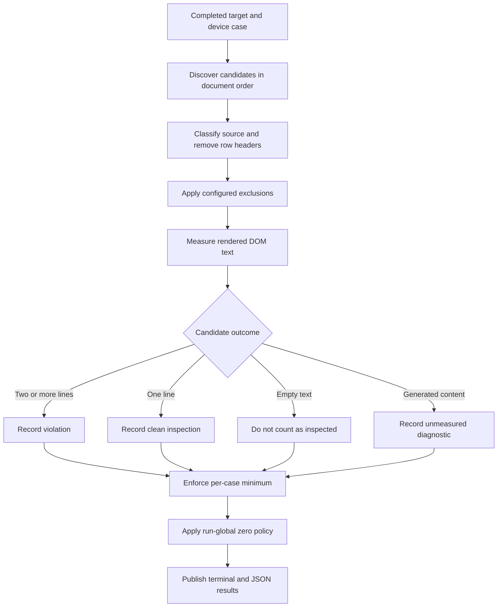
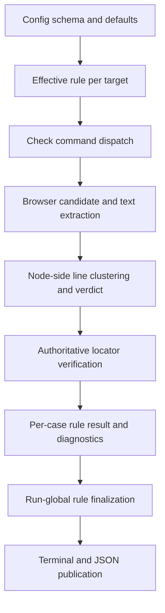
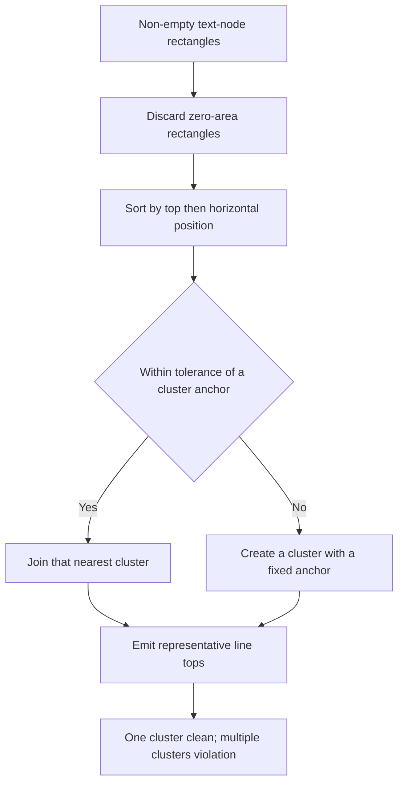

# Table Header Single-Line Rule - Plan

## Goal Capsule

- **Objective:** Developers and AI agents can detect unintended table column-header wrapping at every configured viewport without adding per-element markers.
- **Means:** Extend the built-in rule pipeline with an isolated semantic table-header evaluator (KTD1, KTD2).
- **Product authority:** GitHub Issue [#17](https://github.com/wh3at/vlint/issues/17), the Product Contract below, then the Planning Contract.
- **Execution profile:** Code change with browser-backed rule evaluation, additive output contracts, and no data migration.
- **Stop conditions:** Stop if implementation requires weakening semantic discovery, silently treating an unmeasurable candidate as clean, or changing an existing rule's public behavior.
- **Tail ownership:** Implementation owns tests, documentation, compiled-runtime verification, and removal of abandoned approaches.

---

## Product Contract

### Summary

Extend vlint's existing built-in measurement pattern with a semantic table-header rule rather than a generic single-line abstraction.
The rule is active by default, tolerates a table-free run by default, and exposes strict coverage controls for projects that require tables.

### Problem Frame

A target can complete successfully while a table remains uninspected because existing rules collect different elements.
In the reported KADOU case, short headers such as 「レビュースコア」 wrap only at iPhone width, but the active local rule measures a marked element in another component.
Requiring a marker on every table repeats the omission risk that vlint's semantic coverage model is intended to remove.
Computed `white-space` values also cannot prove whether text occupied one or several lines in the actual viewport.

### Key Decisions

- **Use a dedicated table-header rule.** (session-settled: user-approved — chosen over a generic single-line rule or local-rule example: table semantics remain clear without introducing premature abstraction.) Governs R1–R9.
- **Use semantic discovery with explicit opt-out.** Candidate markers are extensions, not prerequisites. Governs R2–R4.
- **Separate target minimums from run-global zero coverage.** (session-settled: user-approved — chosen over `minimumHeaders` as the only zero-candidate control: per-case expectations and run-level coverage remain independent.) Governs R10–R12.
- **Enable the rule by default and allow global zero by default.** (session-settled: user-directed — chosen over opt-in activation or upgrade-time failure: existing table-free projects remain green while table headers are discovered automatically.) Governs R1, R11, R12.
- **Continue after an unmeasurable generated-content candidate.** (session-settled: user-approved — chosen over failing the whole rule evaluation or ignoring generated content: measurable headers still receive coverage without a false clean verdict.) Governs R9, R15.
- **Keep exclusion evidence out of violation details.** An excluded candidate cannot also be a violation, so its matched selector belongs to machine-readable candidate diagnostics. Governs R14.

### Requirements

**Rule and candidate coverage**

- R1. Vlint must add `table-header-single-line` to every resolved rule set and permit an explicit named instance to replace the injected default.
- R2. The rule must discover rendered native column headers from `th[scope="col"]`, `th[scope="colgroup"]`, and ordinary `thead th`, plus rendered explicit ARIA `[role="columnheader"]` elements.
- R3. Semantic discovery must exclude `th[scope="row"]`, `th[scope="rowgroup"]`, and `[role="rowheader"]` elements.
- R4. The rule must accept additional candidate selectors and exclusion selectors, deduplicate overlapping candidates, and apply exclusions to each candidate itself before measurement.

**Rendered-line verdict**

- R5. The rule must derive line counts only from non-empty rendered DOM text, with decorative element boxes contributing no lines.
- R6. A candidate with no measurable text must not count as inspected.
- R7. The rule must derive visual lines from text-fragment geometry in the active viewport using a deterministic tolerance rule, with `lineTopTolerancePx` configurable and defaulting to `1` pixel.
- R8. A measured candidate with one rendered text line must be clean, while a candidate with two or more rendered text lines must produce a layout violation.
- R9. A candidate with significant generated content must be recorded as unmeasured without stopping evaluation of other candidates.

**Missing-coverage policy**

- R10. `minimumHeaders` must default to `0`, be overridable per target, and fail each completed target-device case that inspects fewer headers than required.
- R11. A run in which all enabled evaluations inspect zero headers must remain clean by default and must fail when the rule instance explicitly disallows global zero-header coverage.
- R12. A target must be able to disable the rule explicitly when the shared rule set does not apply there.

**Diagnostics and compatibility**

- R13. Each violation in terminal and JSON output must identify the target, device viewport, rule, candidate source, stable locator, element geometry, rendered text, line count, measured line-top positions, and tolerance used for the verdict.
- R14. Machine-readable candidate diagnostics must identify excluded candidates and the first configured exclusion selector that matched them without representing those candidates as violations.
- R15. Candidate exclusions, unmeasured generated-content candidates, invalid selectors, failed measurement, target minimum shortfall, and strict run-global zero coverage must remain distinguishable from layout violations and from one another.
- R16. The README must document native and explicit ARIA discovery, row-header exclusions, additional candidates, intentional-wrap opt-out, generated-content diagnostics, target minimums, run-global zero coverage, and viewport-dependent behavior.

### Key Flows

- F1. Column-header evaluation
  - **Trigger:** A target and device case reaches rule evaluation.
  - **Steps:** Discover candidates under R2–R4, measure under R5–R9, and retain evidence under R13–R15.
  - **Outcome:** Every eligible candidate is clean, violating, excluded, unmeasured, or text-empty without being silently lost.
  - **Covers:** R1–R9, R13–R15.
- F2. Coverage finalization
  - **Trigger:** Candidate evaluation for a case completes, followed by completion of all enabled cases in the run.
  - **Steps:** Enforce R10 per case, then apply R11–R12 during rule finalization.
  - **Outcome:** Default activation does not break table-free projects, while strict projects can detect a wholly unexercised rule.
  - **Covers:** R10–R12, R15.

### Acceptance Examples

| ID | Covers | Given | When | Then |
| --- | --- | --- | --- | --- |
| AE1. | R2, R8 | A rendered `<th scope="col">` whose text occupies one visual line | The rule evaluates the target | The header is inspected and no violation is produced. |
| AE2. | R2, R7, R8 | A rendered `<th scope="col">` whose text wraps at the active viewport | The text occupies at least two measured lines | One violation reports the measured line evidence. |
| AE3. | R2, R8 | A rendered `
` with multiline text | The rule evaluates an ARIA table or grid | One column-header violation is produced. |
| AE4. | R3 | `th[scope="row"]`, `th[scope="rowgroup"]`, or `[role="rowheader"]` elements are present | Semantic candidates are collected | Those elements are not inspected as column headers. |
| AE5. | R4, R14 | A multiline column header matches an exclusion selector | Candidates are filtered | It produces no violation and its first matched exclusion is available in candidate diagnostics. |
| AE6. | R4, R8 | A nonstandard rendered header matches an additional candidate selector | Candidates are collected | Its rendered text is evaluated once even if another selector also matches it. |
| AE7. | R5, R8 | A column header contains DOM text plus a decorative icon element | The icon box is on another vertical position | Only the text geometry determines the line count. |
| AE8. | R9, R15 | One candidate has significant generated content and another has measurable wrapped DOM text | The rule evaluates both candidates | The first is diagnosed as unmeasured and the second still produces a violation. |
| AE9. | R1, R11 | No configured target contains a table and no strict global setting is present | The injected rule finalizes | The run may remain clean with zero inspected headers. |
| AE10. | R10, R15 | A case requires at least one header but none is inspected | The case evaluation completes | It returns a machine-distinguishable minimum-coverage failure. |
| AE11. | R11, R15 | Every enabled case inspects zero headers and global zero coverage is explicitly disallowed | Run finalization executes | The run is incomplete rather than green. |
| AE12. | R7, R8, R13 | The same short header is single-line on desktop and multiline on iPhone width | Both device cases run | Only the iPhone case violates and reports its viewport-specific measurements. |

### Scope Boundaries

- No automatic column-width or minimum-width correction.
- No body-cell wrapping checks.
- No natural-language judgment of header wording or Japanese break quality.
- No sticky-header or horizontal-scroll viability checks.
- No product-wide mandate that every table header remain single-line; teams opt out intentional wrapping at the rule boundary.
- No generalization of existing and future single-line checks into one public rule type in this work.

### Dependencies and Assumptions

- Vlint continues to wait for its configured readiness conditions and web fonts before rule evaluation.
- Native implicit column-header semantics are represented by the native selectors in R2 because they are not guaranteed to appear as a literal `role` attribute.
- Existing audit status and exit-code distinctions remain the authority for layout violations versus incomplete execution.
- The vlint binary version is the observable version of the line-grouping behavior; this work adds no separate algorithm-version field.

### Sources and Research

- [GitHub Issue #17](https://github.com/wh3at/vlint/issues/17) — problem statement, proposal, non-scope, and acceptance criteria.
- `vlint-prd.md` — semantic coverage, target application, zero-candidate, deterministic measurement, and output principles.
- `src/rules/tab-label-single-line.ts` — rendered-text extraction, locator verification, and evaluator boundary to mirror.
- `src/config/merge.ts` and `src/config/schema.ts` — built-in injection, normalization, strict schema, and target override patterns.
- `src/run/orchestrator.ts` — per-rule finalization and global zero-label precedent.
- `src/contracts/evaluation.ts`, `src/contracts/result.ts`, and `src/output/terminal.ts` — typed result and reporter extension points.
- No relevant entry exists under `docs/solutions/`; the current source and prior plans are the institutional record for this rule family.

---

## Planning Contract

**Product Contract preservation:** changed R1, R9, R11, AE8, AE9, and AE11 after explicit planning decisions on default activation and generated-content handling; all other requirement meanings and stable IDs are unchanged.

### Key Technical Decisions

- KTD1. **Inject the default instance after existing built-ins.** (session-settled: user-directed — chosen over opt-in activation or strict zero-header failure by default: upgrades gain semantic inspection without breaking table-free projects.) The injected and explicit instance default to `allowZeroHeaders: true`; setting it to `false` enables R11's strict finalization. Governs R1, R11, R12.
- KTD2. **Keep a dedicated evaluator and share only stable rule utilities.** (session-settled: user-approved — chosen over a generic single-line evaluator or local-rule implementation: the table-specific candidate and diagnostic contract remains isolated.) Mirror the two-pass extractor and locator-verification pattern, and reuse `src/rules/locator.ts`. Governs R1–R9, R13–R15.
- KTD3. **Cluster line tops non-transitively.** Sort positive-area text rectangles by top and horizontal position, then compare each top with a fixed anchor for each existing cluster using R7's tolerance. Report one rounded representative top per cluster. Governs R5–R8, R13.
- KTD4. **Add typed optional candidate diagnostics to rule results.** Thread diagnostics from evaluation facts into per-case rule results and JSON publication; omit the field when empty so existing rule output remains stable. Exclusions and unmeasured generated-content candidates use distinct diagnostic variants. Governs R9, R14, R15.
- KTD5. **Preserve document order and assign one canonical candidate source.** Collect a union of validated selectors in document order, deduplicate by element identity, prefer native or explicit ARIA semantics over additional-selector attribution, and record the first configured exclusion match. Governs R2–R4, R13, R14.
- KTD6. **Mirror tab rule coverage granularity.** Enforce `minimumHeaders` per target-device evaluation; expose only `enabled`, `excludeSelectors`, and `minimumHeaders` in target overrides; finalize global zero coverage per named rule instance. Governs R10–R12, R15.
- KTD7. **Extend output contracts additively.** Add the table violation and candidate diagnostics without changing existing violation fields or result ordering, then update exact-output fixtures for intentional new fields. Governs R13–R15.

### High-Level Technical Design

#### Rule data flow

The browser pass extracts serializable facts only.
Node-side code owns deterministic clustering, failures, locator selection, and result contracts.

#### Line grouping

A fixed anchor prevents a chain of near positions from merging two real lines.
The representative tops and configured tolerance become violation evidence under R13.

#### Coverage modes

| Instance state | Per-case minimum | Run-global zero | Expected result |
| --- | --- | --- | --- |
| Injected or explicit default | `0` | Allowed | Table-free cases and runs may remain clean. |
| Strict instance | `0` | Disallowed | A run with zero inspected headers fails finalization. |
| Target expectation | Greater than `0` | Either | Each target-device case below the minimum fails evaluation. |
| Target opt-out | Rule disabled | Not counted | The case contributes no inspection and no minimum failure. |

### Implementation Constraints

- Keep the in-page extractor self-contained for `page.evaluate`; do not close over imported helpers.
- Validate every configured selector before candidate collection so invalid selectors cannot degrade to zero candidates.
- Treat semantic row headers as non-candidates, not configured exclusions; R14 diagnostics apply to configured opt-outs only.
- Do not add `labelSelector` to this rule. Header DOM text is the measurement region for the initial contract.
- Permit multiple named table-header instances, matching the existing tab-rule model; suppress only the injected default when any explicit table-header instance exists.
- Add no dependency and preserve the contracts-only import boundary enforced by `scripts/check-architecture.ts`.
- Append the new integration test file to the enumerated `test:integration` script.

### System-Wide Impact

- **Configuration:** Every resolved config gains one table-header rule unless it declares a named instance of that type. Generated config lists the rule so the default is visible.
- **Execution:** One additional browser evaluator runs per enabled target-device case. Table-free pages perform selector discovery but no text measurement.
- **Results:** JSON gains additive table-violation fields and optional candidate diagnostics. Terminal output gains one-line table-violation evidence.
- **Compatibility:** Existing table-free runs stay clean because global zero headers are allowed by default. Strict coverage is opt-in.
- **Documentation:** README becomes the public contract for default activation, semantic candidates, diagnostics, and strict coverage.

### Risks and Mitigations

| Risk | Mitigation |
| --- | --- |
| Pseudo-element sort markers make common headers unmeasurable. | Diagnose only that candidate, continue the case, and test mixed measurable/unmeasurable headers. |
| A tolerance chain merges two real lines. | Use fixed-anchor non-transitive grouping and boundary-focused pure unit tests. |
| Auto-injection changes rule ordering or blocks later finalizations. | Append the injected table rule after existing built-ins and assert resolved order plus finalization order. |
| Diagnostics accidentally change all existing JSON and golden output. | Make diagnostics optional, preserve existing rule shapes, and update only fixtures that intentionally include the new rule. |
| Responsive visibility makes minimum enforcement ambiguous. | Bind minimums to each target-device case and test desktop-visible/mobile-hidden behavior. |
| Overlapping selectors produce unstable source labels. | Collect in document order and use KTD5's fixed source precedence. |

### Sequencing

1. Establish contracts and normalized config before adding evaluator behavior.
2. Implement and prove pure clustering before browser extraction and semantic discovery.
3. Wire evaluation, diagnostics, finalization, and output after the evaluator contract is stable.
4. Finish with public documentation and full compiled-runtime verification.

---

## Implementation Units

### U1. Add rule contracts and configuration

**Goal:** Make the rule a normalized, default-enabled built-in with typed violations, diagnostics, failures, and overrides.

**Requirements:** R1, R10–R15; F2; AE9–AE11; KTD1, KTD4, KTD6, KTD7.

**Dependencies:** None.

**Files:**
- Modify `src/contracts/config.ts`.
- Modify `src/contracts/evaluation.ts`.
- Modify `src/contracts/result.ts`.
- Modify `src/contracts/failure.ts`.
- Modify `src/config/schema.ts`.
- Modify `src/config/merge.ts`.
- Modify `src/commands/init.ts`.
- Modify `tests/unit/config.test.ts`.
- Modify `tests/unit/init.test.ts`.
- Modify `tests/unit/result.test.ts`.

**Approach:**
1. Add instance and effective-rule discriminants with `lineTopTolerancePx`, `minimumHeaders`, `allowZeroHeaders`, additional selectors, and exclusion selectors.
2. Define the table violation and typed candidate diagnostic variants at the contract boundary.
3. Validate the rule instance and its restricted target override shape with strict `exactKeys` branches.
4. Inject the table rule after existing built-ins, suppress injection when an explicit instance exists, and materialize KTD1's defaults.
5. Add the rule to generated standard configuration without changing existing device defaults.

**Patterns to follow:** `TabLabelSingleLineRuleInstance`, `EffectiveTabLabelSingleLineRule`, `ruleAt`, `ruleOverrideAt`, `rulesWithBuiltins`, and `STANDARD_RULES`.

**Test scenarios:**
- Parse a complete table-header rule and materialize selector arrays, `lineTopTolerancePx: 1`, `minimumHeaders: 0`, and `allowZeroHeaders: true`.
- Reject unknown fields, invalid selectors at evaluation time, negative tolerance, negative minimums, and non-boolean zero-coverage values through the owning validation boundary.
- Resolve no-rule config to tab, overflow, then table defaults without changing existing rule defaults.
- Resolve an explicit named table instance without adding a second injected instance.
- Merge target exclusions after instance exclusions and replace the target minimum while leaving global zero policy instance-scoped.
- Generate `vlint.config.json` with the table rule visible in the standard rule list.
- Preserve result parsing and summary behavior when candidate diagnostics are absent or present.

**Verification:** Config resolution produces one effective table rule per intended instance, existing rule contracts remain unchanged, and architecture checks accept the new contract dependencies.

### U2. Implement semantic header measurement

**Goal:** Discover semantic column headers and return deterministic per-candidate outcomes from a real browser.

**Requirements:** R2–R9, R13–R15; F1; AE1–AE8, AE12; KTD2, KTD3, KTD5.

**Dependencies:** U1.

**Files:**
- Create `src/rules/table-header-single-line.ts`.
- Create `tests/unit/table-header-single-line.test.ts`.
- Create `tests/integration/table-header-single-line.test.ts`.
- Create `tests/fixtures/app/pages/table-headers.html`.

**Approach:**
1. Build a self-contained extraction pass that validates selectors, collects candidates in document order, classifies source, rejects semantic row headers, and records the first configured exclusion match.
2. Reuse the rendered-state, DOM text-fragment, element-description, and locator-verification patterns from the tab evaluator without extracting a generic public rule abstraction.
3. Keep line-top clustering as exported pure Node-side logic under KTD3.
4. Return violations, exclusions, text-empty outcomes, and unmeasured generated-content outcomes without letting one candidate stop the case.
5. Verify every violation and diagnostic locator that must identify an element with the existing composed-locator round trip.

**Execution note:** Start with pure clustering and browser acceptance cases before completing orchestration wiring.

**Patterns to follow:** `src/rules/tab-label-single-line.ts`, `src/rules/locator.ts`, `tests/unit/geometry.test.ts`, and `tests/integration/tab-label-single-line.test.ts`.

**Test scenarios:**
- Covers AE1. Measure a native scoped column header with one rendered line as clean.
- Covers AE2. Wrap the same native header into two line-top clusters and report both representative tops at tolerance `1`.
- Covers AE3. Detect multiline text in an explicit ARIA column header.
- Covers AE4. Ignore native row scopes and explicit ARIA row headers while retaining adjacent column headers.
- Covers AE5. Exclude a configured multiline header and report its first matching exclusion selector once.
- Covers AE6. Add a nonstandard selector, overlap it with a semantic selector, and inspect the element once with semantic source precedence.
- Covers AE7. Place a decorative icon element above or below DOM text and prove that its box does not add a text line.
- Covers AE8. Diagnose one generated-content candidate as unmeasured and still report a wrapped violation from a second candidate.
- Skip hidden, detached, whitespace-only, and icon-only candidates without incrementing `elementsInspected`.
- Fail invalid candidate and exclusion selectors distinctly before treating the case as empty.
- Keep clustering non-transitive at tolerance boundaries, including fractional browser coordinates and three-position chains.
- Evaluate the same fixture in desktop and iPhone-width browser contexts and produce a violation only at the narrow width.

**Verification:** Browser facts are deterministic for the fixture set, every measured violation has a unique locator, and one unsupported candidate cannot suppress other observations.

### U3. Wire orchestration, coverage, and reporters

**Goal:** Carry table evaluation through case execution, finalization, terminal output, JSON output, and end-to-end device runs.

**Requirements:** R1, R9–R15; F1, F2; AE8–AE12; KTD1, KTD4, KTD6, KTD7.

**Dependencies:** U1, U2.

**Files:**
- Modify `src/commands/check.ts`.
- Modify `src/run/orchestrator.ts`.
- Modify `src/output/publish.ts`.
- Modify `src/output/terminal.ts`.
- Modify `tests/unit/check.test.ts`.
- Modify `tests/unit/output.test.ts`.
- Modify `tests/golden/reporter-golden.test.ts`.
- Modify `tests/golden/fixtures/violations.json.txt`.
- Modify `tests/golden/fixtures/violations.terminal.txt`.
- Modify `tests/golden/fixtures/incomplete.json.txt`.
- Modify `tests/golden/fixtures/incomplete.terminal.txt`.
- Modify `tests/acceptance/vlint.test.ts`.

**Approach:**
1. Dispatch the new effective rule to its evaluator without changing local-rule or existing built-in branches.
2. Thread optional candidate diagnostics from evaluation outcome to published per-case rule results.
3. Enforce strict global zero coverage per named table instance after all cases complete, while preserving default clean finalization.
4. Render table violations with candidate source, locator, geometry, line count, line tops, tolerance, and text; keep candidate diagnostics machine-complete in JSON.
5. Extend exact-output fixtures only where the constructed result includes table data.

**Patterns to follow:** `evaluateWithCancellation`, `resolveFinalizations`, `publishResult`, `renderTerminal`, and the existing zero-label finalization tests.

**Test scenarios:**
- Covers AE8. Preserve an unmeasured-candidate diagnostic in JSON while another candidate violation reaches terminal and JSON output.
- Covers AE9. Finalize the injected default as passed when every complete case inspects zero headers.
- Covers AE10. Fail only the target-device case whose inspected count is below `minimumHeaders`.
- Covers AE11. Return `zero-headers-global` when strict global coverage is configured and all enabled completed cases inspect zero headers.
- Do not count disabled target-rule pairs toward strict global coverage.
- Preserve the existing first-failed-finalization behavior and confirm the appended table finalization cannot mark earlier built-ins not executed.
- Sanitize diagnostic text and locators through the existing publication boundary without altering clean existing results.
- Render candidate source, line tops, tolerance, locator, geometry, and text in one escaped terminal violation line.
- Covers AE12. Run one target across configured desktop and iPhone device profiles and report the violation only for the iPhone case.

**Verification:** A complete CLI run distinguishes clean, violation, per-case failure, and strict global-zero failure while terminal and JSON remain mutually consistent.

### U4. Publish the rule contract and aggregate verification

**Goal:** Make the rule discoverable and ensure every standard verification path executes its tests.

**Requirements:** R16.

**Dependencies:** U1, U2, U3.

**Files:**
- Modify `README.md`.
- Modify `package.json`.

**Approach:**
1. Add the rule to the configuration example and built-in rule reference.
2. Document default activation, semantic candidates, row-header exclusions, selector extensions, opt-out, generated-content diagnostics, per-case minimums, and strict global zero coverage.
3. Add the new integration suite to the enumerated aggregate script.
4. Document a narrow-viewport example that makes viewport-dependent wrapping observable.

**Patterns to follow:** Existing README sections for `tab-label-single-line`, target overrides, terminal output, and JSON output.

**Test scenarios:** Test expectation: none — this unit documents and wires behavior proven by U1–U3.

**Verification:** A reader can configure default, excluded, additional, strict, and target-specific behavior without consulting source, and the aggregate integration command includes the new browser suite.

---

## Verification Contract

| Gate | Command | Proves | Applies to |
| --- | --- | --- | --- |
| Type safety | `bun run typecheck` | All closed unions and exhaustive rule branches include the new type. | U1–U3 |
| Architecture | `bun run check:architecture` | Contract imports and module dependencies remain acyclic. | U1–U3 |
| Unit and golden | `bun run test:unit` | Config defaults, clustering, finalization, result contracts, reporters, and exact output are correct. | U1, U2, U3 |
| Browser integration | `bun run test:integration` | Native and ARIA discovery plus rendered geometry work in Chromium. | U2, U4 |
| CLI acceptance | `bun run test:acceptance` | Multi-device scheduling, statuses, exit behavior, and published evidence work end to end. | U3 |
| Compiled runtime | `bun run test:feasibility` | The rule and Playwright evaluator survive single-executable compilation. | U1–U4 |
| Release artifact | `bun run release:validate` | Packaged binary behavior remains valid when this change is included in a release candidate. | Release only |

Behavioral verification must include one fixture whose text is single-line on desktop and multiline at iPhone width.
JSON and terminal assertions must use the same observed violation while JSON alone retains candidate diagnostics.

---

## Definition of Done

- Product behavior satisfies R1–R16 and every applicable AE1–AE12 scenario is represented by automated coverage.
- U1 is complete when configuration, contracts, defaults, generated config, and override semantics are typed and unit-tested.
- U2 is complete when semantic discovery and browser measurement pass pure and Chromium-backed tests.
- U3 is complete when orchestration, strict coverage, diagnostics, reporters, goldens, and multi-device acceptance agree.
- U4 is complete when README examples match the shipped schema and aggregate integration runs the new suite.
- All required Verification Contract gates pass; release-only validation is recorded when a release artifact is being prepared.
- Existing tab-label, horizontal-overflow, local-rule, and multi-device behavior remains green.
- The final diff contains no abandoned generic-rule abstraction, duplicate extractor experiment, temporary fixture, or dead diagnostic shape.
- The plan contains no launch-blocking open question and remains portable through repo-relative paths.

